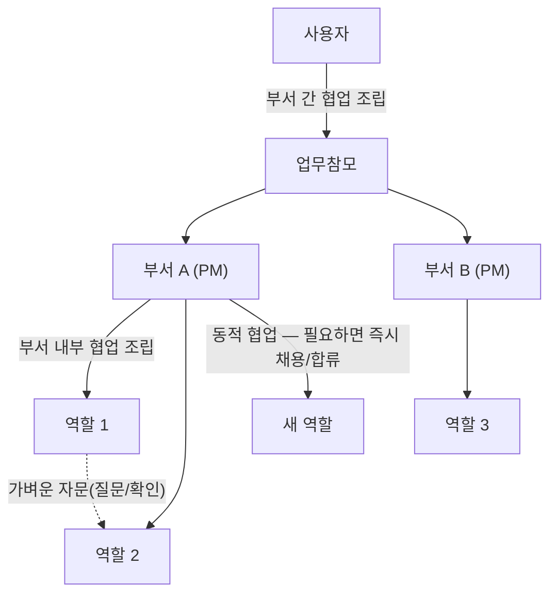

# 협업이 일어나는 세 층위

여기까지 왔다면 궁금해질 질문이 있습니다 — 부서 안에서만 협업하나요, 아니면 부서끼리도 협업하나요?
답은 둘 다이고, 거기에 하나가 더 있습니다.

- **부서 내부 협업** — 같은 부서 안의 역할들이 하나의 책임 아래 협업합니다. 설계하는 역할,
  구현하는 역할, 테스트하는 역할이 같은 목표를 향해 나눠 맡는 식입니다.
- **부서 간 협업** — 서로 다른 부서가 하나의 목표를 위해 함께 움직입니다. 예를 들어 개발 부서가
  만든 결과물을 문서 부서가 정리하고, 검증 부서가 확인하는 식으로 이어집니다.
- **동적 협업** — 필요한 역량이 지금 없다면, 새 역할을 만들거나 기존 역할을 그 자리에 즉시
  참여시킵니다. 미리 다 갖춰놓지 않고, 상황에 맞춰 그때그때 팀을 꾸립니다.

이 세 층위 모두 [Organization Model](/organization-model)에서 본 실행 그래프 위에서 일어납니다 —
조직도는 누가 책임지는지만 정하고, 실제로 어떻게 협업할지는 이 층위들이 그때그때 채웁니다.

같은 레벨끼리는 가벼운 질문·확인을 자유롭게 주고받을 수 있지만, **실제 작업 위임은 항상 그
레벨의 관리자가 실행 그래프에 반영**합니다 — 부서원끼리는 PM이, 부서끼리는 업무참모가.

## 두 역할이 서로를 기다리고 있다면

이 원칙이 문서에만 머물지 않고 실제로 시험대에 오른 적이 있습니다.

::: info 결정 되짚어보기 — 병렬로 맡겼는데 왜 서로 멈춰 있었나
**문제.** 실제 Operator 모드 작업 중, 반복되는 교착 패턴이 관찰됐습니다 — 프론트엔드 작업은
백엔드의 결정을 기다리고, 백엔드 작업은 프론트엔드의 결정을 기다리는 상황. 두 역할의 작업이
공유 인터페이스에 의존하는 지점에서 매번 이런 일이 벌어졌습니다. 그 시점엔 서브에이전트 위임
자체가 제대로 작동하지 않아서, 결국 사람이 매번 하나하나 직접 풀어야 했습니다 — 원래 의도했던
층위별 조율(동급 간 가벼운 자문, PM의 인터페이스 중재, 정말 PM이 못 푸는 것만 에스컬레이션)은
한 번도 실제로 작동하지 못했습니다.

**조사.** 이게 "더 나은 도구"로 풀릴 문제인지부터 확인했습니다. Anthropic이 자사 멀티에이전트
리서치 시스템을 만들며 공개한 글은 명확합니다 — 에이전트 사이에 의존관계가 많은 영역은
*"not a good fit for multi-agent systems today"*(오늘날의 멀티에이전트 시스템에 잘 맞지 않는다),
그래서 자신들의 실제 프로덕션 시스템도 동기적 hub-and-spoke 구조(리드 에이전트가 조율하고,
서브에이전트끼리는 대화하지 않는다)를 **의도적으로** 택했다고 적혀 있습니다. 진짜 상호의존은
"병렬로 돌리고 대충 맞춰지길 바라는" 방식으로는 풀리지 않고, 관찰된 교착을 그대로 재현할
뿐이었습니다.
(근거: `knowledge/decisions/2026-08-06-pm-interface-negotiation-before-parallel-work.md`)

**해결.** CONSTITUTION §10.6이 이미 정확히 이렇게 규정하고 있었습니다 — *"부서원 간 협업 →
PM이 조립. 부서 간 협업 → 업무참모가 조립. 가벼운 자문(질문/확인)은 같은 레벨 구성원끼리 자유롭게
주고받을 수 있다. 실제 작업 위임은 항상 해당 레벨 관리자가 실행 그래프에 반영한다."* 빠진 건
새 메커니즘이 아니라, 이 원칙을 PM이 실제로 실행할 수 있을 만큼 **구체화**하는 것이었습니다:
두 역할의 작업이 공유 결정(인터페이스·계약·전제)에 의존한다면, PM이 그 결정을 먼저 짧고
집중적으로 순차 해결(직접 정하거나, 가장 가까운 역할과 짧게 상의)한 **다음**에야 나머지
독립적인 작업을 병렬로 위임합니다.

**그래서 생긴 강점.** 동급 간 페어 채널을 새로 만들 필요가 없어졌습니다 — 이미 존재하는
"관리자를 거친다"는 규칙을 실제로 지키는 것만으로 교착이 사라졌습니다. 그리고 이건 자기보고로
끝난 게 아니라, 이후 실제 병렬 위임 사례에서 (a) PM이 상호의존을 인지했는지, (b) 짧은 순차
단계로 풀었는지, (c) 진짜 못 푸는 것만 올렸는지를 실제 커밋·도구 호출 증거로 대조 확인하는
후속 절차까지 남겼습니다.
:::

파일이 겹치지 않는다고 해서 항상 안전한 것은 아니라는 걸, 이 조직은 다시 한번 직접 겪었습니다.

::: info 결정 되짚어보기 — "겹치는 파일이 없다"는 "독립적이다"의 충분조건이 아니다
**문제.** 실제 다부서 세션 데이터를 재구성해 보니, PM이 진짜 독립적인 작업(예: 서로 아무
공유 결정도 없는 백엔드 엔드포인트 하나와 프론트엔드 스캐폴드 하나)조차 순차로 위임하는 경우가
있었습니다. 처음엔 "검증 지침이 '결과를 확인하고 신뢰하라'는 것과 '다음 독립 작업을 바로
넘겨라'는 것을 구분하지 못해서"라고 가설을 세웠지만, 직접 시나리오를 재현해보니 이 가설은
재현되지 않았습니다 — PM은 지시 변경 없이도 진짜 독립 작업 두 개를 올바르게 병렬로 처리했습니다.

**조사.** 다만 그 시나리오는 실제 저장소 쓰기가 없는 스파이크였습니다. 실제 프로덕션에서는 두
역할-클래스가 **같은 저장소 체크아웃**을 동시에 건드릴 때 진짜 위험(git 상태 경합, 한쪽이 절반만
쓴 상태, 한쪽 변경이 다른 쪽 빌드를 중간에 깨뜨림)이 있습니다. 그렇다면 관찰된 "신중함"은
지침 결함이 아니라, 이 조직이 PM에게 아직 제거할 방법을 주지 않은 **실제 위험에 대한 정당한
신중함**이었을 가능성이 떠올랐습니다. 실제로 최초 시도한 격리 수단(`Agent`의 `isolation:
"worktree"`)을 검증해 보니, 결정 문서가 정정하듯 *"isolates the caller's own already-running
repository ... never an arbitrary target path named in a delegation prompt"*(호출자 자신이 이미
실행 중인 저장소만 격리할 뿐, 위임 프롬프트가 가리키는 임의의 대상 경로는 전혀 격리하지
못한다) — 실제로 이 방식으로 위임받은 부서원이 엉뚱한 저장소의 임시 브랜치에 커밋한 사고까지
있었습니다.
(근거: `knowledge/decisions/2026-08-28-parallel-work-needs-isolation-not-just-independence.md`)

**해결.** 논리적 상호의존(위 결정 상자)과는 다른, **물리적 충돌**이라는 별개의 실패 모드로
정리했습니다 — 같은 저장소를 건드리는 진짜 독립 작업이라도, 병렬 위임 전에 PM이 **실행
메커니즘이 실제로 각 동시 브랜치를 격리하는지**를 확인해야 합니다. 격리가 된다면 병렬로 위임한
뒤 각자 끝나면 병합(reconcile)하고, 격리 수단이 없다면 순차 실행이 판단 실패가 아니라 **안전한
기본값**입니다. ("격리"가 구체적으로 무엇을 뜻하는지는 도구마다 다르며, 최초 시도(`Agent`의
`isolation: "worktree"`)는 실제로는 PM 자신이 이미 실행 중인 저장소만 격리할 뿐 위임 대상
저장소는 전혀 격리하지 못한다는 게 실측으로 드러나 정정됐습니다 — 지금은 PM이 대상 저장소
안에 직접 `git worktree add`를 실행해 각 위임에 절대경로를 주는 방식으로 굳어졌습니다.)

**그래서 생긴 강점.** "파일이 겹치는가"라는 얕은 질문 대신 "한쪽 산출물이 다른 쪽 없이도
의도대로 동작하는가"라는 더 정확한 질문으로 병렬 위임의 안전 기준이 바뀌었습니다. 이 교훈은
이 사이트를 만드는 작업(`aise-org-site`) 자신에서도 그대로 재현됐습니다 — 콘텐츠 페이지와
i18n 스캐폴드가 파일은 겹치지 않았지만, 콘텐츠의 다이어그램 문법이 스캐폴드의 렌더링 지원 없이는
동작하지 않는 의미론적 의존이 실제로 있었습니다.
:::

## Quick guide

**한 문장으로.** 협업은 부서 안·부서 사이·즉석 동적 팀 구성이라는 세 층위에서 일어나고, 두
층위 모두에서 "진짜 병렬로 가도 되는가"는 관리자(PM 또는 업무참모)가 공유 결정을 먼저 풀고
난 뒤, 그리고 물리적 격리가 확보된 뒤에만 성립합니다.

**이 페이지를 직접 확인해 보려면**

1. `CONSTITUTION.md` §10.6에서 "가벼운 자문"과 "실제 작업 위임"이 나뉘는 문장을 직접 찾아보세요.
2. `schema/README.md`의 "Intra-department execution graph" 절이 이 페이지의 두 결정 상자를
   어떻게 하나의 규칙으로 합쳐뒀는지 비교해 보세요.
3. `adapters/claude-code/README.md`의 "Execution graph" 행이 이 조직이 쓰는 도구(Claude Code)의
   실제 제약(서브에이전트끼리 직접 대화 불가)을 어떻게 명시하는지 확인해 보세요.

**다음으로.** 이 협업이 조직 자신을 바꾸는 순간과는 어떻게 다른지 →
[Operator vs Meta Mode](/operator-vs-meta-mode).

*근거: `CONSTITUTION.md` §5, §10.6; `schema/README.md` "Intra-department execution graph";
`knowledge/decisions/2026-08-06-pm-interface-negotiation-before-parallel-work.md`,
`knowledge/decisions/2026-08-28-parallel-work-needs-isolation-not-just-independence.md`.*
