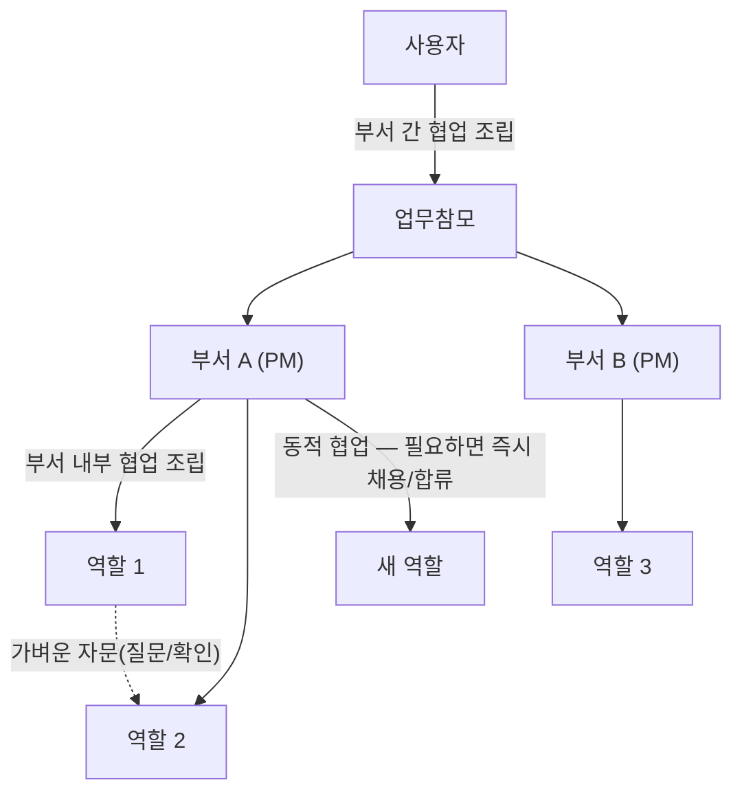
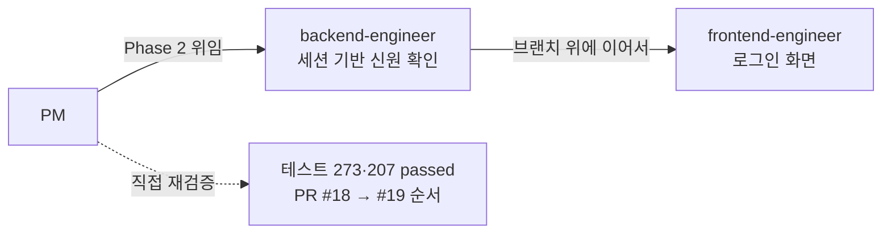

# 협업은 어디서, 어떻게 일어나나

::: tip 읽는 자리 — 동작 원리 (4/5)
[동작 원리](/how-it-works) 대분류의 네 번째 글입니다. 앞 [Lifecycle](/lifecycle)이 부서 **하나**의
시간축을 따라갔다면, 이 페이지는 **여러 개가 같은 순간에 굴러갈 때** 무슨 일이 생기는지를
다룹니다 — 누가 실행 그래프를 조립하는가, 서로를 기다리는 두 역할을 어떻게 풀어주는가, 그리고
실제 부서들 사이에서는 무엇이 오갔는가. 다음 [Operator vs Meta Mode](/operator-vs-meta-mode)가
이 대분류의 마지막 안전장치입니다.
:::

여기까지 읽으셨다면 이런 궁금증이 생길 것 같습니다 — 부서 안에서만 협업하나요, 아니면 부서끼리도
협업하나요? 답은 둘 다이고, 거기에 하나가 더 있습니다.

- **부서 내부 협업** — 같은 department(부서) 안의 역할들이 하나의 책임 아래 협업합니다. 설계하는
  역할, 구현하는 역할, 테스트하는 역할이 같은 목표를 향해 나눠 맡는 식입니다.
- **부서 간 협업** — 서로 다른 부서가 하나의 목표를 위해 함께 움직입니다. 한 부서가 만든 결과물을
  다른 부서가 가져다 쓰는 식으로 이어집니다.
- **동적 협업** — 필요한 역량이 지금 없다면, 새 역할을 만들거나 기존 역할을 그 자리에 즉시
  참여시킵니다. 미리 다 갖춰놓지 않고, 상황에 맞춰 그때그때 팀을 꾸립니다.

이 세 층위 모두 [Organization Model](/organization-model)에서 본 execution graph(실행 그래프)
위에서 일어납니다 — 조직도는 누가 책임지는지만 정하고, 실제로 어떻게 협업할지는 이 층위들이
그때그때 채웁니다.

```mermaid
flowchart TD
  U["사용자"] -->|"부서 간 협업 조립"| M["업무참모"]
  M --> P1["부서 A (PM)"]
  M --> P2["부서 B (PM)"]
  P1 -->|"부서 내부 협업 조립"| R1["역할 1"]
  P1 --> R2["역할 2"]
  P2 --> R3["역할 3"]
  R1 -.->|"가벼운 자문(질문/확인)"| R2
  P1 -->|"동적 협업 — 필요하면 즉시 채용/합류"| R4["새 역할"]
```

같은 레벨끼리는 가벼운 질문·확인을 자유롭게 주고받을 수 있지만, **실제 작업 위임은 항상 그
레벨의 관리자가 실행 그래프에 반영**합니다 — 부서원끼리는 `project-manager`(부서를 맡은 PM)가,
부서끼리는 `OP_ORCHESTRATOR`(업무참모)가.

## 서로를 기다리며 멈춰 있던 두 역할

이 원칙이 문서에만 머물지 않고 실제로 시험대에 오른 적이 있습니다.

::: info 결정 되짚어보기 — 병렬로 맡겼는데 서로 멈춰 있던 일
**문제**

- `sfr-ssot-platform` 부서의 실제 Operator 모드 작업에서 교착이 반복됐습니다 — 프론트엔드는
  백엔드의 결정을, 백엔드는 프론트엔드의 결정을 기다렸습니다.
- 두 역할의 작업이 공유 인터페이스에 걸리는 지점마다 같은 일이 벌어졌습니다.
- 당시엔 서브에이전트 위임도 제대로 작동하지 않아, 결국 사람이 매번 하나씩 직접 풀었습니다.

**조사**

- 먼저 "더 나은 도구"로 풀릴 문제인지 확인했습니다.
- Anthropic이 자사 멀티에이전트 리서치 시스템을 설명한 글은 의존관계가 많은 영역을
  *"not a good fit for multi-agent systems today"*(오늘날의 멀티에이전트 시스템에 잘 맞지 않는다)라고
  봤고, 자신들도 리드 에이전트가 조율하는 동기적 hub-and-spoke 구조를 택했습니다.
- 진짜 상호의존은 "병렬로 돌리고 맞춰지길 바라는" 방식으로는 풀리지 않는다는 결론이었습니다.
- 근거: `knowledge/decisions/execution/pm-authority-and-method.md` "2026-08-06 — pm-interface-negotiation-before-parallel-work"

**해결**

- 규칙은 이미 있었습니다. 결정 문서가 인용한 당시 CONSTITUTION §10.6(한국어 원문 시절) — *"부서원
  간 협업 → PM이 조립. 부서 간 협업 → 업무참모가 조립. 가벼운 자문(질문/확인)은 같은 레벨 구성원끼리
  자유롭게 주고받을 수 있다. 실제 작업 위임은 항상 해당 레벨 관리자가 실행 그래프에 반영한다."*
- 빠진 건 이 규칙을 PM이 실제로 실행할 수 있게 구체화하는 것이었습니다.
- 두 역할이 공유 결정(인터페이스·계약·전제)에 걸려 있으면, PM이 그 결정을 **먼저** 짧게 순차로
  정리하고, 그 **다음에** 나머지 독립 작업을 병렬로 맡깁니다.

**그래서 생긴 강점**

- 동급끼리 직접 대화하는 새 채널을 만들 필요가 없었습니다 — "관리자를 거친다"는 기존 규칙을 실제로
  지키는 것만으로 교착이 풀렸습니다.
- 자기보고로 끝내지 않고, 이후 실제 병렬 위임에서 (a) 상호의존을 알아챘는지, (b) 짧은 순차 단계로
  풀었는지, (c) 정말 못 푸는 것만 올렸는지를 커밋·도구 호출 기록으로 대조하는 후속 확인까지
  남겼습니다.
:::

파일이 겹치지 않는다고 해서 항상 안전한 것은 아니라는 것도, 이 조직은 직접 겪으며 배웠습니다.

::: info 결정 되짚어보기 — 파일이 안 겹친다고 독립적인 건 아니었다
**문제**

- 실제 다부서 세션 기록을 재구성해 보니, PM이 서로 공유 결정이 전혀 없는 작업(예: 백엔드 엔드포인트
  하나와 프론트엔드 스캐폴드 하나)조차 순차로 맡기고 있었습니다.
- 처음 세운 가설("검증 지침이 '결과 확인'과 '다음 작업 넘기기'를 구분하지 못해서")은 시나리오로
  재현해 보니 재현되지 않았습니다.

**조사**

- 그 시나리오는 실제 저장소 쓰기가 없는 스파이크였습니다. 진짜 저장소에서는 두 역할이 **같은
  체크아웃**을 동시에 건드리면 git 상태 경합, 반쯤 쓴 파일, 서로의 빌드 깨뜨리기 같은 실제 위험이
  있습니다.
- 그러니 PM의 "신중함"은 지침 결함이 아니라, 제거할 수단이 없던 실제 위험에 대한 정당한 반응이었을
  수 있습니다.
- 처음 시도한 격리 수단(`Agent`의 `isolation: "worktree"`)은 결정 문서가 정정하듯 *"isolates the
  caller's own already-running repository ... never an arbitrary target path named in a delegation
  prompt"*(호출자 자신이 이미 실행 중인 저장소만 격리할 뿐, 위임 프롬프트가 가리키는 대상 경로는
  격리하지 못한다)였고, 실제로 부서원이 엉뚱한 저장소에 커밋하는 사고도 있었습니다.
- 근거: `knowledge/decisions/execution/delegation.md` "2026-08-28 — parallel-work-needs-isolation-not-just-independence"

**해결**

- 논리적 상호의존(위 상자)과는 다른 **물리적 충돌**이라는 별개의 실패 모드로 정리했습니다.
- 같은 저장소를 건드리는 병렬 위임 전에는, 실행 수단이 각 브랜치를 **실제로 격리하는지**부터
  확인합니다. 격리되면 병렬로 맡기고 끝나면 합치며, 격리가 안 되면 순차가 안전한 기본값입니다.
- 지금은 PM이 대상 저장소 안에 `git worktree add .wt/<branch> <branch>`로 작업 공간을 따로 만들어
  위임하는 방식으로 굳어졌습니다.

**그래서 생긴 강점**

- "파일이 겹치는가" 대신 "한쪽 결과물이 다른 쪽 없이도 의도대로 동작하는가"를 묻게 됐습니다.
- 이 사이트를 만드는 `aise-org-site` 부서에서도 같은 일이 있었습니다 — 콘텐츠 페이지와 다국어
  스캐폴드는 파일이 겹치지 않았지만, 콘텐츠의 다이어그램 문법이 스캐폴드의 렌더링 지원 없이는
  동작하지 않았습니다.
:::

## 한 부서 안에서 실제로 이어진 모습

위 두 결정이 실제 작업에서 어떻게 보이는지, `sfr-ssot-platform` 부서의 로그인 기능(F9) 작업을
예로 들어 보겠습니다(2026-08-20, 그 부서 `project-record.md` Ledger
`f9-auth-phase2-phase3-2026-08-20` 행).

```mermaid
flowchart LR
  PM["PM"] -->|"Phase 2 위임"| BE["backend-engineer<br/>세션 기반 신원 확인"]
  BE -->|"브랜치 위에 이어서"| FE["frontend-engineer<br/>로그인 화면"]
  PM -.->|"직접 재검증"| V["테스트 273·207 passed<br/>PR #18 → #19 순서"]
```

- **순서가 먼저 정해져 있었습니다.** 백엔드가 8개 수정 엔드포인트에 "로그인한 사람이 누구인가"를
  붙이는 일(Phase 2)을 먼저 끝내야, 프론트엔드가 그 계약에 맞춰 로그인 화면을 붙일 수 있었습니다
  (Phase 3). 그래서 병렬이 아니라 순차였고, 프론트엔드 브랜치는 백엔드 브랜치 위에서 시작했습니다.
- **중간에 끊겨도 이어갔습니다.** 프론트엔드 위임이 API 사용량 한도로 중간에 끊겼을 때, PM은 남은
  미커밋 변경을 체크포인트 커밋(`4b79f6c`)으로 먼저 살려둔 뒤 "이미 끝난 부분은 다시 만들지 말 것"을
  명시해 다시 맡겼습니다.
- **자기보고를 그대로 믿지 않았습니다.** PM이 백엔드 테스트 273 passed, 프론트엔드 테스트 207
  passed를 직접 다시 돌렸고, 실패하던 E2E 5건은 이번 변경과 무관하게 `dev`에서도 똑같이 실패한다는
  걸 재현해 확인했습니다.
- **PR 순서까지 남겼습니다.** PR #19의 기준 브랜치가 PR #18의 브랜치라서, #18을 먼저 병합해야 한다는
  주의사항을 다음 사람을 위해 기록해 뒀습니다.

## 부서 사이에서 실제로 오간 것들

부서 간 협업은 "두 부서가 같은 목표로 함께 움직인다"는 설명만으로는 잘 와닿지 않습니다. 이 조직의
네 부서(`sfr-ssot-platform`, `simple-ragcurl-platform`, `llm-wiki-platform`, `aise-org-site`)
사이에서 실제로 오간 것은 크게 세 가지였습니다.

**1. 역할 정의서가 부서를 건너 재사용됐습니다.** `backend-engineer`·`frontend-engineer`는
2026-07-20 `sfr-ssot-platform`의 PoC를 위해 처음 채용됐고, `devops-engineer`는 2026-07-27에
합류했습니다(`instance/portfolio/index.yaml`의 `created`). 이후 `llm-wiki-platform`은
`backend-engineer`/`frontend-engineer`를 그대로 가져다 썼고, 이 사이트(`aise-org-site`)는
`frontend-engineer`/`devops-engineer`를 가져다 썼습니다. 같은 `devops-engineer`를 두고
`llm-wiki-platform`은 "CI/CD 자동화 요구가 없다"며 재사용하지 않았고 이 사이트는 "GitHub Pages
배포가 실제 요구사항"이라 재사용했습니다 — 두 부서의 판단이 왜 갈리는지가 양쪽 기록에 근거와 함께
남아 있습니다(각 부서 `project-record.md` Roster).

**2. 한 부서가 만든 도구를 다른 부서가 소비했습니다.** `simple-ragcurl-platform`이 만든 검색
서비스와 `ragcurl-search` 스킬(`aise-core/.claude/skills/ragcurl-search/`)을, 이 사이트는 결정 상자의
조사 인용을 찾는 데 실제로 썼고(2026-09-09~14, 실 쿼리 결과의 `source_path`와 유사도를 직접 확인),
`llm-wiki-platform`은 자기 수집 에이전트에 조직 전체 코퍼스 검색 도구로 붙였습니다. 부서끼리 직접
열쇠를 주고받지 않았고, API 키 요청은 전부 업무참모를 거쳤습니다.

**3. 한 부서의 결과물이 다른 부서의 평가를 흔들었습니다.** 아래 상자가 그 이야기입니다 — 점수를 매긴
평가에서 나온 수치가 실제 결정으로 이어진 사례이기도 합니다.

::: info 결정 되짚어보기 — 평가 점수가 떨어진 이유를 숫자로 따라가 보니
**문제**

- `simple-ragcurl-platform`이 골드셋 12문항으로 검색 품질을 채점하자 `mean_recall=0.694`가
  나왔고, 그중 q3·q10은 `recall=0`으로 완전히 빗나갔습니다.
- "코퍼스에 정답 문서가 빠졌다"는 게 가장 쉬운 추측이었습니다.

**조사**

- PM은 추측 대신 실제로 확인했습니다. 정답 문서가 전부 인제스트돼 있다는 걸 먼저 DB에서 보고
  "코퍼스 누락" 가설을 지웠습니다.
- q3·q10을 top-5/20/200으로 직접 다시 검색해 순위와 거리를 대조했습니다.
- 원인은 다른 부서에 있었습니다. 코퍼스에 포함된 `llm-wiki-platform`의 큐레이션 요약본 9개가 이
  12문항과 거의 1:1로 대응했고, **12문항 전부**에서 top-5에 들어갔습니다(10문항에서는 1·2위).
- 정답 문서가 1~2개인 문항은 남는 자리에 정답이 끼어 점수를 지켰지만, 정답이 5~6개인 q3·q10은
  요약본이 자리를 다 차지해 0점이 됐습니다.
- q10에는 요약본과 별개로, 원본 `instance/roles/*.yaml`이 top-200에도 안 잡히는 독립적인 임베딩
  약점이 따로 있다는 것까지 구분해 적어 뒀습니다.
- 근거: `instance/workspace/simple-ragcurl-platform/project-record.md` Ledger
  `ragcurl-eval-miss-root-cause-llm-wiki-decoy-2026-09-15`

**해결**

- 코퍼스 범위와 라벨 중 무엇을 고칠지는 두 부서에 걸친 판단이라 PM이 정하지 않고 올렸고(그 부서의
  OQ-10), operator가 "큐레이션 콘텐츠를 코퍼스에서 제외"로 결정했습니다.
- 실행하다 보니 매니페스트에서 빼고 재인제스트하는 것만으로는 이미 들어간 청크 117개가 지워지지
  않는다는 걸 직접 쿼리로 발견해, 그 청크를 따로 삭제했습니다(6688 → 6571).
- 근거: 같은 파일 Ledger `op-parallel-backlog-oq10-2026-09-15`

**그래서 생긴 강점**

- 재평가에서 `mean_recall`이 0.694 → 0.744로 올랐고, q3는 0.000 → 0.600으로 회복했습니다.
- q10은 `recall=0.000` 그대로였고, 기록도 그렇게 남겼습니다 — 앞서 구분해 둔 별개의 임베딩 약점이
  예측대로 남아 있었기 때문입니다. 좋아진 숫자만 골라 적지 않았습니다.
- 같은 날 업무참모가 평가 스크립트를 직접 다시 돌려 q3 `recall=0.600`, `mean_recall=0.744`를
  재현했습니다(`knowledge/protocols/operational-watchlist/op-orchestrator-independent-verification.md`,
  2026-09-15 항목).
:::

솔직하게 덧붙이면, 부서 사이의 비교·중재·전달을 따로 모아두는 기록(`coordination-record.md`,
`schema/OP_ORCHESTRATOR.md`에 설계돼 있음)은 **아직 한 번도 만들어진 적이 없습니다.** 위 세 사례는
전부 각 부서의 `project-record.md`와 업무참모의 확인 기록에 흩어져 남아 있고, 이 전용 기록은 첫
사례를 기다리는 중입니다.

## 정리

**한 문장으로.** 협업은 부서 안·부서 사이·즉석 팀 구성이라는 세 층위에서 일어나고, "진짜 병렬로
가도 되는가"는 관리자(PM 또는 업무참모)가 공유 결정을 먼저 풀고 물리적 격리까지 확보한 뒤에만
성립합니다.

**이 페이지를 직접 확인해 보려면**

1. `CONSTITUTION.md` §10.6("Who assembles collaboration")에서 가벼운 자문과 실제 작업 위임이
   나뉘는 문장을 찾아보세요. 지금 원문은 영어입니다(2026-09-17 전환).
2. `schema/README.md`의 "Intra-department execution graph" 절이 이 페이지의 두 결정 상자를
   어떻게 하나의 규칙으로 합쳐뒀는지 비교해 보세요.
3. `instance/workspace/simple-ragcurl-platform/project-record.md`에서 위 평가 수치(0.694, 0.744,
   q10의 0.000)가 가공 없이 그대로 남아 있는 Ledger 두 행을 찾아보세요.

**다음으로.** 이 협업이 조직 자신을 바꾸는 순간과는 어떻게 다른지 →
[Operator vs Meta Mode](/operator-vs-meta-mode).

*근거: `CONSTITUTION.md` §5, §10.6; `schema/README.md` "Intra-department execution graph";
`knowledge/decisions/execution/pm-authority-and-method.md` "2026-08-06 — pm-interface-negotiation-before-parallel-work",
`knowledge/decisions/execution/delegation.md` "2026-08-28 — parallel-work-needs-isolation-not-just-independence";
`instance/workspace/{sfr-ssot-platform,simple-ragcurl-platform,llm-wiki-platform,aise-org-site}/project-record.md`;
`instance/portfolio/index.yaml`.*
