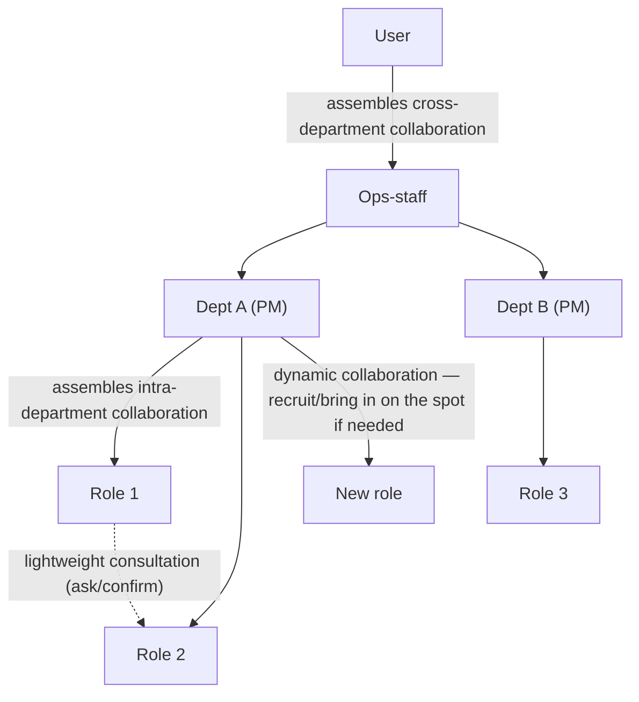

# Three layers where collaboration happens

If you've made it this far, a question naturally comes up — does collaboration happen only
within a department, or across departments too? The answer is both, and there's a third layer on
top.

- **Intra-department collaboration** — roles within the same department collaborate under one
  shared accountability. A role that designs, a role that implements, and a role that tests split
  the work toward the same goal.
- **Cross-department collaboration** — different departments move together toward one goal. For
  example, a development department produces something, a documentation department writes it up,
  and a verification department confirms it, one after another.
- **Dynamic collaboration** — if a needed capability doesn't exist right now, a new role is
  created or an existing role is brought in on the spot. Nothing is fully staffed in advance; the
  team is assembled to fit the situation as it arises.

All three layers happen on top of the execution graph seen in
[Organization Model](/en/organization-model) — the org chart only fixes who's accountable; how
collaboration actually happens is filled in on the fly by these layers.

Peers at the same level can freely exchange lightweight questions and confirmations, but **actual
work delegation is always reflected into the execution graph by the manager at that level** — the
PM for members within a department, the Ops-staff for departments.

## When two roles are stuck waiting on each other

This principle wasn't just written down and left on paper — it was actually put to the test.

::: info Revisiting the decision — why were two roles blocked, even though they were assigned in parallel?
**Problem.** During actual Operator-mode work, a recurring deadlock pattern was observed — the
frontend work waits on a backend decision, and the backend work waits on a frontend decision. It
happened every time both roles' work depended on a shared interface. At that point, subagent
delegation itself wasn't working properly, so a human ended up having to resolve it manually every
single time — the originally intended layered coordination (lightweight peer consultation, PM
interface mediation, escalating only what the PM genuinely can't resolve) had never actually
worked in practice.

**Investigation.** We first checked whether "better tooling" would fix this. Anthropic's own
writeup on building their multi-agent research system is clear — domains with heavy
inter-agent dependencies are *"not a good fit for multi-agent systems today"*, which is why their
own production system **deliberately** chose a synchronous hub-and-spoke structure (a lead agent
coordinates; subagents don't talk to each other). Real interdependency isn't resolved by "running
things in parallel and hoping it works out" — it just reproduces the exact deadlock we observed.
(Source: `knowledge/decisions/2026-08-06-pm-interface-negotiation-before-parallel-work.md`)

**Resolution.** CONSTITUTION §10.6 already specified exactly this — *"Collaboration among
department members → assembled by the PM. Collaboration across departments → assembled by the
Ops-staff. Lightweight consultation (asking/confirming) can be freely exchanged among peers at
the same level. Actual work delegation is always reflected into the execution graph by the
manager at that level."* What was missing wasn't a new mechanism, but making this principle
**concrete** enough for a PM to actually execute: when two roles' work depends on a shared
decision (an interface, contract, or assumption), the PM resolves that decision first, briefly and
sequentially (deciding it directly, or consulting quickly with the closest role) — **and only
then** delegates the remaining, genuinely independent work in parallel.

**The strength that followed.** There was no need to invent a new peer-to-peer channel. The
deadlock disappeared just by actually following the "go through the manager" rule that already
existed. And this wasn't left as a self-report — a follow-up procedure was added to check, using
real commits and tool-call evidence from subsequent parallel delegations, whether (a) the PM
recognized the interdependency, (b) resolved it with a short sequential step, and (c) escalated
only what genuinely couldn't be resolved.
:::

This organization also learned, the hard way, that files not overlapping doesn't always mean
it's safe.

::: info Revisiting the decision — "no overlapping files" is not sufficient for "independent"
**Problem.** Reconstructing actual multi-department session data revealed cases where a PM
delegated genuinely independent tasks (say, a backend endpoint and a frontend scaffold with no
shared decision between them at all) sequentially anyway. The first hypothesis was that verifying
"check and trust the result" was being confused with "hand off the next independent task
immediately" — but reproducing the scenario directly didn't confirm that hypothesis. The PM
correctly ran two genuinely independent tasks in parallel with no change in instructions.

**Investigation.** But that scenario was a spike with no actual repository writes. In real
production, when two role-classes touch **the same repository checkout** at the same time, there
is a genuine risk (git state races, one side left in a half-written state, one side's change
breaking the other's build mid-flight). That raised the possibility that the observed "caution"
wasn't a flaw in the instructions, but **legitimate caution about a real risk** the organization
hadn't yet given the PM a way to remove. Testing the first attempted isolation mechanism
(`Agent`'s `isolation: "worktree"`) confirmed exactly this — as the decision record corrects,
it *"isolates the caller's own already-running repository ... never an arbitrary target path
named in a delegation prompt"* — there was even an actual incident where a member delegated this
way committed to a temporary branch in the wrong repository entirely.
(Source: `knowledge/decisions/2026-08-28-parallel-work-needs-isolation-not-just-independence.md`)

**Resolution.** We separated this out as a distinct failure mode — a **physical conflict**,
different from the logical interdependency in the box above. Even for genuinely independent tasks
touching the same repository, before delegating in parallel a PM must confirm whether the
**execution mechanism actually isolates each concurrent branch**. If isolation is available,
delegate in parallel and reconcile (merge) once each finishes; if no isolation mechanism exists,
sequential execution is not a failure of judgment — it's the **safe default**. (What "isolation"
concretely means varies by tool, and the first attempted mechanism (`Agent`'s
`isolation: "worktree"`) was corrected after measurement showed it only isolates the PM's own
already-running repository and does nothing for the delegation's target repository — the settled
practice now is for the PM to run `git worktree add` directly inside the target repository and
hand each delegation an absolute path.)

**The strength that followed.** The safety criterion for parallel delegation shifted from the
shallow question "do the files overlap?" to the more accurate one — "does one side's output work
as intended without the other?" This lesson reproduced itself in the very work of building this
site (`aise-org-site`) — content pages and the i18n scaffold didn't overlap in files, but there
was a real semantic dependency: the content's diagram syntax doesn't work without the scaffold's
rendering support.
:::

## Quick guide

**In one sentence.** Collaboration happens across three layers — within a department, across
departments, and ad hoc dynamic teaming — and in both of the first two, "is it really safe to go
parallel" only holds once the manager (the PM or the Ops-staff) has resolved any shared decisions
first, and physical isolation is confirmed.

**To check this page for yourself**

1. Find, in `CONSTITUTION.md` §10.6, the sentence that draws the line between "lightweight
   consultation" and "actual work delegation."
2. Compare how the "Intra-department execution graph" section of `schema/README.md` folds this
   page's two decision boxes into a single rule.
3. Check how the "Execution graph" row of `adapters/claude-code/README.md` spells out this
   org's actual tool constraint (subagents can't talk to each other directly) for Claude Code.

**Next.** How this collaboration differs from the moment the organization changes itself →
[Operator vs Meta Mode](/en/operator-vs-meta-mode).

*Source: `CONSTITUTION.md` §5, §10.6; `schema/README.md` "Intra-department execution graph";
`knowledge/decisions/2026-08-06-pm-interface-negotiation-before-parallel-work.md`,
`knowledge/decisions/2026-08-28-parallel-work-needs-isolation-not-just-independence.md`.*
