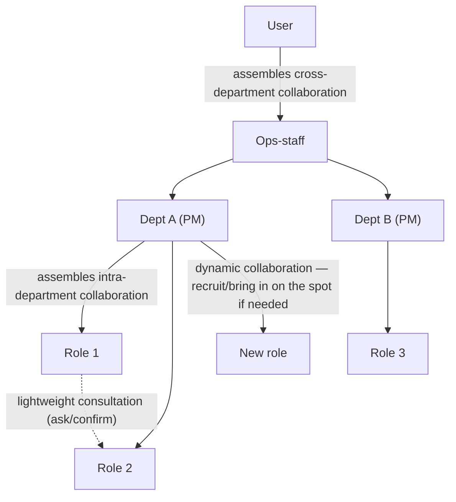
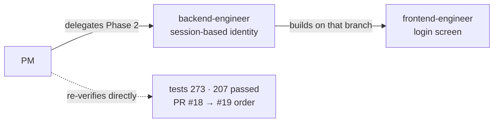

# Where and how collaboration happens

::: tip Where you are — How It Works (4/5)
The fourth page in the [How It Works](/en/how-it-works) category. If [Lifecycle](/en/lifecycle)
followed the time axis of **one** department, this page covers what happens when **several run in
the same moment** — who assembles the execution graph, how two roles waiting on each other get
unstuck, and what actually passed between real departments. The next page,
[Operator vs Meta Mode](/en/operator-vs-meta-mode), is this category's final safety mechanism.
:::

If you've read this far, a question probably comes up — does collaboration happen only within a
department, or across departments too? The answer is both, and there's a third layer on top.

- **Intra-department collaboration** — roles within the same department collaborate under one
  shared accountability. A role that designs, a role that implements, and a role that tests split
  the work toward the same goal.
- **Cross-department collaboration** — different departments move together toward one goal. One
  department's output gets picked up and used by another.
- **Dynamic collaboration** — if a needed capability doesn't exist right now, a new role is
  created or an existing role is brought in on the spot. Nothing is fully staffed in advance; the
  team is assembled to fit the situation as it arises.

All three layers happen on top of the execution graph (who does what, when) seen in
[Organization Model](/en/organization-model) — the org chart only fixes who's accountable; how
collaboration actually happens is filled in on the fly by these layers.

```mermaid
flowchart TD
  U["User"] -->|"assembles cross-department collaboration"| M["Ops-staff"]
  M --> P1["Dept A (PM)"]
  M --> P2["Dept B (PM)"]
  P1 -->|"assembles intra-department collaboration"| R1["Role 1"]
  P1 --> R2["Role 2"]
  P2 --> R3["Role 3"]
  R1 -.->|"lightweight consultation (ask/confirm)"| R2
  P1 -->|"dynamic collaboration — recruit/bring in on the spot if needed"| R4["New role"]
```

Peers at the same level can freely exchange lightweight questions and confirmations, but **actual
work delegation is always reflected into the execution graph by the manager at that level** —
`project-manager` (the `project-manager` (PM) who runs a department) for members within a department,
`OP_ORCHESTRATOR` (Ops-staff) for departments.

## Two roles that stalled waiting on each other

This principle didn't stay on paper — it was actually put to the test.

::: info Revisiting the decision — assigned in parallel, yet both were stuck
**Problem**

- In real Operator-mode work in the `sfr-ssot-platform` department, a deadlock kept recurring —
  frontend work waiting on a backend decision, backend work waiting on a frontend decision.
- It happened every time the two roles' work hit a shared interface.
- Subagent delegation wasn't working properly at the time either, so a person ended up untangling
  each one by hand.

**Investigation**

- First we checked whether a "better tool" would fix it.
- Anthropic's write-up of its own multi-agent research system called domains with many
  inter-agent dependencies *"not a good fit for multi-agent systems today"*, and its own system
  deliberately used a synchronous hub-and-spoke structure coordinated by a lead agent.
- Real interdependency doesn't get resolved by "run it in parallel and hope it lines up."
- Source: `knowledge/decisions/2026-08-06-pm-interface-negotiation-before-parallel-work.md`

**Resolution**

- The rule already existed. The decision record quotes CONSTITUTION §10.6 as it read back when it
  was written in Korean — *"부서원 간 협업 → PM이 조립. 부서 간 협업 → 업무참모가 조립. 가벼운
  자문(질문/확인)은 같은 레벨 구성원끼리 자유롭게 주고받을 수 있다. 실제 작업 위임은 항상 해당
  레벨 관리자가 실행 그래프에 반영한다."* (Collaboration among members → assembled by the PM.
  Across departments → assembled by Ops-staff. Lightweight consultation flows freely between
  peers; actual delegation is always reflected into the execution graph by that level's manager.)
- What was missing was making it concrete enough for a PM to act on.
- If two roles depend on a shared decision (interface, contract, premise), the PM settles that
  decision **first**, in a short sequential step, and only **then** delegates the remaining
  independent work in parallel.

**The strength that followed**

- No new peer-to-peer channel was needed — actually following the existing "go through the
  manager" rule was enough to clear the deadlock.
- It didn't end at self-report: a follow-up check was left to verify, against real commits and
  tool calls, whether later parallel delegations (a) noticed the interdependency, (b) resolved it
  with a short sequential step, and (c) escalated only what truly couldn't be decided.
:::

That "no overlapping files" doesn't always mean safe is something this organization also learned
first-hand.

::: info Revisiting the decision — non-overlapping files didn't mean independent
**Problem**

- Reconstructing real multi-department session data showed PMs delegating even genuinely
  independent work (e.g. one backend endpoint and one frontend scaffold with no shared decision)
  sequentially.
- The first hypothesis ("the verification guideline doesn't separate 'check the result' from
  'dispatch the next task'") did not reproduce when tested with a scenario.

**Investigation**

- That scenario was a spike with no real repository writes. In a real repository, two roles
  touching **the same checkout** at once carry real risks: git state races, half-written files,
  one breaking the other's build.
- So the PM's "caution" may not have been an instruction flaw but a legitimate reaction to a real
  risk it had no way to remove.
- The first isolation mechanism tried (`Agent`'s `isolation: "worktree"`), as the decision record
  corrects, *"isolates the caller's own already-running repository ... never an arbitrary target
  path named in a delegation prompt"* — and a member really did commit into the wrong repository
  because of it.
- Source: `knowledge/decisions/2026-08-28-parallel-work-needs-isolation-not-just-independence.md`

**Resolution**

- It was framed as a separate failure mode — **physical collision** — distinct from logical
  interdependency (the box above).
- Before a parallel delegation that touches the same repository, first confirm that the execution
  mechanism **actually isolates** each branch. If it does, delegate in parallel and reconcile at
  the end; if not, sequential is the safe default.
- Today the PM creates a separate workspace inside the target repository with
  `git worktree add .wt/<branch> <branch>` and delegates into it.

**The strength that followed**

- The question changed from "do the files overlap" to "does one side's output work as intended
  without the other."
- The same thing happened in the `aise-org-site` department that builds this site — the content
  pages and the i18n scaffold shared no files, yet the content's diagram syntax didn't work without
  the scaffold's rendering support.
:::

## What it actually looked like inside one department

Here's how those two decisions look in real work, using the login feature (F9) in the
`sfr-ssot-platform` department (2026-08-20, that department's `project-record.md` Ledger row
`f9-auth-phase2-phase3-2026-08-20`).

```mermaid
flowchart LR
  PM["PM"] -->|"delegates Phase 2"| BE["backend-engineer<br/>session-based identity"]
  BE -->|"builds on that branch"| FE["frontend-engineer<br/>login screen"]
  PM -.->|"re-verifies directly"| V["tests 273 · 207 passed<br/>PR #18 → #19 order"]
```

- **The order was settled first.** The backend had to finish attaching "who is logged in" to 8
  mutating endpoints (Phase 2) before the frontend could build a login screen against that
  contract (Phase 3). So it ran sequentially, not in parallel, and the frontend branch started on
  top of the backend branch.
- **It carried on after an interruption.** When the frontend delegation was cut off by an API
  usage limit, the PM first saved the uncommitted changes as a checkpoint commit (`4b79f6c`), then
  re-delegated with an explicit "don't rebuild what's already done."
- **Self-reports weren't taken at face value.** The PM re-ran 273 backend tests and 207 frontend
  tests itself, and confirmed that 5 failing E2E tests failed identically on `dev`, unrelated to
  this change.
- **Even the PR order was written down.** Since PR #19's base was PR #18's branch, a note was left
  for the next person that #18 had to be merged first.

## What actually passed between departments

"Different departments move together toward one goal" doesn't land well as an abstract
description. Between this organization's four departments (`sfr-ssot-platform`,
`simple-ragcurl-platform`, `llm-wiki-platform`, `aise-org-site`), three kinds of things actually
passed.

**1. Role definitions were reused across departments.** `backend-engineer` and
`frontend-engineer` were first recruited on 2026-07-20 for `sfr-ssot-platform`'s PoC, and
`devops-engineer` joined on 2026-07-27 (the `created` field in `instance/portfolio/index.yaml`).
Later `llm-wiki-platform` reused `backend-engineer`/`frontend-engineer` as-is, and this site
(`aise-org-site`) reused `frontend-engineer`/`devops-engineer`. Looking at the same
`devops-engineer`, `llm-wiki-platform` declined it ("no CI/CD automation need") while this site
adopted it ("GitHub Pages deployment is a real requirement") — and both records keep the reasons
for the different verdicts (each department's `project-record.md` Roster).

**2. One department consumed a tool another built.** The search service and `ragcurl-search` skill
(`aise-core/.claude/skills/ragcurl-search/`) built by `simple-ragcurl-platform` were actually used
by this site to find the investigation quotes for its decision boxes (2026-09-09 to 14, checking
the real `source_path` and similarity of each result), and `llm-wiki-platform` wired it into its
collection agent as an org-wide corpus search tool. The departments didn't hand keys to each
other directly; every API-key request went through Ops-staff.

**3. One department's output shook another department's evaluation.** The box below tells that
story — it's also a case where numbers from a scored evaluation led to a real decision.

::: info Revisiting the decision — following a falling evaluation score, number by number
**Problem**

- `simple-ragcurl-platform` scored its search quality on a 12-question gold set and got
  `mean_recall=0.694`; q3 and q10 missed entirely with `recall=0`.
- The easiest guess was "the gold documents are missing from the corpus."

**Investigation**

- The PM checked instead of guessing. It first confirmed in the DB that every gold document had
  been ingested, ruling out the "missing from corpus" hypothesis.
- It re-ran q3 and q10 at top-5/20/200 and compared the actual ranks and distances.
- The cause was in another department. The corpus included 9 curated summaries from
  `llm-wiki-platform` that mapped almost one-to-one onto these 12 questions, and they appeared in
  the top-5 for **all 12** questions (taking 1st and 2nd place for 10 of them).
- Questions with 1–2 gold documents kept their score because a gold document squeezed into the
  remaining slots; q3 and q10, with 5–6 gold documents each, lost every slot to the summaries and
  scored 0.
- For q10 the record also separated out an independent embedding weakness: the original
  `instance/roles/*.yaml` files didn't appear even in the top-200, summaries or not.
- Source: `instance/workspace/simple-ragcurl-platform/project-record.md` Ledger
  `ragcurl-eval-miss-root-cause-llm-wiki-decoy-2026-09-15`

**Resolution**

- Whether to fix the corpus scope or the labels was a judgment spanning two departments, so the PM
  escalated it instead of deciding (that department's OQ-10), and the operator decided to "exclude
  the curated content from the corpus."
- While executing, direct queries showed that removing it from the manifest and re-ingesting did
  not delete the 117 chunks already in the index, so those were deleted separately (6688 → 6571).
- Source: same file, Ledger `op-parallel-backlog-oq10-2026-09-15`

**The strength that followed**

- On re-evaluation, `mean_recall` rose from 0.694 to 0.744, and q3 recovered from 0.000 to 0.600.
- q10 stayed at `recall=0.000`, and the record says so — the separate embedding weakness
  identified earlier remained, exactly as predicted. Only the improved numbers weren't
  cherry-picked.
- The same day, Ops-staff re-ran the evaluation script itself and reproduced q3 `recall=0.600` and
  `mean_recall=0.744` (`knowledge/protocols/operational-watchlist/op-orchestrator-independent-verification.md`,
  2026-09-15 entry).
:::

To be candid: the dedicated record for cross-department comparison, mediation, and relay
(`coordination-record.md`, designed in `schema/OP_ORCHESTRATOR.md`) **has never actually been
created yet.** All three cases above are scattered across each department's `project-record.md`
and Ops-staff's verification notes; that dedicated record is still waiting for its first case.

## Wrap-up

**In one sentence.** Collaboration happens across three layers — within a department, across
departments, and ad hoc teaming — and "is it really safe to go parallel" only holds once the
manager (the PM or Ops-staff) has resolved shared decisions first and secured physical isolation.

**To check this page for yourself**

1. Find, in `CONSTITUTION.md` §10.6 ("Who assembles collaboration"), the sentence that separates
   lightweight consultation from actual work delegation. The original is now in English
   (converted 2026-09-17).
2. Compare how the "Intra-department execution graph" section of `schema/README.md` folds this
   page's two decision boxes into a single rule.
3. In `instance/workspace/simple-ragcurl-platform/project-record.md`, find the two Ledger rows
   where the evaluation numbers above (0.694, 0.744, q10's 0.000) are kept exactly as measured.

**Next.** How this collaboration differs from the moment the organization changes itself →
[Operator vs Meta Mode](/en/operator-vs-meta-mode).

*Source: `CONSTITUTION.md` §5, §10.6; `schema/README.md` "Intra-department execution graph";
`knowledge/decisions/2026-08-06-pm-interface-negotiation-before-parallel-work.md`,
`knowledge/decisions/2026-08-28-parallel-work-needs-isolation-not-just-independence.md`;
`instance/workspace/{sfr-ssot-platform,simple-ragcurl-platform,llm-wiki-platform,aise-org-site}/project-record.md`;
`instance/portfolio/index.yaml`.*
