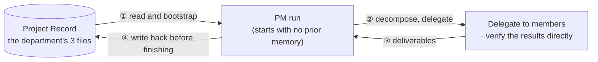

# What Happens When You Build a Company Around an AI That Forgets Every Session

Ask a coding assistant to fix a bug today, and something pretty impressive happens — it reads
the code, finds the cause, and writes a fix that actually works. Ask about a similar bug a month
later, in a new session, and it starts from zero. The model didn't suddenly get worse. Nothing it
learned in that session survived.

This isn't a flaw in any particular model. **It's what always happens when a session ends and
nothing gets written down.**

**AISE took that problem seriously and ran an experiment: what if you built an actual
organization around the AI?**

## Not a smarter prompt — an org chart

The difference between a solo AI session and AISE isn't "how smart is it." It's **what's left
after it's done**.

<figure>
<svg viewBox="0 0 720 380" role="img" aria-label="A solo AI session leaves nothing behind when it ends, while AISE writes to the department's Project Record so the next session can read it and continue">
  <defs>
    <marker id="arrow" viewBox="0 0 10 10" refX="8" refY="5" markerWidth="7" markerHeight="7" orient="auto-start-reverse">
      <path d="M 0 0 L 10 5 L 0 10 z" fill="currentColor" />
    </marker>
  </defs>

  <!-- divider -->
  <line x1="360" y1="10" x2="360" y2="370" stroke="currentColor" stroke-width="1" stroke-dasharray="3 5" opacity="0.35" />

  <!-- LEFT: solo session -->
  <text x="180" y="28" text-anchor="middle" font-size="13" font-weight="600">Solo AI session</text>

  <circle cx="180" cy="55" r="14" fill="none" stroke="currentColor" stroke-width="1.5" />
  <line x1="180" y1="69" x2="180" y2="95" stroke="currentColor" stroke-width="1.5" />
  <text x="180" y="112" text-anchor="middle" font-size="11">User</text>

  <line x1="180" y1="120" x2="180" y2="150" stroke="currentColor" stroke-width="1.5" marker-end="url(#arrow)" />
  <text x="196" y="138" font-size="10">question</text>

  <rect x="100" y="155" width="160" height="50" rx="6" fill="none" stroke="currentColor" stroke-width="1.5" />
  <text x="180" y="185" text-anchor="middle" font-size="12">AI session</text>

  <line x1="180" y1="205" x2="180" y2="235" stroke="currentColor" stroke-width="1.5" marker-end="url(#arrow)" />
  <text x="196" y="223" font-size="10">solved</text>

  <rect x="100" y="240" width="160" height="40" rx="6" fill="none" stroke="currentColor" stroke-width="1.5" />
  <text x="180" y="265" text-anchor="middle" font-size="12">Task done &#10003;</text>

  <line x1="180" y1="280" x2="180" y2="315" stroke="currentColor" stroke-width="1.5" stroke-dasharray="4 4" marker-end="url(#arrow)" />
  <text x="180" y="335" text-anchor="middle" font-size="11" opacity="0.7">Session ends</text>
  <text x="180" y="350" text-anchor="middle" font-size="11" font-weight="600" opacity="0.7">— nothing survives</text>

  <!-- RIGHT: AISE -->
  <text x="540" y="28" text-anchor="middle" font-size="13" font-weight="600">AISE</text>

  <circle cx="540" cy="55" r="14" fill="none" stroke="currentColor" stroke-width="1.5" />
  <line x1="540" y1="69" x2="540" y2="95" stroke="currentColor" stroke-width="1.5" />
  <text x="540" y="112" text-anchor="middle" font-size="11">User</text>

  <line x1="540" y1="120" x2="540" y2="150" stroke="currentColor" stroke-width="1.5" marker-end="url(#arrow)" />
  <text x="556" y="138" font-size="10">instruction</text>

  <rect x="460" y="155" width="160" height="40" rx="6" fill="none" stroke="currentColor" stroke-width="1.5" />
  <text x="540" y="180" text-anchor="middle" font-size="12">Ops-staff &#8594; department</text>

  <line x1="540" y1="195" x2="540" y2="225" stroke="currentColor" stroke-width="1.5" marker-end="url(#arrow)" />
  <text x="556" y="213" font-size="10">records</text>

  <rect x="450" y="230" width="180" height="45" rx="6" fill="none" stroke="#c1652a" stroke-width="2" />
  <text x="540" y="258" text-anchor="middle" font-size="12" font-weight="600" fill="#c1652a">Project Record</text>

  <path d="M 450 252 C 340 252, 340 175, 458 172" fill="none" stroke="#c1652a" stroke-width="1.5" marker-end="url(#arrow)" />
  <text x="360" y="150" text-anchor="middle" font-size="10" fill="#c1652a">the next session</text>
  <text x="360" y="163" text-anchor="middle" font-size="10" fill="#c1652a">starts here</text>

  <text x="540" y="300" text-anchor="middle" font-size="11" opacity="0.7">Sessions end,</text>
  <text x="540" y="315" text-anchor="middle" font-size="11" font-weight="600" opacity="0.7">the department's record doesn't</text>
</svg>
<figcaption>Left: the ordinary way everyone uses AI today, where nothing survives the end of a
session. Right: AISE, where a department's (project's) Project Record becomes the starting point
for the next session.</figcaption>
</figure>

The left side is what all of us do every day. The right side is AISE — the user instructs the
Ops-staff, the Ops-staff assembles a department (staff/PM/roles) to handle it, and the department
keeps writing to its own **Project Record** while it works. When the next session opens, that
department starts by reading this record — nobody has to re-explain where things left off
yesterday.

## Why an "organization," not a "workflow"

We could have just built this as a well-crafted script or an agent pipeline. There's a reason
AISE deliberately borrowed the shape of a **company** — departments, HR, a constitution, audits:

- **Accountability can't blur.** Every task has an owning department, and within that
  department, who did what is tracked. It never collapses into "the AI just handled it."
- **The same problem shouldn't be solved from scratch twice.** The trial and error one department
  goes through should accumulate as knowledge for the whole organization, so that a different
  department facing a similar problem later can reuse it.
- **The organization has to be able to grow on its own.** Not every role is pre-designed up
  front — new roles are recruited only when actual work reveals a real need.

At the same time, AISE doesn't copy human organizations wholesale either. What AI does
differently and better than people (never getting tired, following rules exactly, skimming
mountains of documentation instantly) is kept and leaned into; the problems human organizations
have (emotion, politics, reading the room) were designed out from the start, since those
conditions simply don't exist here.

*How these five principles came about continues in [Philosophy](/en/philosophy).*

## Actually making "it keeps a memory" real

It's easy to say — just keep a record. But there was one place we badly stumbled: **where**
exactly to keep it. This story is worth telling because most of the decisions on this site follow
the same shape: the obvious first answer turns out, once actually checked, to be wrong — and that
checking is what produces the real design.

::: info Revisiting the decision — an organization's memory has to live inside the repository
**Problem.** Early on, the org's own operating rules (git discipline, checking before relying on
a tool's features, portability principles, and the like) were written into the AI tool's
**personal memory feature**. It was convenient. But that's storage tied to one specific person, on
one specific machine. It collided head-on with the goal that "AISE should work the same way when
moved to a different machine, a different operator."

**Investigation.** So could the personal-memory storage location just be pointed back inside the
project? Checking the tool's own documentation directly showed it was blocked — changing that
personal-memory path via a project-committed setting was **deliberately designed to be ignored**
(*"Ignored if set in projectSettings ... for security"*). It's a safeguard against someone else's
personal notes leaking into your session when you clone their repo. In other words, **there was
no way at all to use the tool's personal memory as the organization's portable memory.**
(Source: `knowledge/decisions/2026-07-07-org-memory-must-be-project-local.md`)

**Resolution.** Rather than work around it, we split the two apart. **Facts about a specific
person** (an operator's background, say) stay in the tool's personal memory — that's the right
place for it, since it's supposed to differ from person to person. **Anything about how AISE
itself is built and run** moved unconditionally into files committed to the repository. Further,
any setting that affects how the org behaves (hooks, permissions, connected servers) was made to
default to project settings committed to the repo, not personal global settings.

**The strength that followed.** The bar became very simple — **if something isn't reconstructed
by a single `git clone`, and it still governs how the org behaves, it's in the wrong place.**
Credentials are the one deliberate exception (a new operator logging into their own tool isn't a
portability failure — it's just the normal setup step).
:::

So a single unit of work (a run) in this organization traces this cycle. Because memory lives in
**files**, not in a person, whoever executes it can start fresh every time without losing
anything.

## What exists right now

AISE didn't stop at a design document — right now, at this very moment, several departments are
actually building real software on top of this structure. This site itself is the output of one
of those departments.

And this site is organized into **four big groups.** The order is the story — it starts with why
we built it, then what it looks like, then actually using it, and ends with what that was worth.

| Category | The question it answers | What's inside |
|---|---|---|
| **1. [Background & Philosophy](/en/background)** | Why build this at all | The five principles · **What the usual way does differently** · What's different because it's AI |
| **2. [How It Works](/en/how-it-works)** | What it looks like and how it runs | The shape of the org · Staff & governance · A department's lifecycle · How collaboration works · Operator/Meta mode |
| **3. [In Practice](/en/in-practice)** | So how do you use it | **How to hand work to this org** · **Carrying on across sessions** |
| **4. [Evaluation & Value](/en/value)** | So what did it produce | How the structure absorbs change · What it is ultimately for |

Click a category name and you'll first get a short guide explaining **why its pages are best read
in that order.** Every page also opens with a paragraph telling you where you are in the overall
flow, so dropping in from the middle won't get you lost.

If you want the more precise source text, the ground truth behind every story here is, in the
end, a single file: `CONSTITUTION.md` — this site doesn't just copy those clauses, it unpacks why
they were decided that way.

## Quick guide — where to start reading

**In one sentence.** AISE isn't a trick for using AI better — it's an experiment in building
**memory, accountability, and growth** that survive the end of a session, shaped like an
organization around AI.

**Reading paths by what you're curious about**

| If you're wondering about... | Start here |
|---|---|
| I want to read it all, in order | [Background & Philosophy](/en/background) → [How It Works](/en/how-it-works) → [In Practice](/en/in-practice) → [Evaluation & Value](/en/value) |
| Just quickly, what's different from the usual way | The one comparison table in [What the usual way does differently](/en/real-world-vs-aise) |
| What shape the organization actually takes | [Organization Model](/en/organization-model) → [Staff & Governance](/en/staff-governance) |
| I want to hand work to this org | [How to hand work to this org](/en/usage) → [Carrying on across sessions](/en/handoff) |
| What the safeguards look like | [Operator vs Meta Mode](/en/operator-vs-meta-mode) → [Structural Principles / OCP](/en/structural-principles-ocp) |
| The terminology is unfamiliar | [Glossary](/en/glossary) |

**If you only have 5 minutes.** The two diagrams on this page, the seven-axis comparison table in
[What the usual way does differently](/en/real-world-vs-aise), and "Why two diagrams were needed"
on [Organization Model](/en/organization-model) will get you the core.

**Worth knowing before you read on.** Every info box on this site (**Revisiting the decision**) is
pulled from an actual decision record — read it as *problem → investigation → resolution → the
strength that followed*. Each box ends with the source file's path.
