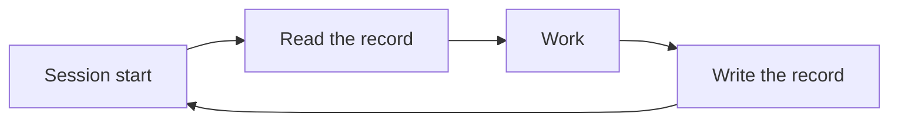

# Levels demo

::: lead
*Say it in one sentence, show the key points, keep the evidence folded.*
:::

## Key points

::: point The organization remembers through documents, not people
:::

::: point A **record** survives the session — it is written into the `Project Record` {#record-stays}
What is recorded when a session ends becomes the starting point of the next one. This body is folded until opened.
It is also in [the constitution](https://example.com/).

- First detail
- Second detail

<Cite ids="constitution,agents" />
:::

:::: point A point holding a table and an info box {#table-and-box}
| Kind | Meaning | Note |
|---|---|---|
| Rule | A document to obey | Constitution, governance |
| Decision | Why it was done that way | Reversible |

::: info Note
Info boxes nest inside a point body.
:::

<Cite ids="constitution-sec,operator-memo,guess,ops-log" />
::::

::: point A point holding a diagram {#diagram}

:::

<SourceTable />
