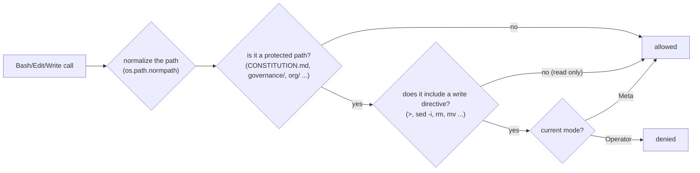

# Wearing a different hat each day

::: tip Where you are — How It Works (5/5)
The last page in the [How It Works](/en/how-it-works) category. If the previous four were all
about **"doing work,"** this page covers how **"the organization changing itself"** was separated
from it — it comes last because what's being protected only lands once you've seen the whole
structure. That closes out the structural explanation; the next category,
[In Practice](/en/in-practice), starts actually handing over work.
:::

The person operating this organization actually switches between very different roles several
times a day — assigning today's work requires an entirely different mode than reshaping the
organization itself.

- **Operator mode** — hands actual work to the organization exactly as it stands today (the same
  staff/PM system seen in [Staff & Governance](/en/staff-governance)). This covers everyday
  recruitment, and even reorganization that has been approved by the user — the organization's
  **instance** (who's doing what right now) changes, but the organization's **schema** (the
  structure itself, like the depth-2 pyramid) is left untouched.
- **Meta mode** — changes the organization itself. Adding or removing roles, revising a Workflow,
  changing the schema of the portfolio or asset catalog, or amending the CONSTITUTION or this very
  policy — all of that belongs here. The standing partner in this mode is the Management-staff,
  but it only analyzes and proposes — final approval and execution always go through the user.

<figure>
<svg viewBox="0 0 720 300" role="img" aria-label="Operator mode keeps the shape of the depth-2 pyramid unchanged and only changes the instance inside it (who is doing what), while Meta mode changes the pyramid's shape itself and always goes through user confirmation">
  <defs>
    <marker id="arrow-mode" viewBox="0 0 10 10" refX="8" refY="5" markerWidth="6" markerHeight="6" orient="auto-start-reverse">
      <path d="M 0 0 L 10 5 L 0 10 z" fill="currentColor" />
    </marker>
  </defs>

  <line x1="360" y1="10" x2="360" y2="290" stroke="currentColor" stroke-width="1" stroke-dasharray="3 5" opacity="0.35" />

  <text x="180" y="24" text-anchor="middle" font-size="13" font-weight="600">Operator mode</text>
  <path d="M 180 55 L 110 175 L 250 175 Z" fill="none" stroke="currentColor" stroke-width="1.5" />
  <line x1="156.7" y1="95" x2="203.3" y2="95" stroke="currentColor" stroke-width="1" opacity="0.6" />
  <line x1="133.3" y1="135" x2="226.7" y2="135" stroke="currentColor" stroke-width="1" opacity="0.6" />
  <text x="266" y="72" font-size="9" opacity="0.7">User</text>
  <text x="266" y="112" font-size="9" opacity="0.7">Department</text>
  <text x="266" y="152" font-size="9" opacity="0.7">Member</text>

  <circle cx="205" cy="163" r="9" fill="none" stroke="#c1652a" stroke-width="1.5" stroke-dasharray="3 3" />
  <text x="205" y="166" text-anchor="middle" font-size="9" fill="#c1652a">+1</text>
  <text x="180" y="200" text-anchor="middle" font-size="9" fill="#c1652a">new hire = instance change</text>

  <text x="180" y="270" text-anchor="middle" font-size="11" opacity="0.8">The shape (schema) stays,</text>
  <text x="180" y="286" text-anchor="middle" font-size="11" font-weight="600" opacity="0.8">only the people inside change</text>

  <text x="540" y="24" text-anchor="middle" font-size="13" font-weight="600">Meta mode</text>
  <path d="M 540 55 L 470 175 L 610 175 Z" fill="none" stroke="#c1652a" stroke-width="1.5" stroke-dasharray="5 4" />
  <path d="M 450 175 L 630 175 L 650 215 L 430 215 Z" fill="none" stroke="#c1652a" stroke-width="1.5" stroke-dasharray="5 4" />
  <text x="540" y="235" text-anchor="middle" font-size="9" fill="#c1652a">new layer = the schema itself changes</text>

  <text x="540" y="270" text-anchor="middle" font-size="11" fill="#c1652a">The shape itself changes —</text>
  <text x="540" y="286" text-anchor="middle" font-size="11" font-weight="600" fill="#c1652a">always after user confirmation</text>
</svg>
<figcaption>Operator mode keeps the organization's shape (the depth-2 pyramid) unchanged and only
changes the instance inside it; Meta mode changes that shape itself — the latter always goes
through user confirmation.</figcaption>
</figure>

## Why bother separating them

Mixing the two modes together risks the organization's own definition quietly shifting while
you're just handling routine work. So every session (or a specific unit of work within a session)
must explicitly declare one mode before it starts — Meta-level write authority is never granted
silently by default.

::: info Revisiting the decision — why the policy and the enforcement were put in entirely different places
**Problem.** The operator moves between Operator (running a department head handing out real
work) and Meta/Architect (evolving AISE's own structure) within the same day. Without an explicit
signal, there was a risk that the organization's own definition (§2.1's "clear accountability,"
§2.4's "the philosophy stays even as tools change") could quietly shift in the middle of ordinary
work.

**Investigation.** The operator wanted AISE to eventually be portable to other AI tools, while
also wanting to be asked for confirmation every time before a Claude-specific mechanism became
part of the organization's actual structure. Satisfying both at once meant **policy (what to
protect)** and **enforcement (how to block it)** had to sit in entirely different layers.
(Source: `knowledge/decisions/2026-07-07-operator-meta-mode-split.md`)

**Resolution.** `governance/MODE_POLICY.md` defines the two modes and the core protected paths
(`CONSTITUTION.md`, `governance/`, `org/`, `registry/`, `adapters/`, `memory/`) using
**tool-agnostic language only** — it says nothing about which mechanism enforces it. The
constitution, org chart, governance, and memory core stay tool-neutral, while the actual binding
to Claude Code (slash commands, PreToolUse hooks, subagent format) lives entirely inside
`adapters/claude-code/`. In the decision record's words, *"a different AI tool can be supported
later via a new adapter without touching core."*

**The strength that followed.** Supporting a different AI tool later only requires adding one new
adapter — the core policy never has to be touched (this open-for-extension/closed-for-modification
principle comes back again in [Structural Principles / OCP](/en/structural-principles-ocp)).
:::

Writing down the two modes and actually making the boundary hold were two different problems.

::: info Revisiting the decision — writing down a policy and actually enforcing it are different problems
**Problem.** Testing the hook that enforces this policy (`mode-gate.sh`) with genuinely
adversarial input revealed two real bypasses. ① The hook only watched the `Edit`/`Write`/
`NotebookEdit` tools, so writing via `Bash` with something like
`echo ... > governance/MODE_POLICY.md` sailed through regardless of mode. ② A path with `..`
mixed in, like `.../scratch/../governance/MODE_POLICY.md`, passed through even though it actually
pointed at a protected file, because the simple string match only checked whether the path
*started with* a protected prefix — this was confirmed by directly testing that exact payload and
seeing it slip past the block in Operator mode.
(Source: `knowledge/decisions/2026-07-07-mode-gate-hardening.md`)

**Investigation.** Neither bug was found just by reading the code — in the decision record's
words, *"Both bugs were found by directly testing the hook with adversarial-shaped inputs rather
than only reasoning about the code."* The path-traversal (`../`) bug in particular only came to
light after actually feeding it a real `../` payload, since the original code, with its
`case "$REL_PATH" in ...`, looked at a glance like it was checking properly.

**Resolution.** `Bash` was added to the list of watched tools, and paths were normalized with
`os.path.normpath` before comparison. `Bash` commands are blocked with a heuristic only when a
write directive (`>`, `tee`, `cp`, `mv`, `rm`, `sed -i`, etc.) and a protected path appear
**together** — explicitly documented as not a perfect defense, but a guard against "an honest
agent's everyday, accidental drift." That heuristic itself then created a brand-new trap — the
`>` character in the heredoc trailer this organization requires in commit messages
(`Co-Authored-By: ... <noreply@anthropic.com>`), combined with a commit message body that merely
mentions a protected path name, produced false-positive blocks on legitimate commits. On top of
that, while this very hook was being fixed, a literal quote embedded inside a bash single-quoted
string caused a total lockout of **every** tool call — twice.
(Source: `knowledge/decisions/2026-07-15-mode-gate-heredoc-false-positive-and-recurrence.md`)

**The strength that followed.** Instead of quietly fixing these failures and forgetting them, all
of them were written into the decision record, so the next person touching this file doesn't step
on the same trap (a literal quote inside a bash single-quoted string) again. And the whole episode
hardened a general principle for this organization — **security-adjacent logic like path matching
is never trusted just by reading the code; it must be directly tested with adversarial payloads
like `../`.**
:::

## Quick guide

**In one sentence.** Because the same person hands out work today and might reshape the
organization itself tomorrow, the policy (what to protect) stays tool-neutral at the constitution
layer, the enforcement (how to actually block it) lives in a tool-specific adapter, and the
latter is never trusted from reading alone — it's actually tested with adversarial input.

**To check this page for yourself**

1. Open `governance/MODE_POLICY.md` and confirm the list of protected paths never mentions any
   tool name at all.
2. Confirm that `.claude/hooks/mode-gate.sh` (the Claude Code adapter) actually watches `Bash` —
   the second decision box on this page explains why.
3. The work of building this very site (`aise-org-site`) is always done in Operator mode — no
   matter how much content gets edited, the CONSTITUTION and `schema/*` are never touched.

**Next.** That's the structural explanation done. Now **the actual procedure for handing work to
this organization** → [How to hand work to this org](/en/usage). That's where declaring a mode
becomes the first move in practice.

*Source: `governance/MODE_POLICY.md`; `knowledge/decisions/2026-07-07-operator-meta-mode-split.md`,
`knowledge/decisions/2026-07-07-mode-gate-hardening.md`,
`knowledge/decisions/2026-07-15-mode-gate-heredoc-false-positive-and-recurrence.md`.*
