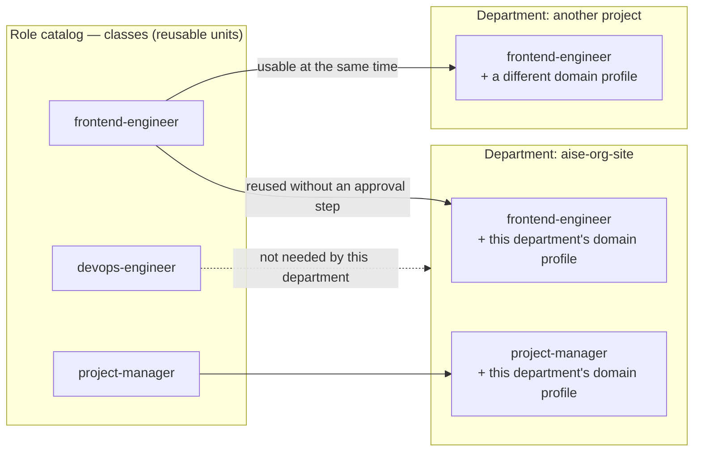

# One person still has to be able to see the whole thing

Turn the fourth of the five principles from [Philosophy](/en/philosophy), "accountability must be
unambiguous," into an actual structure, and this is what you get.

## Why two diagrams were needed

At first we tried to draw everything in a single org chart. But the lines showing "who is
accountable for this" kept diverging from the lines showing "who actually worked with whom
today." Forcing both onto one diagram made neither of them accurate. So we split it into two
diagrams entirely.

- **Organization Chart** — the **fixed accountability structure** that defines roles,
  responsibilities, authority, and reporting lines. It defines who answers to whom, but not how
  they'll actually collaborate today.
- **Execution Graph** — the **collaboration structure** that's actually formed on the fly while
  work gets done. Parallel work, temporary subagents, and cross-department collaboration all
  happen freely here. It uses the org chart as a foundation, but it isn't the org chart itself.

<figure>
<svg viewBox="0 0 640 380" role="img" aria-label="A depth-2 org chart (solid lines) with Department A and Department B under the user, each with two members underneath, overlaid by an execution graph (dashed lines) formed by cross-department collaboration between members and temporary subagent participation">
  <defs>
    <marker id="arrow-org" viewBox="0 0 10 10" refX="8" refY="5" markerWidth="6" markerHeight="6" orient="auto-start-reverse">
      <path d="M 0 0 L 10 5 L 0 10 z" fill="currentColor" />
    </marker>
  </defs>

  <circle cx="320" cy="30" r="14" fill="none" stroke="currentColor" stroke-width="1.5" />
  <text x="320" y="55" text-anchor="middle" font-size="12" font-weight="600">User</text>

  <line x1="320" y1="44" x2="320" y2="78" stroke="currentColor" stroke-width="1.5" />
  <line x1="320" y1="78" x2="172" y2="94" stroke="currentColor" stroke-width="1.5" marker-end="url(#arrow-org)" />
  <line x1="320" y1="78" x2="468" y2="94" stroke="currentColor" stroke-width="1.5" marker-end="url(#arrow-org)" />

  <rect x="100" y="95" width="140" height="40" rx="6" fill="none" stroke="currentColor" stroke-width="1.5" />
  <text x="170" y="120" text-anchor="middle" font-size="12">Dept A — PM</text>

  <rect x="400" y="95" width="140" height="40" rx="6" fill="none" stroke="currentColor" stroke-width="1.5" />
  <text x="470" y="120" text-anchor="middle" font-size="12">Dept B — PM</text>

  <line x1="170" y1="135" x2="112" y2="173" stroke="currentColor" stroke-width="1.5" marker-end="url(#arrow-org)" />
  <line x1="170" y1="135" x2="228" y2="173" stroke="currentColor" stroke-width="1.5" marker-end="url(#arrow-org)" />
  <line x1="470" y1="135" x2="412" y2="173" stroke="currentColor" stroke-width="1.5" marker-end="url(#arrow-org)" />
  <line x1="470" y1="135" x2="528" y2="173" stroke="currentColor" stroke-width="1.5" marker-end="url(#arrow-org)" />

  <rect x="60" y="175" width="100" height="40" rx="6" fill="none" stroke="currentColor" stroke-width="1.5" />
  <text x="110" y="200" text-anchor="middle" font-size="11">Member A1</text>

  <rect x="180" y="175" width="100" height="40" rx="6" fill="none" stroke="currentColor" stroke-width="1.5" />
  <text x="230" y="200" text-anchor="middle" font-size="11">Member A2</text>

  <rect x="360" y="175" width="100" height="40" rx="6" fill="none" stroke="currentColor" stroke-width="1.5" />
  <text x="410" y="200" text-anchor="middle" font-size="11">Member B1</text>

  <rect x="480" y="175" width="100" height="40" rx="6" fill="none" stroke="currentColor" stroke-width="1.5" />
  <text x="530" y="200" text-anchor="middle" font-size="11">Member B2</text>

  <path d="M 280 195 C 320 235, 320 235, 360 195" fill="none" stroke="#c1652a" stroke-width="1.5" stroke-dasharray="4 4" marker-end="url(#arrow-org)" />
  <text x="320" y="248" text-anchor="middle" font-size="10" fill="#c1652a">cross-department collaboration (execution graph)</text>

  <line x1="110" y1="215" x2="110" y2="250" stroke="#c1652a" stroke-width="1.5" stroke-dasharray="4 4" marker-end="url(#arrow-org)" />
  <rect x="40" y="250" width="140" height="40" rx="6" fill="none" stroke="#c1652a" stroke-width="1.5" stroke-dasharray="4 4" />
  <text x="110" y="275" text-anchor="middle" font-size="11" fill="#c1652a">subagent (temporary)</text>

  <text x="320" y="335" text-anchor="middle" font-size="11" opacity="0.7">solid = org chart (fixed accountability structure)</text>
  <text x="320" y="353" text-anchor="middle" font-size="11" fill="#c1652a">dashed = execution graph (collaboration assembled on the fly)</text>
</svg>
<figcaption>A depth-2 org chart (solid lines) of user — department — members, overlaid at any
given moment by an execution graph (dashed lines) formed through cross-department collaboration
and temporary subagent participation.</figcaption>
</figure>

## Why depth was capped at 2

The second question was "how deep should the org chart go?" The answer came, surprisingly, not
from organizational theory but from something very practical — **a single user must be able to
see the whole organization at a glance.** The deeper the chart, the more layers that person has
to review, until eventually nobody fully grasps what's actually happening. So the line
organization (the part that carries execution accountability) was fixed at exactly two levels —
**user — department — member.**

A department consists of a PM and members. The PM understands each member's role, responsibility,
and capability, and breaks down the large task handed down from the user into pieces its members
can actually handle.

## Why isn't the PM a "fourth staff"?

A natural question follows here. [There are three staff](/en/staff-governance), and the PM
leading a department seems just as important. Why isn't the PM pinned down as a staff role
instead of just being one role among others?

::: info Revisiting the decision — the PM is a recruited role, not a fixed seat
**Problem.** Once departments stopped being "permanent organizations" and became "project-scoped"
instead, there was no longer a reason to carve out a permanent department-head seat in the org
structure. At the same time, there was a worry running the other way — how do you prevent
so-called *skip-level* behavior, where the Ops-staff bypasses the department head and instructs
members directly?

**Investigation.** The first attempted fix was to block it with directory structure — nest member
files physically underneath the department head's, on the idea that this would make direct access
harder. The review came back negative — *"still bypassable by anything that already knew a target
subagent's name"*, and on top of that, it assumed departments were permanent units, which cut
against the direction of this whole reorganization.
(Source: `knowledge/decisions/2026-07-09-pm-is-a-recruited-role-not-a-fourth-staff.md`)

**Resolution.** We solved it with the **nature of the role**, not structure. We gave the PM the
authority of "the sole interface representing this department," and made it so members are only
ever created within the PM's own execution scope. That way, there's exactly one path by which the
Ops-staff can reach a department — the PM — so skip-level *has no way to happen*. In the words of
the decision record, it's **"a structural guarantee, not a documented courtesy"** — not a
politeness written down to be honored, but a structural fact. So the PM became an ordinary role,
recruited from and retired to the catalog just like any other, without the exemption from being
"recruited" that the three staff get.

**The strength that followed.** The org structure has one fewer fixed seat, yet the safeguard got
stronger, not weaker. A PM is freshly recruited for every department that needs one and vanishes
when it's done, so no unused organizational layer sits around.
:::

## How can the same role exist in multiple departments at once?

What happens if a "frontend-engineer" role is needed in three departments at the same time?
Copying the role definition three times is obviously wasteful. But managing it like "this person
is currently assigned to Department A" creates a whole new headcount-pool management problem —
someone has to track who's free across every department.

::: info Revisiting the decision — a role is a "class," not an "instance"
**Problem.** Reusing the same role across departments meant copy-pasting the definition. The
first candidate solution resembled a human organization — a "talent pool" model that splits a
reusable role *type* (class) from an *individual* (instance) that's assigned to a department and
accumulates experience there.

**Investigation.** Testing this instance concept against how execution actually works didn't
hold up. To quote the finding directly: every subagent invocation is always a *fresh, independent
execution* of the class definition, and **"There is no mechanism that keeps an 'instance'
idle-yet-remembering between assignments"** — there is no such thing, to begin with, as an
individual that rests between assignments while retaining memory. Modeling it would have required
inventing a ledger for idle/assigned status — to simulate something that, in reality, doesn't
exist.
(Source: `knowledge/decisions/2026-07-09-role-is-a-class-not-an-instance.md`)

**Resolution.** We dropped the instance concept and kept **only the class**. Fields in role files
that represented department affiliation (`tier`, `department`, `reports_to`) were removed
entirely. Instead, whatever context a role needs to know about a specific department is attached
as a **domain profile** at the moment it joins that department.

**The strength that followed.** Three things followed at once. ① The concurrency problem
disappeared — nothing ever becomes "checked out," so any number of departments can use the same
class at the same time with nothing to fight over. ② Using an already-recruited class in a new
department is **free, with no approval step**. ③ "Experience" isn't tied to any one individual's
identity — it accumulates in the organization's knowledge assets, so those lessons can later be
drawn on by *other* roles too.
:::

The same class can sit in two departments **at the same time** without interfering with each
other. What makes the difference isn't the class itself, but the domain profile HR attaches when
it joins a department.

## Quick guide

**In one sentence.** The org chart fixes only "who is accountable" (depth 2: user — department —
member); the actual shape of collaboration is assembled on the fly by the execution graph; and
the roles filling it in are reusable classes, not tied to any department.

**To check this page for yourself**

1. If you want to see the org chart, look at `instance/roles/` — the list of role classes that
   currently exist in the org. Check that there is **no** `tier` or `department` field. That's
   the direct result of the decision above.
2. If you want to see the execution graph, look at the **Ledger** in each department's
   `project-record.md` — what was delegated to which role is recorded in the actual form
   `delegation: A, B → C`.
3. To confirm reuse, look at `reuse_tier` in `instance/portfolio/index.yaml` — it shows which
   classes can be used by any department (`generic-technical`).

**Next.** Curious about the three staff who actually run this structure? →
[Staff & Governance](/en/staff-governance). Curious how a single department is born and comes to
an end? → [Lifecycle](/en/lifecycle).

*Source: `CONSTITUTION.md` §3, §10.1-§10.2 / from `knowledge/decisions/`:
`2026-07-09-pm-is-a-recruited-role-not-a-fourth-staff.md`,
`2026-07-09-role-is-a-class-not-an-instance.md`.*
