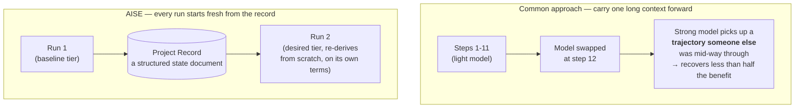

# Five principles, and why each one was needed

Going back to the problem we saw on [Home](/en/) — AI forgets when a session ends. That single
sentence actually produced five distinct decisions. Follow them one at a time, and you can see
why each one was necessary.

## 1. The organization is the center

The first thing that had to be decided was whether to build "a better way to use AI" or "an
organization where AI works." Choose the former, and you have to re-tune your prompts every time
GPT-5 becomes GPT-6, or Claude 6 replaces Claude 5. AISE chose the latter — the AI tool is a
member that can be swapped out at any time, and what shouldn't change is the organization's
philosophy and how it operates.

## 2. The organization must remember

Once the purpose was settled, the next question followed immediately — what does it take for
something to actually count as an "organization"? The first answer was memory. It's fine for a
person to forget — a colleague remembers, or the meeting minutes survive. An AI session vanishes
with no colleague and no minutes. So the first rule was: knowledge and experience that gets used
repeatedly must be preserved somewhere as a knowledge asset.

## 3. The organization must keep growing

Memory alone wasn't enough — writing something down and actually learning from it are two
different things. From this came the principle that the whole organization should get a little
more capable every time it faces a new problem. A problem solved once should be solved faster and
more accurately the next time — we decided that only if that gap accumulates does it deserve to
be called an "organization."

## 4. Accountability must be unambiguous

Separately from remembering and growing, "who is accountable for this" could not be allowed to
blur. Every task has an owner, and while collaboration is free, accountability doesn't blur along
with it.

One thing worth being explicit about — "owner" here does not mean the legal, final bearer of
responsibility. An AI agent can never stand in that spot. "Owner" is a label on the audit trail —
"which role should have reviewed this, if something goes wrong" — something you can trace back
to. Final responsibility always rests with the person operating this organization.

## 5. Make the most of what AI is good at

The last principle sets one more direction — that in order to uphold the first four, we don't
simply copy human organizations wholesale. The strengths of human organizations (accountability,
roles, collaboration, reporting, memory) are kept, but where AI is good at things people aren't —
never getting tired, following rules exactly, skimming mountains of documentation instantly,
performing several roles at the same moment — we don't needlessly whittle those down just to fit
the inertia of a human organization.

## One unexpected bonus

Principles are usually a trade — you give something up to gain something else. But when the
first and fifth principles above interlocked, one benefit rolled out that wasn't intended at
first. It's a case we found later while surveying other systems, and it was worth **recording
separately as a strength**.

::: info Revisiting the decision — starting fresh every time turned out to be an advantage
**Problem.** A single unit of work doesn't always need the same size of model. It's reasonable to
use a stronger model for stretches that need difficult judgment and a lighter one for mechanical
stretches. But **is it okay to switch models mid-task?**

**Investigation.** We checked this two ways. ① What's actually widely practiced turned out to be
**fixing the model per role at the start and never switching mid-run** (Anthropic's own
multi-agent research system, LangGraph, CrewAI, and AutoGen all let you configure per node, but
none promote mid-execution). ② A paper explained why — *"The Handoff Tax: Continuing Non-Native
Trajectories in LLM Agents"* (arXiv 2608.24358): when a stronger model picks up a weaker model's
**in-progress reasoning trajectory**, it recovers **less than half** of the quality benefit it
would have gotten by running the strong model from the start. It gets tied down by someone else's
half-built plan and possibly wrong intermediate conclusions.
(Source: `knowledge/decisions/2026-09-08-stateless-pm-sidesteps-handoff-tax.md`)

**Resolution.** What we confirmed here was that AISE had **already been avoiding this problem**.
A single AISE run doesn't inherit the reasoning of the previous execution — every time, it
bootstraps fresh from **structured records** (the department's three files). That's not a frozen
thought process; it's a status document written for a human to read. So the situation of
"inheriting someone else's trajectory" **structurally never arises.** This wasn't a countermeasure
we built — it's a property that fell out of keeping the first principle (tools are swappable
members) and the second (memory lives in records).

**The strength that followed.** Model tier became **a decision you can pick cleanly, fresh, every
run** — because there's no carry-over loss. Most agent frameworks carry one long context forward,
so "just make this one task use a stronger model" means paying a tax or throwing away state. AISE
loses essentially nothing by re-instantiating.
:::

Of course, it's not entirely free — a caveat: the **problem statement** a prior run leaves in the
record may itself reflect that run's tier, so the following run shouldn't accept it as gospel and
must **re-derive it**. This is a very weak, narrowly scoped form of the trajectory tax the paper
measured.

## Quick guide

**In one sentence.** Read in order, the five principles derive from a single question — should
we build an organization (1)? If so, what does it take to be one (2 memory, 3 growth, 4
accountability)? And how do we do that without just imitating people (5)?

**Where each principle shows up in the actual structure**

| Principle | Where it actually shows up |
|---|---|
| 1. The organization is the center | [Ultimate Goal](/en/ultimate-goal) — why not a framework |
| 2. The organization remembers | The Project Record cycle on [Home](/en/), knowledge accumulation in [Lifecycle](/en/lifecycle) |
| 3. Continuous growth | The 6-stage cycle in [Lifecycle](/en/lifecycle) |
| 4. Clear accountability | [Organization Model](/en/organization-model), [Staff & Governance](/en/staff-governance) |
| 5. Leaning into AI's strengths | [AI-Native Principles](/en/ai-native-principles) |

**Want to check it yourself.** The source text is `CONSTITUTION.md` §2.1-§2.5, five clauses. It's
only five sentences, so reading them once lets you compare directly against how this page
unpacked those five lines.

**Next.** How these five actually turn into a concrete shape of organization →
[Organization Model](/en/organization-model).

*Source: `CONSTITUTION.md` §2.1-§2.5 /
`knowledge/decisions/2026-09-08-stateless-pm-sidesteps-handoff-tax.md`.*
