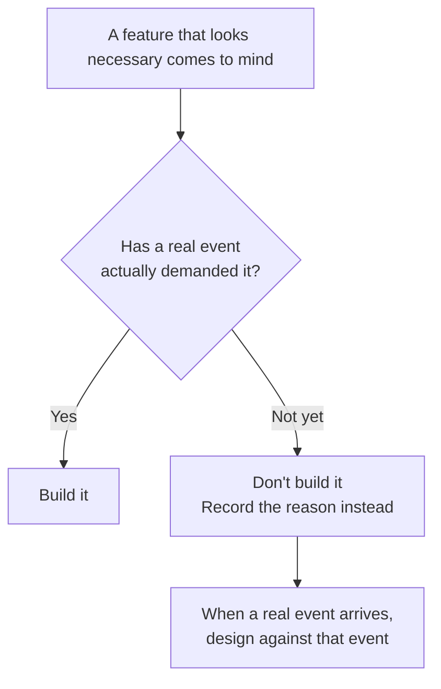

# What the usual way does differently

::: tip Where you are — Background & Philosophy (2/3)
The second page in the [Background & Philosophy](/en/background) category. If
[Philosophy](/en/philosophy) covered "why we decided to build an organization," this page lines
up **where that choice actually diverges from the way things are usually done**, across seven
axes. The next page, [AI-Native Principles](/en/ai-native-principles), collects only the
differences that AI made possible.
:::

The five principles on the previous page are, read on their own, hard to disagree with. It must
remember, it must grow, accountability must be clear — who would argue? **The difference comes
after that.** It comes from what you decide *not* to build while saying the same words.

So this page doesn't boast; it only **compares**. And the "usual way" side isn't invented either
— every contrast below is a comparison point this organization **wrote into its own decision
record** while actually making that decision. The original filename for each axis is listed right
below the table, so you can check for yourself.

## The seven axes at a glance

| Axis | The usual way | AISE |
|---|---|---|
| **1. The org's memory** | People's heads, scattered chat logs, whatever personal memory the tool offers | Files committed to the repository. If a single `git clone` can't reconstruct it, it's in the wrong place |
| **2. When you draw the org chart** | Pick a domain, pre-design the roles, then fill the seats | Start empty. A role is created only when real work reveals the gap |
| **3. A member's identity** | One person occupies one seat (a talent pool) | A role is a **class**. Unbound to any department, and no contention even when several use it at once |
| **4. Where experience accumulates** | The individual gets more proficient; performance reviews record it | It accumulates in the **organization**, not the individual. A per-role proficiency mechanism has now been deferred twice |
| **5. Reporting lines** | Urgent things go straight to whoever's doing the work | Everything goes through the staff figure, with no exception however trivial (no skip-level) |
| **6. Permissions** | Draw up a fine-grained access-control matrix | Coarse approval plus judgment. The real boundary sits at the OS/infra layer, not the application |
| **7. How a session is picked up** | Hand the in-progress context straight to the next execution | Don't hand it over. **Re-derive from the record** every time |

**The document where each axis's contrast is actually written** (all under `knowledge/decisions/`):

1. `2026-07-07-org-memory-must-be-project-local.md`
2. `2026-07-07-recruit-on-demand-phase-1.md`
3. `2026-07-09-role-is-a-class-not-an-instance.md`
4. `2026-07-07-role-proficiency-idea-deferred.md` +
   `2026-09-02-role-proficiency-idea-still-deferred.md`
5. `2026-07-07-line-staff-org-model.md`
6. `2026-07-09-provisioning-scope-is-a-judgment-not-a-mechanism.md` +
   `2026-07-14-folder-scoped-access-control-deferred.md`
7. `2026-09-08-stateless-pm-sidesteps-handoff-tax.md`

One thing stands out. **Four of the seven are decisions to *not* build something.** That's true
of 2, 4, and 6, and 7 is a case where not building it turned out to be the advantage. In this
organization, roughly half of the design documents are not about what got built but about **what
deliberately didn't, and why.**

## We didn't draw the org chart first

Usually the org chart comes first. You sketch what teams you need, then fill them with people.
AISE inverted that order, and it wasn't convenience — it was an explicit decision.

::: info Revisiting the decision — we chose to start with an empty org chart
**Problem.** Starting Phase 1 meant having a starting org chart. But the operator's actual scope
of work was too broad — embedded SW, firmware simulation tooling, general software engineering,
plus CI/CD and service development. The moment you pick one domain and draw the chart around it,
you have to unwind all of it if that pick was wrong.

**Investigation.** The decision record wrote the risk down like this — *"Pre-picking a domain
would have overfit Phase 1 to a guess, contradicting §4.1 itself (recruitment happens in response
to a real gap, not speculatively) and risking premature structure the operator would have to
unwind later."* A pre-chosen domain produces a structure overfit to a guess, and that structure
becomes a debt the operator personally has to unwind.
(Source: `knowledge/decisions/2026-07-07-recruit-on-demand-phase-1.md`)

**Resolution.** We started with the org chart deliberately empty. *"A role is only created ...
when a real Operator-mode task reveals a capability the organization doesn't yet have. No
top-down pre-design of roles by domain."* A role exists only once real Operator-mode work
surfaces "we don't have this capability."

**The strength that followed.** A side effect came along: the recruitment procedure itself became
**a working mechanism rather than a diagram**. In the record's own words, it *"doubles as a live
test of the Recruitment lifecycle rather than a diagram exercise."* Had the chart been
pre-filled, the recruitment mechanism would have sat unused, alive only on paper.
:::

## We don't let members build a career

This is where AISE diverges most from a human organization, and it got confirmed twice.

::: info Revisiting the decision — we started building a talent pool, stopped, and stopped again
**Problem.** The first picture that came to mind was natural. If the same role (say, market
research) is needed in several departments at once, you could define a reusable role **type** and
place an **instance** of it in each department. Have that instance move between assignments and
accumulate its own experience, and you have exactly a **talent pool**. The decision record uses
that very phrase — *"mirroring a 'talent pool.'"*

**Investigation.** Pressing that instance concept against how execution actually works, there was
no floor underneath it — *"a subagent invocation is always a fresh, independent run of a class
definition ... There is no mechanism that keeps an 'instance' idle-yet-remembering between
assignments."* An instance that sits idle while remembering simply cannot exist, and imitating
one would have meant inventing **bookkeeping to simulate an identity that isn't there**
(idle/assigned status, pool management).
(Source: `knowledge/decisions/2026-07-09-role-is-a-class-not-an-instance.md`)

**Resolution.** We dropped the instance and kept only the **class**. Every instance-shaped field
(department, tier) was removed from the role file, and experience was routed to the organization
instead of the individual — *"'Experience' doesn't live in any one class's identity — it lives in
`org/retrospectives/` → `portfolio/` `insight` entries."*

Then in September 2026 the same question came back. Five role-classes were now being reused
across four departments, so wasn't the original condition ("revisit once a real role does
recurring work") met? **We looked again, and deferred again** — *"the letter of the original
trigger condition looks met, but the substance behind it ... is not."* Several departments had
used the same class for different one-off projects; no single role had done the same kind of work
twice and hit friction. Instead we rewrote the revisit condition to be far sharper: revisit once
a real record shows a second occurrence **visibly re-deriving something the first had already
worked out.**
(Source: `knowledge/decisions/2026-09-02-role-proficiency-idea-still-deferred.md`)

**The strength that followed.** The concurrency problem vanished entirely — using a class doesn't
put anything "on loan," so there's no scarce resource to contend over. Any number of departments
can use the same role simultaneously. And because we deferred twice, **the revisit condition
moved from "someday" to "when this specific scene shows up in the record."** Postponing something
can get more precise the second time too.
:::

## We didn't build a permissions matrix

"Who can access what" is usually solved with a table. You draw a role × resource matrix and
assume finer is safer. This organization met that temptation twice and built no table either time.

::: info Revisiting the decision — scaffolding around a gate doesn't sharpen the judgment behind it
**Problem.** Once roles became shared classes crossing departments, a real worry appeared. If one
department gets a permission approved because it needed it, that grant **follows the class onto
every unrelated department that reuses it later**. A ratchet that only ever turns one way.

**Investigation.** The first prescription that came to mind was a new mechanism — a
project-scoped permissions file per department. On inspection it **added no safety at all**:
*"the same single decision-maker (자산참모) would still decide what goes in the new file, using
the same judgment."* Same person, same judgment, new file. So the premise got re-examined, and it
turned out a request about **scope** (which data, which credential) had always been a different
kind of question from an approval about **capability** (is this tool allowed at all).
(Source: `knowledge/decisions/2026-07-09-provisioning-scope-is-a-judgment-not-a-mechanism.md`)

**Resolution.** No new schema, no per-department permissions file. Instead the line the judgment
has to draw was written into the document explicitly — **(a) coarse capability approval** is what
provisioning governs; **(b) fine-grained scope/credential issuance** isn't provisioning's job at
all. A request that looks like (b) is read not as a need for a new approval tier but as **a
signal that the catalog entry itself is defined too coarsely.**

Five days later the same family of question arrived in a different shape — "what if we want a
role never to read one specific folder?" Again nothing was built; instead we recorded where the
real boundary is. An application-layer hook is inherently best-effort, and *"The strictly
stronger boundary ... is OS/infrastructure-level isolation ... this is tool-agnostic ... and
doesn't depend on the agent's cooperation at all."* We also wrote down that a hook, if ever
built, is a convenience layer on top of that boundary and not the boundary itself. And the reason
for not starting was simple — *"No department has actually hit this need — the whole discussion
was prompted by a hypothetical, not a real task."*
(Source: `knowledge/decisions/2026-07-14-folder-scoped-access-control-deferred.md`)

**The strength that followed.** Both times resolve into the same sentence — *"Adding scaffolding
around a gate that already can't be skipped doesn't make the judgment behind it any sharper;
documenting the actual distinction the judgment needs to draw does."* Instead of stacking more
scaffolding around a gate nobody can bypass, we wrote down the distinction that gate actually has
to draw. As a result there's still no permissions table — there's **a sentence about what the
judgment must distinguish.**
:::

## So what did we give up

Worth writing down honestly. The choices above aren't free.

- **We gave up some predictability.** A pre-drawn org chart lets you see "what does our
  organization have" at a glance. Recruiting only on demand means that picture is always
  incomplete.
- **We gave up the individual's growth curve.** There's currently no guarantee the same role is
  faster the second time. Org-level knowledge accumulation stands in for it, but that isn't the
  same thing as individual proficiency. As seen above, this is a **deliberately unresolved
  state**, not something we claim to have solved.
- **We gave up fine-grained permission control.** Right now this organization has no mechanism
  for "this role cannot read that folder." We'll build one if it becomes necessary — we've only
  written down that it should then live at the infrastructure layer, not in a hook.
- **We accept a little duplicated work.** Re-deriving from the record every time also means
  re-thinking something a previous run already thought. The last box on
  [Philosophy](/en/philosophy) calls this cost "a very weak and bounded form of the trajectory
  tax."

## And the biggest difference of all

There's one axis we left out of the table: **the organization changing itself.**

Usually that's just another kind of work — you're fixing code, and you fix the process along the
way. AISE split the two into entirely different modes, and made the organization's core documents
untouchable without a mode declaration. That story is too big to compress into one table row, so
it lives separately in [Operator vs Meta Mode](/en/operator-vs-meta-mode).

## Quick guide

**In one sentence.** Of the seven points where AISE diverges from the usual way, four are not
"something extra we built" but **"something we chose not to build until a real event demanded
it."**

**Want to check it yourself.** The numbered list under the table above is all real filenames —
open them under `knowledge/decisions/`. Skimming just the `## Why` sections is enough to get a feel
for how this organization justifies the not-doing side. The source for the overall direction is
`CONSTITUTION.md` §1, whose four-line problem statement ("Individuals forget. / Organizations
fail to accumulate enough experience. / The same problems get solved over and over. / AI has
remarkable capability, but once a session ends it doesn't remain part of the organization.") is
the starting point of every contrast here.

**Next.** To collect only the differences AI made possible →
[AI-Native Principles](/en/ai-native-principles).

*Source: `CONSTITUTION.md` §1, §2.1-§2.5, §4.1 /
`knowledge/decisions/2026-07-07-recruit-on-demand-phase-1.md` /
`knowledge/decisions/2026-07-07-line-staff-org-model.md` /
`knowledge/decisions/2026-07-07-org-memory-must-be-project-local.md` /
`knowledge/decisions/2026-07-07-role-proficiency-idea-deferred.md` /
`knowledge/decisions/2026-07-09-role-is-a-class-not-an-instance.md` /
`knowledge/decisions/2026-07-09-provisioning-scope-is-a-judgment-not-a-mechanism.md` /
`knowledge/decisions/2026-07-14-folder-scoped-access-control-deferred.md` /
`knowledge/decisions/2026-09-02-role-proficiency-idea-still-deferred.md` /
`knowledge/decisions/2026-09-08-stateless-pm-sidesteps-handoff-tax.md`.*
