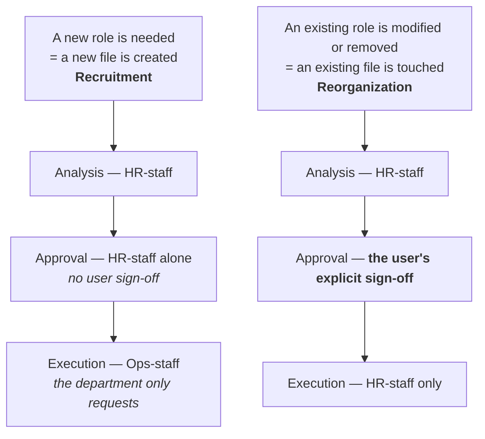

# Why execution accountability and operating accountability are separated

While departments do the work, there had to be a separate role watching over the whole
organization so nothing drifts out of alignment. But simply slotting that role into the
[depth-2 pyramid](/en/organization-model) causes a problem — the user would have to go through
this role for every single department, quietly deepening the hierarchy. So these roles were kept
entirely outside the depth count instead — the same way staff officers or an executive office in
a real company aren't counted as a level in the hierarchy chart.

## Three staff, all peers

- **Ops-staff** — turns the user's intent into actually executable work, and assembles the most
  suitable department.
- **HR-staff** — owns recruitment and reorganization exclusively. Doesn't get involved in
  executing work itself.
- **Asset-staff** — owns which roles can actually use which tools, MCP servers, and skills
  (provisioning).

None of the three carry execution accountability, they're all peers, and none reports to another.
The Ops-staff never decides HR or provisioning matters directly either — it only requests them
from the relevant staff when needed.

<figure>
<svg viewBox="0 0 640 300" role="img" aria-label="A line organization from user to department to members, and three peer staff (Ops-staff, HR-staff, Asset-staff) outside the depth count who coordinate between the user and departments, plus a separate Management-staff active only in Meta mode">
  <defs>
    <marker id="arrow-sg" viewBox="0 0 10 10" refX="8" refY="5" markerWidth="6" markerHeight="6" orient="auto-start-reverse">
      <path d="M 0 0 L 10 5 L 0 10 z" fill="currentColor" />
    </marker>
  </defs>

  <text x="160" y="18" text-anchor="middle" font-size="12" font-weight="600">Line (depth 2)</text>
  <circle cx="160" cy="34" r="12" fill="none" stroke="currentColor" stroke-width="1.5" />
  <text x="160" y="65" text-anchor="middle" font-size="11">User</text>
  <line x1="160" y1="46" x2="160" y2="83" stroke="currentColor" stroke-width="1.5" marker-end="url(#arrow-sg)" />

  <rect x="100" y="85" width="120" height="40" rx="6" fill="none" stroke="currentColor" stroke-width="1.5" />
  <text x="160" y="110" text-anchor="middle" font-size="12">Department (PM)</text>
  <line x1="160" y1="125" x2="160" y2="158" stroke="currentColor" stroke-width="1.5" marker-end="url(#arrow-sg)" />

  <rect x="100" y="158" width="120" height="40" rx="6" fill="none" stroke="currentColor" stroke-width="1.5" />
  <text x="160" y="183" text-anchor="middle" font-size="12">Member</text>

  <text x="495" y="18" text-anchor="middle" font-size="12" font-weight="600">Staff — outside the depth count</text>
  <path d="M 220 100 C 300 100, 330 90, 392 82" fill="none" stroke="currentColor" stroke-width="1.5" stroke-dasharray="3 4" />
  <text x="300" y="90" text-anchor="middle" font-size="9" opacity="0.7">consulted only when needed</text>

  <rect x="392" y="65" width="86" height="40" rx="6" fill="none" stroke="currentColor" stroke-width="1.5" />
  <text x="435" y="90" text-anchor="middle" font-size="11">Ops-staff</text>

  <rect x="486" y="65" width="86" height="40" rx="6" fill="none" stroke="currentColor" stroke-width="1.5" />
  <text x="529" y="90" text-anchor="middle" font-size="11">HR-staff</text>

  <rect x="580" y="65" width="52" height="40" rx="6" fill="none" stroke="currentColor" stroke-width="1.5" />
  <text x="606" y="90" text-anchor="middle" font-size="10">Asset<tspan x="606" dy="11">-staff</tspan></text>

  <line x1="478" y1="85" x2="486" y2="85" stroke="currentColor" stroke-width="1.5" stroke-dasharray="2 3" />
  <line x1="572" y1="85" x2="580" y2="85" stroke="currentColor" stroke-width="1.5" stroke-dasharray="2 3" />
  <text x="512" y="122" text-anchor="middle" font-size="10" opacity="0.7">peers · no execution accountability · don't report to each other</text>

  <path d="M 435 105 C 400 135, 260 130, 222 108" fill="none" stroke="#c1652a" stroke-width="1.5" stroke-dasharray="4 4" marker-end="url(#arrow-sg)" />
  <text x="330" y="150" text-anchor="middle" font-size="10" fill="#c1652a">assembles department · instructs</text>

  <rect x="452" y="200" width="178" height="52" rx="6" fill="none" stroke="#c1652a" stroke-width="1.5" stroke-dasharray="4 4" />
  <text x="541" y="221" text-anchor="middle" font-size="11" fill="#c1652a">Management-staff</text>
  <text x="541" y="238" text-anchor="middle" font-size="9" fill="#c1652a">Meta mode only · outside the depth count</text>
  <line x1="529" y1="105" x2="541" y2="200" stroke="#c1652a" stroke-width="1.5" stroke-dasharray="4 4" />
  <text x="600" y="180" text-anchor="middle" font-size="9" fill="#c1652a">not involved in execution</text>
</svg>
<figcaption>Left: the depth-2 line organization. Top right: the three staff, peers outside the
depth count. Bottom right: the Management-staff, uninvolved in Operator-mode execution and active
only in Meta mode.</figcaption>
</figure>

## Why accountability was split into two kinds

Mixing **execution accountability** (the technical accuracy of a deliverable, carried by a
department) with **operating accountability** (carried by each of the three staff in their own
domain) makes "whose fault is this" blur again the moment something goes wrong. This is where the
fourth principle from [Philosophy](/en/philosophy) shows up again.

## The story of when there was only one staff

There are three now, but at first there was only **one** staff — a single role that both handed
out work, hired people, and decided tool permissions. What we actually ran into here, and how it
was solved, is the case that teaches the most about this organization, so it's worth telling in
full.

::: info Revisiting the decision — why recruitment authority was pulled away from the staff role
**Problem.** A single staff role being able to freely change the org's composition is a problem.
But requiring the user to approve every single hire causes approval fatigue. Neither option
worked.

**Investigation.** The first attempt was to **detect it technically** — could you automatically
tell "simple recruitment" apart from "reorganization" from file-change history? The investigation
found this direction kept getting defeated — creating a new file and deleting the old one,
renaming with `mv`, or just swapping the `id:` value inside a file all slipped through. The
decision record's conclusion is exact: these safeguards *"kept being defeated by new bypass
shapes"*, because **"does this operation deserve extra scrutiny" is a semantic judgment that no
path-matching mechanism can fully resolve.**
(Source: `knowledge/decisions/2026-07-07-hr-orchestrator-split.md`)

**Resolution.** We gave up on detection and switched to **structure**. ① Recruitment/reorg
authority was pulled out entirely and handed to a separate staff role (HR-staff). ② Further,
*analysis, approval,* and *execution* were split across different actors, so no single actor could
decide and execute at the same time. And the decisive move — **a department has zero authority
over existing role files. All a department can do is request a new role, and even the file for
that new role is actually created by the Ops-staff, not the department.** This turns "is it a new
file or an existing one" into a mechanically checkable line that separates recruitment from
reorganization. Instead of trying to classify ambiguous cases after the fact, **the organization's
design itself was changed so ambiguous cases can't arise.**

**The strength that followed.** Recruitment stays cheap (HR-staff approves alone — no user
fatigue). Meanwhile only reorganization, which can shake up the existing structure, requires the
user's explicit sign-off. In other words, **human confirmation is spent only on the one thing
that's actually a real signal**, and everything else flows automatically.
:::

The key to this design is that the line separating the two paths is not "intent," but
**"is it a new file, or an existing one"** — because it's decided by fact, not judgment, there's
no room to route around it.

## But why three?

The second staff role is explained by the recruitment problem. The third (Asset-staff) came from
somewhere completely different.

::: info Revisiting the decision — a tool belongs to the organization, not the individual
**Problem.** Working out what a newly joined role should be given revealed that two things were
entirely different in nature — **persona** (its own expertise and accountability, belonging to
the individual) and **provisioning** (tools, MCP, model, skills — the actual means of acting).
The latter is like a company issuing a laptop — it **belongs to the organization, not the
individual.**

**Investigation.** The first attempt was to create an ordinary department — a "general affairs"
team — to own this. But two things got in the way. ① This function isn't something an
organization can take or leave — translating an organization's real constraints into "what's
allowed" is itself just as universal a function as HR — except **what gets approved varies
completely by deployment** (one org has security standards, another has cost/licensing
standards). ② More decisively, if an ordinary department owned this, it creates a circularity —
**"who approves that department's own provisioning?"** — exactly the same circularity that HR-staff
was created to avoid.
(Source: `knowledge/decisions/2026-07-07-as-orchestrator-provisioning-split.md`)

**Resolution.** We applied the same remedy as with HR — broke the circularity by making it a
**third staff role directly defined by the constitution**, not a recruited department. Naming it
**Asset-staff** rather than "security team" or "general affairs" was deliberate too: the name has
to work across any deployment (since the kind of constraint varies by deployment), leaving only
the actual policy content specific to that deployment. So the roles settled into three —
**HR-staff decides who exists, Ops-staff decides what happens, Asset-staff decides what can be
used.**

**The strength that followed.** The three are independent gates. **Approval to be recruited does
not imply provisioning approval** — being hired doesn't automatically hand you tools; a separate
judgment has to be passed as well.
:::

There's one more interesting postscript to this gate.

::: info Revisiting the decision — instead of bolting more onto the gate, we wrote down the standard for the judgment
**Problem.** Once roles became reusable classes not tied to a department, a side effect showed
up — if one department grants a class some authority because it needs it, that authority
**permanently sticks to every future department that reuses that class.** Like a ratchet that only
tightens in one direction, the principle of least privilege slowly erodes.

**Investigation.** The first candidate fix was a new mechanism — a separate
`provisioning.yaml` per department. On review, this made **nothing** safer — the same Asset-staff
would end up filling in that new file with the same judgment anyway. So we re-examined the
premise, and it turned out that a request about **scope** (which data, which credentials) was
never something provisioning — which deals with **capability** (whether a tool can be used at
all) — was meant to record in the first place. That's a runtime parameter, like which file a
`Read` call happens to read.
(Source: `knowledge/decisions/2026-07-09-provisioning-scope-is-a-judgment-not-a-mechanism.md`)

**Resolution.** No new schema, no per-department file. Instead, the Asset-staff's own document
was given an explicit **line for the judgment to draw** — (a) coarse capability approval is
provisioning's job, (b) fine-grained scope and credential issuance is not provisioning's job. And
if a request that looks like (b) shows up, that's read as **a signal that the catalog entry is
defined too coarsely**, and instead of adding a new approval layer, the catalog is rewritten at
the right granularity.

**The strength that followed.** *"Adding scaffolding around a gate that already can't be skipped
doesn't make the judgment behind it any sharper"* — bolting structure onto a gate that's already
unbypassable doesn't sharpen the judgment behind it. This decision stands as **a case of not
mistaking a problem for a mechanism**, and thanks to it, the organization didn't end up with a
single additional file to manage.
:::

## The Meta mode partner

Separate from these three, there's a **Management-staff** who analyzes and proposes evolution of
the organization's own schema (CONSTITUTION, schema, governance) — but it's active only in Meta
mode, and any actual change always goes through user confirmation. The full distinction continues
in [Operator vs Meta Mode](/en/operator-vs-meta-mode).

## Quick guide

**In one sentence.** The three staff stand outside the depth count as peers, each owning exactly
one different question — **who exists (HR)? what happens (Ops)? what can be used (Asset)?** —
and this very separation is the safeguard that keeps any single actor from deciding and executing
at the same time.

**To check this page for yourself**

1. The three staff's actual definitions are `schema/OP_ORCHESTRATOR.md` /
   `HR_ORCHESTRATOR.md` / `AS_ORCHESTRATOR.md`. Find the sentence in each document explicitly
   stating that **it does not do work outside its own domain** — the boundary is written directly
   into the documents.
2. The analysis/approval/execution split for recruitment/reorganization is tabulated in
   `CONSTITUTION.md` §10.5, §10.8.
3. What a role can use is in that role file's `provisioning` field; the approved catalog is
   `assets/index.yaml`. **Why these two are kept separate** is exactly the content of the third
   decision box above.

**One thing easy to get confused about.** "Staff outrank departments" is not true. Staff carry no
execution accountability, and departments carry no operating accountability — it's not a
hierarchy, it's **a different kind of accountability**.

**Next.** How the organization isolated the moment it changes itself →
[Operator vs Meta Mode](/en/operator-vs-meta-mode). The layers of collaboration these staff
assemble → [Collaboration Model](/en/collaboration-model).

*Source: `CONSTITUTION.md` §10.3-§10.9, §11; `schema/OP_ORCHESTRATOR.md`,
`schema/HR_ORCHESTRATOR.md`, `schema/AS_ORCHESTRATOR.md`, `schema/MG_ORCHESTRATOR.md`;
from `knowledge/decisions/`: `2026-07-07-hr-orchestrator-split.md`,
`2026-07-07-as-orchestrator-provisioning-split.md`,
`2026-07-09-provisioning-scope-is-a-judgment-not-a-mechanism.md`.*
