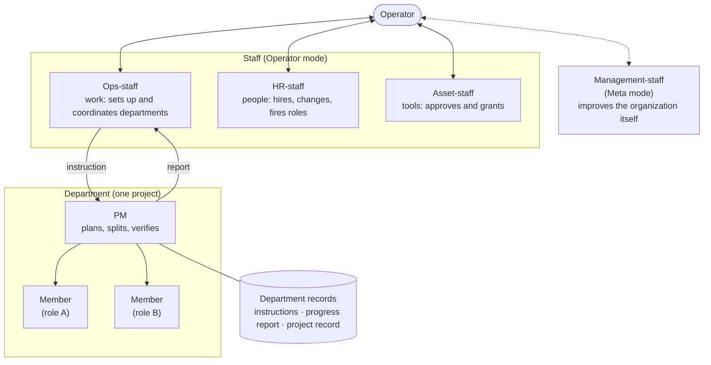

# 2. At a glance

::: lead
The operator talks only to the staff; Ops-staff hands the work to a department; the department's PM splits it, hands
it to members, checks their results directly and reports upward.
:::

This page shows only the "how". "Why it was built this way" is in [3. Why an organization](/en/story/why-organization)
and [4. Principles](/en/story/principles).

## What happens when the operator gives an instruction, in five sentences

::: point 1. The operator first sets the session's mode — **Operator mode**, to get work done with the organization, or **Meta mode**, to change the organization itself.
The declaration is the `/aise:op` or `/aise:meta` command; without it, writes to the protected core documents are
blocked. Why the two modes are separate is in the reference page [Operator vs Meta Mode](/en/operator-vs-meta-mode).
:::

::: point 2. In Operator mode the operator talks to one person only, **Ops-staff**. Ops-staff judges which department the work belongs to and writes an instruction to it, creating a new department if none fits.
The only file Ops-staff may write inside a department is the instruction file (`directive.md`). A department's records
are written only by its PM. There is no path for the operator to instruct a PM directly (no skip-level).
:::

::: point 3. The department's **PM** reads its own records, makes a plan, splits the work and hands it to **members** (roles). If a needed role or tool is missing, it asks HR-staff or Asset-staff through Ops-staff.
A PM has no memory between sessions, so it starts every time by reading the department's three record files
(instructions, progress report, project record). Work whose parts wait on each other is split into parallel pieces only
after the shared decision is settled.
:::

::: point 4. The PM checks the members' results directly, combines them, leaves a record, puts the result up as a PR and reports to Ops-staff. Anything that needs the operator's decision travels up in this report.
The PM does not take a member's "all done" at face value; it checks the actual commits or tool calls. What the operator
must decide (merging, a scope change, a credential and so on) stays in the progress report's "operator decisions" table.
:::

::: point 5. Ops-staff does not take the PM's report at face value either: it re-checks against the actual deliverables, then reports to the operator. The last decisions, such as merging and publishing, are the operator's.
:::

## One structure figure

Lines run only up and down. There is no line from the operator to a PM, nor from one PM to another department's PM. The
line that bears execution accountability (operator — department — member) is never more than two levels deep. The staff
are a supporting organization not counted in that line. Fuller figures are in the reference pages
[The shape of the org](/en/organization-model) and [Staff & governance](/en/staff-governance).

## Who does what

| Position | Does | Does not |
|---|---|---|
| Operator | Sets the mode, instructs and decides through the staff. Decides merging and publishing, adopting high-impact tools, ending a department, and changes of policy and governance | Instruct a PM or a member directly |
| Ops-staff | Interprets instructions and assigns them to departments, sets up departments, coordinates between departments, re-verifies PM reports against the actual deliverables | Edit a department's records (writes only the instruction file), develop anything itself |
| HR-staff | Hires roles (job definitions), changes their definitions, fires them; researches the domain profile of a role joining a department | Do project work |
| Asset-staff | Keeps the approved list of tools (skills, MCP servers and so on), decides which tools each role may use | Decide which roles exist |
| Management-staff | In Meta mode, diagnoses and changes the organization itself (rules, structure, mechanisms) | Do project work |
| PM | The department's plan, definition of done and methodology; splitting and delegating work; verifying and integrating results; writing the department's records | Decide the department's end on its own, change the definition of done by itself |
| Member | Does the actual work with a single responsibility in one area (code, configuration, checks) | Call other agents, talk to anyone outside the department directly |

## One request that really happened: the 2026-10-01 "upstream change propagation test"

Let's follow something that actually happened this week from start to finish. Every step is on record.

::: point ① The operator's instruction — aise-core has been restructured at scale; see how well the three departments that use it absorb the change, and get each PM's proposal for absorbing such changes more cheaply in future.
On 2026-10-01 aise-core's rule documents were rewritten and its 124 decision-record files were moved into 30 topic
files. Three departments (this site, the wiki platform, the search platform) used this content as content or data.

Source: Ops-staff's cross-department coordination record "2026-10-01 — aise-core upstream restructure: propagation
test" (record exists, repository private).
:::

::: point ② Ops-staff — wrote only the facts and the ask into the three departments' instruction files. It did not prescribe what to change or how.
The operator's purpose was to see "how well each PM absorbs it on its own". What was passed on were the changed commits,
the map from old file names to new citations, and the name of the checking tool.
:::

::: point ③ Each department's PM — investigated the effect on its own department, planned and fixed it. One department split the work three ways and handed it to three members in parallel.
- This site's department: found 167 unresolved decision citations, 6 paths and the descriptions of rules that had
  changed, and fixed 7 pages × two languages (PR #14).
- The wiki platform's department: the PM split 9 pages into three groups, handed them to three members of the same role
  (backend-engineer) on separate branches in parallel, checked the results and merged them into one (merge commit
  `ed23834`).
- The search platform's department: compared its search data chunk by chunk, found the chunks pointing at dead paths and
  re-synced. This run was cut off midway by a usage limit and then finished the same work.
:::

::: point ④ The PMs' reports — each came with its own proposal for "absorbing it more cheaply next time".
For example, this site's department now records the aise-core commit the site was last checked against and scripted the
check. To aise-core it proposed "send a one-line list of the concepts that changed along with the files". Part of these
proposals was later adopted in aise-core (change-notice documents).
:::

::: point ⑤ Ops-staff's re-verification — instead of trusting the PM's report, it took the branch and re-ran the checks itself.
For this site's department, Ops-staff re-ran the same check scripts in a temporary working folder, confirmed 0
reference findings and 0 quote findings, and compared the numbers in the browser-check result file with the PM's report.
What it could not check (no one had visually checked the Korean screens, because of a font problem) was written down
as it was.
:::

::: point ⑥ The operator's decision — merged the PR and published it. Afterwards the PM checked the published site again.
PR #14 reached `dev` on 2026-10-06 and then `main`, and went live. On 2026-10-07 this department's PM re-checked the
published wording in a real browser, and also tested on the old build that the check fails when the old wording is still
there.
:::

**What this example shows.** All the operator did was give one instruction and merge. Planning, splitting, parallel
delegation and verification were each done by one layer doing only its own part. Why this shape was chosen is the
story of the [next page](/en/story/why-organization).

**Next.** → [3. Why: control and the organization model](/en/story/why-organization)
