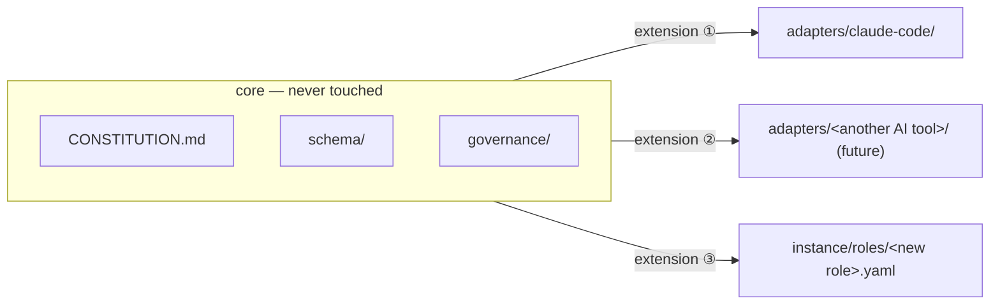

# Extend without modifying

The organization's own implementation follows a software design principle too — the
**Open-Closed Principle (OCP)**, from SOLID. When something new is needed, it's added alongside
what already exists instead of modifying it.

- To support a new AI tool, a new `adapters/<tool>/` is added — the existing core
  (`CONSTITUTION.md`, `schema/`, `assets/`, `knowledge/`, `continuity/`, `governance/`) is left
  untouched.
- When a new role or capability is needed, a new file is added inside `schema/` — existing
  adapter or core logic is not modified.
- Core consists only of tool-independent documents and data. Anything specific to a particular
  AI tool (hooks, slash commands, subagent formats, etc.) must live only in `adapters/`.

But just declaring the principle leaves "is this really tool-specific?" as something someone has
to notice and judge every single time. It actually happened twice in practice — once pointing
outward, toward the adapter boundary, and once pointing inward, toward the hooks themselves.

::: info Revisiting the decision — turning OCP from a declaration into something checkable
**Problem.** `CONSTITUTION.md` §9 and `governance/STANDING_RULES.md` already carried the OCP
principle and the rule that "tool-specific mechanisms require sign-off," but there was no
repeatable test for actually judging "is this feature tool-specific?" On top of that, there was
no way to confirm whether a second adapter (for a different AI tool) actually covered everything
the first one did.

**Investigation.** The decision record pins down this gap exactly — *"nothing wrote down why
that shape is required or gave a repeatable test for 'is this tool-specific?'"*, leaving the
judgment dependent purely on "whoever happens to notice and check it in," and *"no way to check
whether a future second adapter ... actually covers everything the first one does."*
(Source: `knowledge/decisions/2026-07-08-adapter-conformance-policy.md`)

**Resolution.** `governance/ADAPTER_POLICY.md` was created to turn the judgment criterion into a
concrete test — *"a concrete test (\"would this need to change if the underlying AI tool
changed?\")"*. Every `adapters/<tool>/README.md` is required to have a one-line-per-core-concept
binding table, with bindings not yet built explicitly marked `*(not yet built)*`, and
"conformance" itself is pinned down as **row-for-row agreement across that table** (not that the
implementations have to be identical).

**The strength that followed.** Whether a second adapter actually has everything it needs is no
longer a matter of gut feeling — it's checked mechanically, table against table. This site's own
introduction of mermaid (Phase 10a, added along with the i18n scaffold) was made under this same
judgment — a choice that followed the exact same principle of "add alongside what's already there
instead of modifying it."
:::

::: info Revisiting the decision — don't extract until it's the third time
**Problem.** `mode-gate.sh` and `execution_directive_gate.py` had already, independently, each
implemented the exact same shape (reading incoming JSON, normalizing the target path against the
repo root, and printing an allow/deny response in a standard format). Building a new reorg
approval gate would have made this duplication happen a third time, unchanged.

**Investigation.** The decision record points this out directly — *"mode-gate.sh and
execution_directive_gate.py already independently reimplement the same shape ... the reorg gate
would be a third occurrence of this exact duplication."* It's also explicit about why we waited
this long instead of building a shared module speculatively up front — *"The shared module is
justified by the rule-of-three, not built speculatively — this was the third occurrence of the
exact same duplicated shape."*
(Source: `knowledge/decisions/2026-09-01-reorg-approval-gate-shared-common-module.md`)

**Resolution.** Shared helpers were extracted into `gate_common.py`, and existing gates were only
migrated after new unit tests confirmed behavior was unchanged. The new reorg-approval gate
(`reorg_approval_gate.py`) was built on top of this module from the start.

**The strength that followed.** *"a fourth (any future path-based gate) now cheaper to add
correctly"* — a fourth gate, whenever it's needed, can now be added much more cheaply and
correctly. Not building the shared module preemptively "just in case it's needed someday," and
only extracting it after it had actually repeated three times, follows the exact same direction
as this page's principle — extend freely, but don't lay down structure prematurely.
:::

## Quick guide

**In one sentence.** This organization adds a new file alongside existing code instead of
modifying it whenever a new capability is needed, and even the standard for making that
judgment — what counts as tool-specific, when a shared module is justified — is pinned down as a
checkable test rather than left to guesswork.

**To check this page for yourself**

1. Open `governance/ADAPTER_POLICY.md` directly and look at the binding-table format and the
   `*(not yet built)*` notation.
2. Open `.claude/hooks/gate_common.py` and confirm that `mode-gate.sh`,
   `execution_directive_gate.py`, and `reorg_approval_gate.py` all actually share this module.
3. In `adapters/claude-code/README.md`'s binding table, you can see, concept by concept, how (or
   whether yet) each core concept is implemented for this tool.

**Next.** What this organization is ultimately trying to build →
[Ultimate Goal](/en/ultimate-goal).

*Source: `CONSTITUTION.md` §9; `knowledge/decisions/2026-07-08-adapter-conformance-policy.md`,
`knowledge/decisions/2026-09-01-reorg-approval-gate-shared-common-module.md`.*
