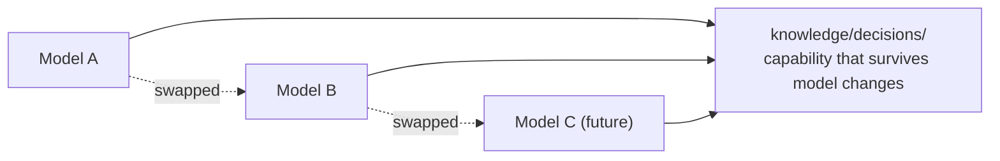

# Why build an organization, not a framework

AISE is not a project to build a multi-agent framework. There are already plenty of those, and
more will keep coming. What AISE is trying to build sits at a different layer — an **AI
organizational operating system that learns on its own, grows on its own, and continuously
accumulates organizational capability**, using AI.

This distinction actually matters. A framework has to be re-tuned every time a new model comes
out, while an organization is supposed to get more capable over time, and that growth shouldn't
waver just because new AI technology shows up — this confirms the first principle from
[Philosophy](/en/philosophy) ("the organization is the center") all over again. The tool (the
model) is a member that can be swapped out at any time; what shouldn't change is the
organization's philosophy and its operating principles.

But saying "the organization remembers" can easily lump together two entirely different kinds of
memory — to keep that distinction from getting lost, we once renamed something wholesale.

::: info Revisiting the decision — don't stuff two different things into the single word "memory"
**Problem.** When an execution context (a session, an agent run) hits its limit, whatever was in
progress risked disappearing entirely (`CONSTITUTION.md` §2.2, "the organization must remember").
While discussing where to keep the handoff record that would prevent this, the first proposal was
simply to extend the existing `memory/` directory.

**Investigation.** The operator pushed back on the spot — *"'memory' as a word covers both
durable, accumulated knowledge (long-term memory) and in-progress working state (working
memory) — naming both the existing directory and the new one around 'memory' would keep that
ambiguity baked into the org's own vocabulary."*
(Source: `knowledge/decisions/2026-07-08-knowledge-continuity-split.md`)

**Resolution.** `memory/` was renamed to **`knowledge/`**, holding only "organizational
capability that accumulates durably," and in-progress state (handoff records) was split off into
a brand-new directory, **`continuity/`**.

**The strength that followed.** If a handoff record later turns out to be a real, recurring
lesson, it gets promoted at that point to `knowledge/retrospectives/` — but *"the record itself,
while work is still open, is operational, not knowledge, and forcing a Meta-mode switch just to
avoid losing in-progress work would defeat the point of having continuity at all."* Thanks to
this distinction, this site itself can keep growing by citing what's accumulated in
`knowledge/decisions/`, without needing a wholesale re-tuning every time the model changes — the
decision records this very page cites live in exactly that directory.
:::

## Quick guide

**In one sentence.** AISE is not a framework tuned to a particular model or tool — it's a project
to build an organization where the capability accumulated in `knowledge/decisions/` survives no
matter how many times the model changes.

**To check this page for yourself**

1. Open the `knowledge/decisions/` directory and count for yourself how many decisions have
   accumulated.
2. Read `continuity/README.md` and `governance/CONTINUITY_POLICY.md` side by side, and you'll
   confirm that "in-progress state" and "accumulated capability" actually follow different
   directories and different rules.
3. Check the four kinds of knowledge assets (Workflow/Capability/Framework/Registry) in
   `CONSTITUTION.md` §4.6 for yourself — "Memory" is no longer on that list.

**Next.** To gather all the terms used here in one place → [Glossary](/en/glossary).

*Source: `CONSTITUTION.md` §8; `knowledge/decisions/2026-07-08-knowledge-continuity-split.md`.*
