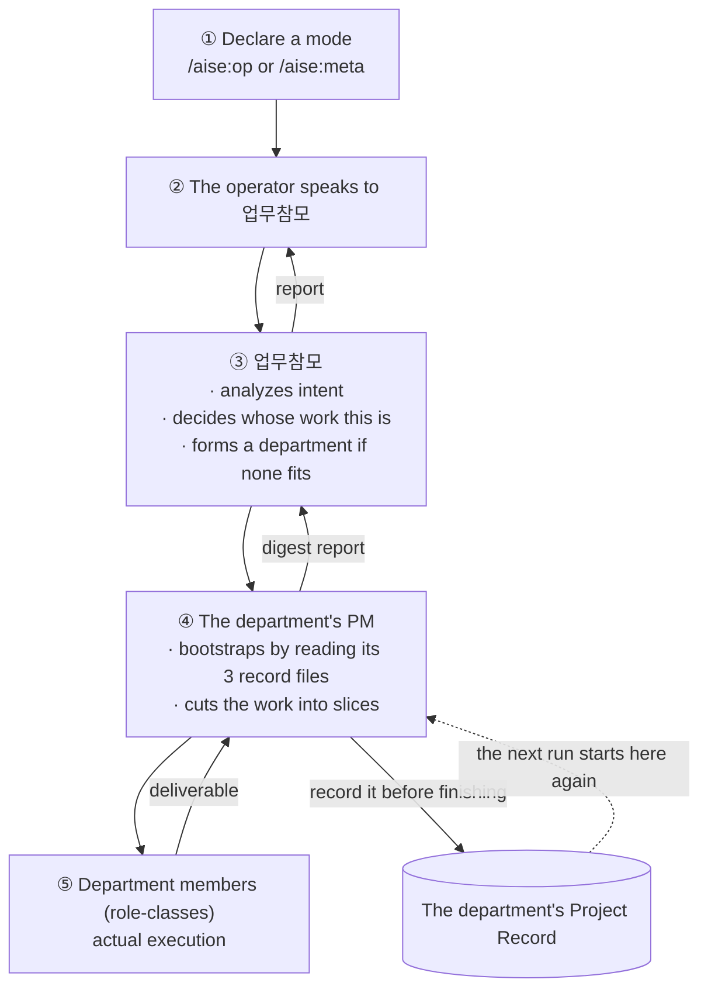

# How to hand work to this org

::: tip Where you are — In Practice (1/2)
The first page in the [In Practice](/en/in-practice) category. If
[How It Works](/en/how-it-works) finished explaining **what the organization looks like**, this
page walks through, in order, **what actually happens when you hand it work**. The next page,
[Carrying on across sessions](/en/handoff), is about what happens after that session ends.
:::

By now you've seen the whole org chart. And yet **"so how do I actually assign work"** hasn't
come up. This page follows only the moves an operator actually makes.

First the whole picture. Here's the path a single instruction travels.

Worth noting that the arrows only ever flow up and down. **There is no line that skips a level** —
and below you'll see that this isn't incidental but explicitly forbidden.

## Pick the hat first

Before handing over work there's one thing to settle: is what you're about to do **work that uses
the organization to build something**, or **work that changes the organization itself**? This org
never mixes the two in one session.

- `/aise:op` — **Operator mode.** Do real work with the organization exactly as it currently
  exists. The org's protected core documents (constitution, schema, mechanism docs) stay
  untouched.
- `/aise:meta` — **Meta mode.** Change the organization itself. Create new roles, amend rules,
  redesign workflows.

Both commands literally write the single word `op` or `meta` into a `.aise/mode` file. And without
that declaration, writes to the protected paths are blocked — meaning the declaration is a real
gate, not a courtesy. Why it was separated this hard lives in
[Operator vs Meta Mode](/en/operator-vs-meta-mode).

And until recently, the mode-declaration command itself had a fairly large hole in it.

::: info Revisiting the decision — the staff figure had never once read its own operating manual
**Problem.** Two new rules were added to 업무참모's operating document, and in the very next
Operator-mode session they were followed **zero times.** The rules had been committed before that
session even started, so "bad timing" wasn't available as an excuse.

**Investigation.** Digging directly into that session's own tool-call history, the cause was
almost absurdly clear — *"it never read `schema/OP_ORCHESTRATOR.md` at all — not once, at any
point."* We checked the system prompt too: a stock base prompt with zero AISE-specific content.
So why hadn't this been visible before? Because every other role goes through a **realize** step
that bakes its role definition into a system prompt, while 업무참모 and 경영참모 existed only by
the convention that "the top-level session declaring the mode *is* them." We also confirmed why
it had limped along fine: that session was reading department records and **imitating** the
conventions soaked into them. Which is exactly why long-standing rules survived and freshly added
ones were quietly ignored.
(Source: `knowledge/decisions/2026-09-15-orchestrator-persona-never-realized-nor-read.md`)

**Resolution.** A step was added to both `/aise:op` and `/aise:meta` — **read the corresponding
staff document in full**, framed explicitly not as a reference to consult if convenient but as
*"a real operating manual to follow this session."* Something heavier (a separate realize
artifact) was deliberately not built — these two staff figures aren't spawnable subagents in the
first place, so nothing would ever select such a file, and *"it would sit unused."*

**The strength that followed.** Declaring a mode is no longer flipping a switch but **actually
loading that session's operating manual.** There was a further, incidental gain: this
organization picked up the habit of confirming that "the rule is written down" and "the rule was
actually followed" are different things — **by digging through real session transcripts.** This
decision document's own final section is titled `## Verification still pending`.
:::

## You always speak to one person

Mode settled, you can now speak. But the one you speak to is **always 업무참모, and only
업무참모.** There's no "this is trivial, I'll just tell the department directly."

That's not a convenience convention but an explicitly rejected option. The source reads — *"No
skip-level, no exceptions: the user always goes through the Orchestrator, never directly to a
department head, regardless of how trivial the task is."* Allowing a direct line for trivial
requests was considered, and rejected on the grounds that **업무참모 would lose visibility into
the organization's overall state.**
(Source: `knowledge/decisions/2026-07-07-line-staff-org-model.md`)

The layer below works the same way. The PM divides work among department members; there is no path
for the operator to address a member directly.

## The moment a department gets assembled

업무참모 hears the request and decides whose work it is. If no department fits, it forms one —
forming a department isn't recruitment, so it needs no 인사참모 approval either. A new department
usually starts in **`draft`**, though.

Real work can happen in `draft` too — feasibility checks, research, even a PoC. Which makes "when
did we actually commit to this" easy to blur, and it did blur once.

::: info Revisiting the decision — we built a place to ask instead of an automatic transition
**Problem.** Running the first department in `draft`, background research, scoping, a real PoC
spike and even two role-class hires were all finished — and **nobody had noticed that a formal
go-ahead had never been given.** So should we add a rule that "recruitment automatically promotes
to `active`"?

**Investigation.** That option was considered and rejected, for two reasons. ① Recruitment
legitimately happens inside `draft` for exploratory purposes — making it an automatic trigger
would either retroactively misclassify already-correct PoC-purpose hires as an activation event,
or demand a new and harder-to-draw line between "exploratory" and "production" recruitment. ② The
explicit-go-ahead rule exists as a **safety checkpoint** in the first place, and automating it
away on a plausible proxy *"would remove the one place a human is guaranteed to weigh in before a
department's resourcing/scope escalates."*

Then the actual problem got separated out — the operator hadn't judged wrong; **nothing had told
them there was a judgment to make.** *"That's a missing prompt, not a missing automatic
trigger."*
(Source: `knowledge/decisions/2026-07-27-activation-prompt-point.md`)

**Resolution.** The state-transition rule was left exactly as it was, and only **an obligation to
ask** was added. The moment a PM identifies a recruitment need that is for *executing the actual
deliverable* rather than for exploration, 업무참모 must **explicitly** ask the operator right
there whether to activate. Quietly staying in `draft` and silently promoting to `active` are both
forbidden. The only thing that actually moves the state is still the operator's answer.

**The strength that followed.** The safety property (a human explicitly decides to commit) stayed
fully intact while only the actually-observed failure mode (that decision point slipping by
unnoticed) got fixed. No new state value, no new automatic transition — a case of **not
mistaking a notification problem for a trigger-design problem.**
:::

Once the operator approves activation the department goes `active` and starts running in earnest.
Ending works on the same principle — a PM cannot declare its own work complete. The full flow is
in [A department's lifecycle](/en/lifecycle).

## It gets divided again inside the department

When work arrives at a department, the PM receives it. The PM's first move isn't opening code —
it's **reading its department's three record files.** Why that has to be so is the next page's
subject.

The PM then cuts the work into slices and distributes them to department members (role-classes).
Two things the PM observes here are worth an operator knowing.

- **A PM never takes a member's self-report at face value.** On receiving "done," it opens the
  actual deliverable or the actual tool-call record and cross-checks before reporting upward. In
  the very department that built this site, several errors were caught exactly this way — work
  recorded as committed that wasn't, a leftover temporary block literally labeled "remove before
  commit."
- **Interdependent work doesn't get thrown in parallel.** If two roles each need a decision only
  the other can make, the PM settles the shared decision first and then divides. Details are in
  [How collaboration works](/en/collaboration-model).

## This is all the operator actually has to do

Summed up, the moves **a human must make** in a unit of work are fewer than you'd think.

| Moment | What the operator does |
|---|---|
| Start | Pick one of `/aise:op` or `/aise:meta` |
| Instruct | Tell 업무참모 what you want done (no need to name a department) |
| Activation call | Answer when 업무참모 asks "this is real activation — do you approve?" |
| Gates | Approve hard-to-reverse actions (public deployment, merging to `main`, and so on) |
| Completion call | Judge whether the deliverable satisfies your own intent — AI can't do this for you |

Everything else — which roles to use, in what order to divide, what to write into the record — is
handled inside the organization.

## Quick guide

**In one sentence.** Handing over work is the two moves **declare a mode → speak to 업무참모**;
the rest of the path (assembling a department, slicing, recording) is handled by the org's own
rules, and it comes back to ask you again **only at the hard-to-reverse points.**

**Want to check it yourself.**
- `.claude/commands/aise/op.md` / `meta.md` — what declaring a mode actually does (five steps)
- `governance/MODE_POLICY.md` — what gets locked in each mode
- `schema/README.md`'s "Department lifecycle" — `draft → active → ended → closed`
- `schema/OP_ORCHESTRATOR.md` — 업무참모's own operating manual

**Next.** And then the session ends. What's left, and how the next session picks it up →
[Carrying on across sessions](/en/handoff).

*Source: `CONSTITUTION.md` §10.3, §10.5 / `governance/MODE_POLICY.md` /
`schema/README.md` ("Department lifecycle") / `.claude/commands/aise/op.md`, `meta.md` /
`knowledge/decisions/2026-07-07-line-staff-org-model.md` /
`knowledge/decisions/2026-07-27-activation-prompt-point.md` /
`knowledge/decisions/2026-09-15-orchestrator-persona-never-realized-nor-read.md`.*
