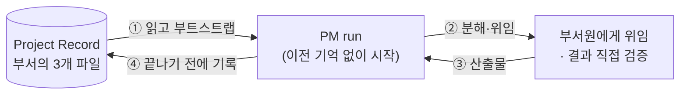

# 매 세션 잊어버리는 AI에게 회사를 만들어주면

오늘 코딩 어시스턴트에게 버그를 고쳐달라고 하면, 꽤 근사한 일이 벌어집니다 — 코드를 읽고,
원인을 파악하고, 실제로 동작하는 수정을 씁니다. 그런데 한 달 뒤 비슷한 버그를 새 세션에서
물어보면, 처음부터 다시 시작합니다. 모델이 갑자기 못해진 게 아닙니다. 그 세션에서 알아낸 것
중 어느 것도 살아남지 못했을 뿐입니다.

이건 특정 모델의 결함이 아닙니다. **세션이 끝나는데 아무것도 기록되지 않으면 항상 일어나는
일**입니다.

**AISE는 이 문제를 진지하게 받아들여서, AI 주위에 조직을 하나 지어보면 어떻게 될까 실험해본
결과물입니다.**

## 더 똑똑한 프롬프트가 아니라, 조직도

혼자 쓰는 AI 세션과 AISE의 차이는 "얼마나 똑똑한가"가 아니라 **끝난 뒤에 뭐가 남는가**입니다.

<figure>
<svg viewBox="0 0 720 380" role="img" aria-label="혼자 쓰는 AI 세션은 종료되면 아무것도 남기지 않지만, AISE는 부서의 Project Record에 기록을 남겨 다음 세션이 그걸 읽고 이어간다">
  <defs>
    <marker id="arrow" viewBox="0 0 10 10" refX="8" refY="5" markerWidth="7" markerHeight="7" orient="auto-start-reverse">
      <path d="M 0 0 L 10 5 L 0 10 z" fill="currentColor" />
    </marker>
  </defs>

  <!-- divider -->
  <line x1="360" y1="10" x2="360" y2="370" stroke="currentColor" stroke-width="1" stroke-dasharray="3 5" opacity="0.35" />

  <!-- LEFT: solo session -->
  <text x="180" y="28" text-anchor="middle" font-size="13" font-weight="600">혼자 쓰는 AI 세션</text>

  <circle cx="180" cy="55" r="14" fill="none" stroke="currentColor" stroke-width="1.5" />
  <line x1="180" y1="69" x2="180" y2="95" stroke="currentColor" stroke-width="1.5" />
  <text x="180" y="112" text-anchor="middle" font-size="11">사용자</text>

  <line x1="180" y1="120" x2="180" y2="150" stroke="currentColor" stroke-width="1.5" marker-end="url(#arrow)" />
  <text x="196" y="138" font-size="10">질문</text>

  <rect x="100" y="155" width="160" height="50" rx="6" fill="none" stroke="currentColor" stroke-width="1.5" />
  <text x="180" y="185" text-anchor="middle" font-size="12">AI 세션</text>

  <line x1="180" y1="205" x2="180" y2="235" stroke="currentColor" stroke-width="1.5" marker-end="url(#arrow)" />
  <text x="196" y="223" font-size="10">해결</text>

  <rect x="100" y="240" width="160" height="40" rx="6" fill="none" stroke="currentColor" stroke-width="1.5" />
  <text x="180" y="265" text-anchor="middle" font-size="12">작업 완료 ✓</text>

  <line x1="180" y1="280" x2="180" y2="315" stroke="currentColor" stroke-width="1.5" stroke-dasharray="4 4" marker-end="url(#arrow)" />
  <text x="180" y="335" text-anchor="middle" font-size="11" opacity="0.7">세션 종료</text>
  <text x="180" y="350" text-anchor="middle" font-size="11" font-weight="600" opacity="0.7">— 아무것도 남지 않음</text>

  <!-- RIGHT: AISE -->
  <text x="540" y="28" text-anchor="middle" font-size="13" font-weight="600">AISE</text>

  <circle cx="540" cy="55" r="14" fill="none" stroke="currentColor" stroke-width="1.5" />
  <line x1="540" y1="69" x2="540" y2="95" stroke="currentColor" stroke-width="1.5" />
  <text x="540" y="112" text-anchor="middle" font-size="11">사용자</text>

  <line x1="540" y1="120" x2="540" y2="150" stroke="currentColor" stroke-width="1.5" marker-end="url(#arrow)" />
  <text x="556" y="138" font-size="10">지시</text>

  <rect x="460" y="155" width="160" height="40" rx="6" fill="none" stroke="currentColor" stroke-width="1.5" />
  <text x="540" y="180" text-anchor="middle" font-size="12">업무참모 → 부서</text>

  <line x1="540" y1="195" x2="540" y2="225" stroke="currentColor" stroke-width="1.5" marker-end="url(#arrow)" />
  <text x="556" y="213" font-size="10">기록</text>

  <rect x="450" y="230" width="180" height="45" rx="6" fill="none" stroke="#c1652a" stroke-width="2" />
  <text x="540" y="258" text-anchor="middle" font-size="12" font-weight="600" fill="#c1652a">Project Record</text>

  <path d="M 450 252 C 340 252, 340 175, 458 172" fill="none" stroke="#c1652a" stroke-width="1.5" marker-end="url(#arrow)" />
  <text x="360" y="150" text-anchor="middle" font-size="10" fill="#c1652a">다음 세션이</text>
  <text x="360" y="163" text-anchor="middle" font-size="10" fill="#c1652a">여기서 시작</text>

  <text x="540" y="300" text-anchor="middle" font-size="11" opacity="0.7">세션은 끝나도</text>
  <text x="540" y="315" text-anchor="middle" font-size="11" font-weight="600" opacity="0.7">부서의 기록은 남음</text>
</svg>
<figcaption>왼쪽은 세션이 끝나면 아무것도 남지 않는 일반적인 AI 사용, 오른쪽은 부서(project)의 Project Record가 다음 세션의 출발점이 되는 AISE의 구조.</figcaption>
</figure>

왼쪽은 우리 모두가 매일 쓰는 방식입니다. 오른쪽이 AISE입니다 — 사용자가 업무참모에게 지시하면,
업무참모는 그 일을 담당할 부서(참모/PM/역할들로 구성)를 조립하고, 부서는 일하면서 **자신의
Project Record**에 계속 기록을 남깁니다. 다음 세션이 열리면, 그 부서는 이 기록을 읽는 것부터
시작합니다 — 어제 어디까지 했는지 다시 설명해줄 필요가 없습니다.

## 왜 "워크플로우"가 아니라 "조직"인가

이걸 그냥 잘 짜인 스크립트나 에이전트 파이프라인으로 만들 수도 있었습니다. AISE가 굳이
**회사 조직**의 모양(부서, 인사, 헌법, 감사)을 빌려온 데는 이유가 있습니다:

- **책임이 흐려지면 안 됩니다.** 모든 일에는 담당 부서가 있고, 그 부서 안에서도 누가 무엇을
  했는지 추적됩니다. "AI가 알아서 했다"로 뭉뚱그려지지 않습니다.
- **같은 문제를 두 번 처음부터 풀면 안 됩니다.** 한 부서가 겪은 시행착오는 조직 전체의 지식으로
  쌓여서, 다음에 비슷한 문제를 만난 다른 부서가 그걸 재사용할 수 있어야 합니다.
- **조직은 스스로 자랄 수 있어야 합니다.** 처음부터 모든 역할을 미리 설계해두지 않습니다 —
  실제 업무가 필요를 드러낼 때만 새 역할을 채용합니다.

동시에, AISE는 인간 조직을 그대로 베끼지도 않습니다. AI가 사람과 다르게 잘하는 것(지치지
않고 규칙을 정확히 따르는 것, 방대한 문서를 순식간에 훑는 것)은 최대한 살리고, 사람 조직이
겪는 문제(감정, 정치, 눈치)는 애초에 존재하지 않는 조건 위에서 다시 설계했습니다.

*이 다섯 가지 원칙이 어떻게 나왔는지는 [Philosophy](/philosophy)에서 이어집니다.*

## "기억을 남긴다"를 실제로 만들려니

말은 쉽습니다 — 기록을 남기면 된다. 그런데 **어디에** 남기느냐에서 한 번 크게 헤맸습니다. 이
이야기를 꺼내는 이유는, 이 사이트 곳곳에 나오는 결정들이 대개 이런 모양이기 때문입니다: 당연해
보이는 첫 답이 실제로 확인해 보면 안 되고, 그 확인이 진짜 설계를 만듭니다.

::: info 결정 되짚어보기 — 조직의 기억은 반드시 저장소 안에 있어야 한다
**문제.** 초기에 조직 운영 규칙(git 규율, 도구 기능에 의존하기 전에 확인할 것, 이식성 원칙 같은
것들)을 AI 도구가 제공하는 **개인 메모리 기능**에 적어뒀습니다. 편했으니까요. 그런데 이건 특정
사람의, 특정 컴퓨터에만 있는 저장소입니다. "AISE를 다른 컴퓨터, 다른 운영자에게 옮겨도 똑같이
동작해야 한다"는 목표와 정면으로 충돌했습니다.

**조사.** 그럼 그 개인 메모리의 저장 위치를 프로젝트 안으로 돌려놓으면 되지 않을까? 도구 문서를
직접 확인해 봤더니 막혀 있었습니다 — 프로젝트에 커밋된 설정으로 그 개인 메모리 경로를 바꾸는 건
**의도적으로 무시되도록** 설계돼 있었습니다(*"Ignored if set in projectSettings ... for
security"*). 남이 만든 저장소를 클론했더니 내 개인 메모가 엉뚱한 데 쓰이는 걸 막기 위한
안전장치였습니다. 즉 **도구의 개인 메모리를 조직의 이식 가능한 기억으로 쓸 방법은 아예
없었습니다.**
(근거: `knowledge/decisions/2026-07-07-org-memory-must-be-project-local.md`)

**해결.** 우회하려 하지 않고 둘을 갈랐습니다. **특정 사람에 관한 사실**(그 운영자의 배경 같은
것)은 그대로 도구의 개인 메모리에 두고 — 그건 원래 사람마다 달라야 하니 옳은 자리입니다 —
**AISE를 어떻게 만들고 운영하는지에 관한 것**은 무조건 저장소 안에 커밋된 파일로 옮겼습니다.
나아가 조직의 동작에 영향을 주는 설정(훅, 권한, 연결 서버)은 전부 개인 전역 설정이 아니라
저장소에 커밋되는 프로젝트 설정을 기본으로 삼기로 했습니다.

**그래서 생긴 강점.** 기준이 아주 단순해졌습니다 — **`git clone` 하나로 재구성되지 않는 것이
조직의 동작을 좌우한다면, 그건 잘못된 자리에 있는 것입니다.** 자격증명만이 의도적인 예외입니다
(새 운영자가 자기 도구에 로그인하는 건 이식성 실패가 아니라 당연한 설치 과정이니까요).
:::

그래서 이 조직에서 한 번의 작업(run)은 이런 순환을 그립니다. 기억이 사람이 아니라 **파일**에
있으니, 실행하는 쪽이 매번 새로 시작해도 아무것도 잃지 않습니다.

## 지금 뭐가 있나

AISE는 설계도로 끝나지 않았습니다 — 지금 이 순간에도 실제로 여러 부서가 이 구조 위에서
실제 소프트웨어를 만들고 있습니다. 이 사이트 자신도 그중 한 부서의 결과물입니다.

- **[Organization Model](/organization-model)** — 참모 3인방, 부서, 역할이 실제로 어떻게
  맞물리는지
- **[Operator vs Meta Mode](/operator-vs-meta-mode)** — 조직이 "일을 하는 것"과 "조직 자신을
  바꾸는 것"을 어떻게 분리해뒀는지
- **[Lifecycle](/lifecycle)** — 부서 하나가 태어나서 끝날 때까지 거치는 단계
- **[Glossary](/glossary)** — 여기 나온 용어들을 한 번에 찾아보고 싶다면

더 정확한 원문이 궁금하다면, 이 모든 이야기의 근거는 결국 `CONSTITUTION.md` 한 파일입니다 —
이 사이트는 그 조항들을 그대로 옮긴 게 아니라, 왜 그렇게 정했는지를 풀어쓴 것입니다.

## Quick guide — 어디부터 읽으면 좋을까

**한 문장으로.** AISE는 AI를 더 잘 쓰는 요령이 아니라, 세션이 끝나도 남는 **기억·책임·성장
구조**를 AI 주위에 조직의 모양으로 지어본 실험입니다.

**목적별 읽기 경로**

| 이런 게 궁금하다면 | 여기부터 |
|---|---|
| 왜 굳이 이런 걸 만들었나 | [Philosophy](/philosophy) → [Ultimate Goal](/ultimate-goal) |
| 실제로 어떤 모양의 조직인가 | [Organization Model](/organization-model) → [Staff & Governance](/staff-governance) |
| 일이 실제로 어떻게 굴러가나 | [Lifecycle](/lifecycle) → [Collaboration Model](/collaboration-model) |
| 안전장치가 어떻게 되어 있나 | [Operator vs Meta Mode](/operator-vs-meta-mode) → [Structural Principles / OCP](/structural-principles-ocp) |
| 용어가 낯설다 | [Glossary](/glossary) |

**5분만 있다면.** 이 페이지의 그림 두 장과 [Organization Model](/organization-model)의 "그림이
두 장 필요했다"만 보셔도 핵심 구조는 잡힙니다.

**읽기 전에 알아두면 편한 것.** 이 사이트의 설명 상자(**결정 되짚어보기**)는 전부 실제로 있었던
결정 기록에서 가져온 것입니다 — *문제 → 조사 → 해결 → 그래서 생긴 강점* 순서로 읽으시면 됩니다.
각 상자 끝에 원본 파일 경로가 적혀 있습니다.
