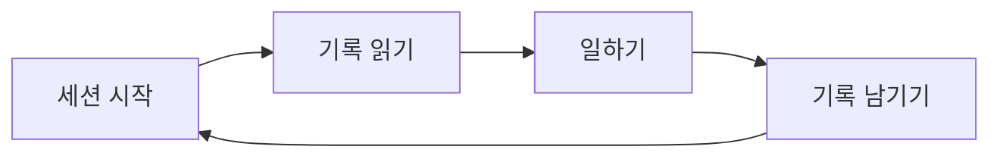

# 단계 구성 시연

::: lead
*한 문장으로 먼저 말하고, 핵심을 보여 주고, 근거는 접어 둡니다.*
:::

## 핵심 요점

::: point 조직은 사람이 아니라 문서로 기억합니다
:::

::: point 세션이 끝나도 **기록**은 남습니다 — `Project Record`에 적힙니다 {#record-stays}
세션이 끝날 때 남기는 기록이 다음 세션의 출발점이 됩니다. 이 본문은 접혀 있다가 펼치면 보입니다.
자세한 내용은 [헌법](https://example.com/)에도 나옵니다. 가나다라마바사 아자차카타파하.

- 첫째 세부 항목
- 둘째 세부 항목

<Cite ids="constitution,agents" />
:::

:::: point 표와 안내 상자가 들어 있는 점 {#table-and-box}
| 구분 | 설명 | 비고 |
|---|---|---|
| 규칙 | 지켜야 하는 문서 | 헌법, 거버넌스 |
| 결정 | 왜 그렇게 했는지의 기록 | 되돌릴 수 있음 |

::: info 참고
안내 상자도 점의 본문 안에 들어갑니다.
:::

<Cite ids="constitution-sec,operator-memo,guess,ops-log" />
::::

::: point 다이어그램이 들어 있는 점 {#diagram}

:::

<SourceTable />
