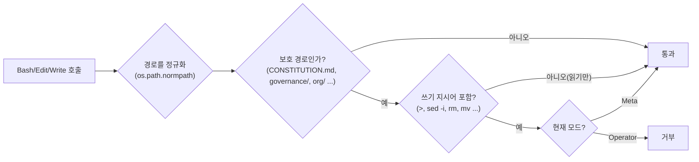

# 매일 다른 모자를 쓴다

::: tip 읽는 자리 — 동작 원리 (5/5)
[동작 원리](/how-it-works) 대분류의 마지막 글입니다. 앞의 네 글이 전부 **"일을 하는 것"** 에
관한 것이었다면, 이 페이지는 **"조직이 자기 자신을 바꾸는 것"** 을 그것과 어떻게 분리해뒀는지를
다룹니다 — 구조를 다 본 뒤에 읽어야 무엇이 보호 대상인지가 와닿기 때문에 마지막입니다.
이걸로 구조 설명은 끝나고, 다음 대분류 [쓰는 법과 이어가기](/in-practice)에서 실제로 일을
맡기기 시작합니다.
:::

이 조직을 운영하는 사람은 사실 하루에도 여러 번 다른 역할을 오갑니다 — 오늘 할 일을 맡길 때와,
조직 자체를 손볼 때는 완전히 다른 모드로 움직여야 하기 때문입니다.

- **Operator 모드** — 조직이 지금 가진 모습 그대로 실제 업무를 맡깁니다
  ([Staff & Governance](/staff-governance)에서 본 참모/PM 체계 그대로). 일상적인 채용, 사용자
  승인을 거친 조직개편까지도 여기 포함됩니다 — 조직의 **인스턴스**(지금 누가 무엇을 하고 있는가)는
  바뀌지만, 조직의 **스키마**(뎁스-2 피라미드 같은 구조 그 자체)는 건드리지 않습니다.
- **Meta 모드** — 조직 그 자체를 바꿉니다. 역할을 추가/제거하고, Workflow를 고치고, 포트폴리오·자산
  카탈로그의 스키마를 바꾸고, CONSTITUTION이나 이 정책 자체를 개정하는 일이 여기 속합니다. 이 모드의
  상시 파트너는 경영참모지만, 분석하고 제안할 뿐 최종 승인과 실행은 언제나 사용자를 거칩니다.

<figure>
<svg viewBox="0 0 720 300" role="img" aria-label="Operator 모드는 뎁스-2 피라미드 모양은 그대로 둔 채 그 안의 인스턴스(누가 무엇을 하는가)만 바꾸고, Meta 모드는 피라미드 모양 자체를 바꾸며 항상 사용자 확인을 거친다">
  <defs>
    <marker id="arrow-mode" viewBox="0 0 10 10" refX="8" refY="5" markerWidth="6" markerHeight="6" orient="auto-start-reverse">
      <path d="M 0 0 L 10 5 L 0 10 z" fill="currentColor" />
    </marker>
  </defs>

  <line x1="360" y1="10" x2="360" y2="290" stroke="currentColor" stroke-width="1" stroke-dasharray="3 5" opacity="0.35" />

  <text x="180" y="24" text-anchor="middle" font-size="13" font-weight="600">Operator 모드</text>
  <path d="M 180 55 L 110 175 L 250 175 Z" fill="none" stroke="currentColor" stroke-width="1.5" />
  <line x1="156.7" y1="95" x2="203.3" y2="95" stroke="currentColor" stroke-width="1" opacity="0.6" />
  <line x1="133.3" y1="135" x2="226.7" y2="135" stroke="currentColor" stroke-width="1" opacity="0.6" />
  <text x="266" y="72" font-size="9" opacity="0.7">사용자</text>
  <text x="266" y="112" font-size="9" opacity="0.7">부서</text>
  <text x="266" y="152" font-size="9" opacity="0.7">부서원</text>

  <circle cx="205" cy="163" r="9" fill="none" stroke="#c1652a" stroke-width="1.5" stroke-dasharray="3 3" />
  <text x="205" y="166" text-anchor="middle" font-size="9" fill="#c1652a">+1</text>
  <text x="180" y="200" text-anchor="middle" font-size="9" fill="#c1652a">신규 채용 = 인스턴스 변경</text>

  <text x="180" y="270" text-anchor="middle" font-size="11" opacity="0.8">모양(스키마)은 그대로,</text>
  <text x="180" y="286" text-anchor="middle" font-size="11" font-weight="600" opacity="0.8">안의 사람만 바뀐다</text>

  <text x="540" y="24" text-anchor="middle" font-size="13" font-weight="600">Meta 모드</text>
  <path d="M 540 55 L 470 175 L 610 175 Z" fill="none" stroke="#c1652a" stroke-width="1.5" stroke-dasharray="5 4" />
  <path d="M 450 175 L 630 175 L 650 215 L 430 215 Z" fill="none" stroke="#c1652a" stroke-width="1.5" stroke-dasharray="5 4" />
  <text x="540" y="235" text-anchor="middle" font-size="9" fill="#c1652a">새 층 = 스키마 자체가 바뀜</text>

  <text x="540" y="270" text-anchor="middle" font-size="11" fill="#c1652a">모양 자체가 바뀐다 —</text>
  <text x="540" y="286" text-anchor="middle" font-size="11" font-weight="600" fill="#c1652a">항상 사용자 확인 후</text>
</svg>
<figcaption>Operator 모드는 조직의 모양(뎁스-2 피라미드)을 그대로 둔 채 그 안의 인스턴스만
바꾸고, Meta 모드는 그 모양 자체를 바꾼다 — 후자는 항상 사용자 확인을 거친다.</figcaption>
</figure>

## 왜 굳이 나눴나

두 모드를 뒤섞으면, 일상적인 업무를 처리하다가 조직 자신의 정의가 의도치 않게 흔들릴 수 있습니다.
그래서 매 세션(또는 세션 안의 특정 작업 단위)은 시작 전에 반드시 하나의 모드를 명시적으로
선언해야 합니다 — 조용히 기본값으로 Meta급 쓰기 권한이 주어지는 경우는 없습니다.

::: info 결정 되짚어보기 — 왜 정책과 강제 장치를 아예 다른 곳에 뒀나
**문제.** 운영자는 하루 사이에도 Operator(실제 업무를 맡기는 부서장)와 Meta/Architect(AISE 자신의
구조를 진화시키는 역할)를 오갑니다. 명시적인 신호 없이는, 평범한 업무 처리 도중 조직 자신의
정의(CONSTITUTION §2.1의 "명확한 책임", §2.4의 "도구가 바뀌어도 철학은 그대로")가 조용히 흔들릴
위험이 있었습니다.

**조사.** 운영자는 AISE가 결국 다른 AI 도구로도 옮겨갈 수 있길 원했고, 동시에 Claude 특정
메커니즘이 조직의 실제 구조 일부로 쓰이기 전에는 항상 한 번 더 확인받길 원했습니다. 이 두 요구를
동시에 만족시키려면 **정책(무엇을 보호할지)**과 **강제(어떻게 막을지)**를 아예 다른 층에 둬야
한다는 결론이 나왔습니다.
(근거: `knowledge/decisions/2026-07-07-operator-meta-mode-split.md`)

**해결.** `governance/MODE_POLICY.md`는 두 모드와 보호 대상 핵심 경로(`CONSTITUTION.md`,
`governance/`, `org/`, `registry/`, `adapters/`, `memory/`)를 **도구에 무관한 말**로만
정의합니다 — 어떤 메커니즘으로 막을지는 여기 적지 않습니다. 헌법·조직도·거버넌스·메모리 같은
핵심부는 도구 중립으로 남기고, Claude Code에 대한 실제 바인딩(슬래시 커맨드, PreToolUse 훅,
서브에이전트 포맷)은 전부 `adapters/claude-code/` 안에만 둡니다. 결정 문서의 표현으로는
*"a different AI tool can be supported later via a new adapter without touching core"*(다른
AI 도구는 나중에 새 어댑터 하나만 추가하면 지원할 수 있고, 핵심부는 건드릴 필요가 없다).

**그래서 생긴 강점.** 나중에 다른 AI 도구를 지원하려면 새 어댑터 하나만 추가하면 됩니다 — 핵심
정책은 건드릴 필요가 없습니다([Structural Principles/OCP](/structural-principles-ocp)에서 이
확장-개방/수정-폐쇄 원칙이 다시 나옵니다).
:::

두 모드를 나눈 것과, 그 경계를 실제로 지키게 만드는 것은 다른 문제였습니다.

::: info 결정 되짚어보기 — 정책을 적어두는 것과, 실제로 지켜지는 것은 다른 문제였다
**문제.** 정책을 강제하는 훅(`mode-gate.sh`)을 실제로 적대적인 입력으로 테스트해 보니, 두 가지
실제 우회가 드러났습니다. ① 이 훅은 `Edit`/`Write`/`NotebookEdit` 도구만 감시해, `Bash`로
`echo ... > governance/MODE_POLICY.md`처럼 쓰면 모드와 무관하게 그냥 통과됐습니다. ②
`.../scratch/../governance/MODE_POLICY.md`처럼 `..`가 섞인 경로는, 단순 문자열 매칭이 보호
경로로 시작하는지만 봤기 때문에 실제로는 보호 파일을 가리키면서도 통과했습니다 — 이 정확한
페이로드가 Operator 모드에서 실제로 막히지 않는 것까지 직접 테스트로 확인했습니다.
(근거: `knowledge/decisions/2026-07-07-mode-gate-hardening.md`)

**조사.** 두 버그 모두 코드를 눈으로만 읽어서는 찾지 못했습니다 — 결정 문서의 표현으로는
*"Both bugs were found by directly testing the hook with adversarial-shaped inputs rather than
only reasoning about the code"*(두 버그 모두 코드를 추론만 한 게 아니라 실제로 적대적 입력을
넣어 훅을 테스트해서 발견했다). 경로 순회(`../`) 버그는 특히, 원래 코드가
`case "$REL_PATH" in ...`로 "제대로 검사하는 것처럼" 보였기 때문에, 실제 `../` 페이로드를
넣어보고 나서야 조용히 통과한다는 게 드러났습니다.

**해결.** `Bash`를 감시 대상 도구 목록에 추가하고, 경로는 `os.path.normpath`로 정규화한 뒤
비교하도록 고쳤습니다. `Bash` 명령은 쓰기 지시어(`>`, `tee`, `cp`, `mv`, `rm`, `sed -i` 등)와
보호 경로가 **함께** 나타날 때만 막는 휴리스틱으로 처리하되, 이건 완벽한 방어가 아니라 "정직한
에이전트의 일상적/우발적 드리프트"를 막기 위한 것이라고 명시적으로 문서화했습니다. 그런데 이
휴리스틱 자체가 다시 새로운 함정을 하나 더 만들었습니다 — 이 조직이 커밋 메시지에 요구하는
heredoc 트레일러(`Co-Authored-By: ... <noreply@anthropic.com>`)의 `>` 문자와, 커밋 메시지
본문에 보호 경로 이름을 언급하는 것만으로도 정당한 커밋이 오탐으로 막혔습니다. 게다가 이 훅
자체를 고치던 중, bash 단일따옴표 문자열 안에 리터럴 따옴표가 끼어들어 **모든** 도구 호출이
막히는 전면 잠금까지 두 번이나 재발했습니다.
(근거: `knowledge/decisions/2026-07-15-mode-gate-heredoc-false-positive-and-recurrence.md`)

**그래서 생긴 강점.** 이런 실패들을 조용히 고치고 잊는 대신 전부 결정 문서에 남겨, 다음에 이
파일을 만지는 사람이 같은 함정(bash 단일따옴표 안의 리터럴 따옴표)을 또 밟지 않게 했습니다.
그리고 이 사례 전체가 이 조직의 일반 원칙 하나를 굳혔습니다 — **경로 매칭처럼 보안에 가까운
로직은 코드를 읽는 것만으로 신뢰하지 않고, 반드시 `../` 같은 적대적 페이로드로 직접
테스트한다.**
:::

## Quick guide

**한 문장으로.** 같은 사람이 오늘은 업무를 맡기고 내일은 조직 자체를 고칠 수 있기 때문에, 정책
(무엇을 보호할지)은 도구 중립으로 헌법 층에 두고, 그걸 실제로 막는 장치(어떻게 막을지)는 도구별
어댑터에 두며, 후자는 눈으로만 읽지 않고 적대적 입력으로 실제 테스트합니다.

**이 페이지를 직접 확인해 보려면**

1. `governance/MODE_POLICY.md`를 열어 보호 경로 목록이 도구 이름을 전혀 언급하지 않는지
   확인해 보세요.
2. `.claude/hooks/mode-gate.sh`(Claude Code 어댑터)가 실제로 `Bash`를 감시 대상에 포함하고
   있는지 확인해 보세요 — 이 페이지의 두 번째 결정 상자가 그 이유를 설명합니다.
3. 지금 이 사이트(`aise-org-site`)를 만드는 작업 자체도 항상 Operator 모드에서 진행됩니다 —
   콘텐츠를 아무리 많이 고쳐도 CONSTITUTION이나 schema/*는 건드리지 않습니다.

**다음으로.** 구조 설명은 여기서 끝납니다. 이제 이 조직에 **실제로 일을 맡기는 절차** →
[일을 맡기는 법](/usage). 모드 선언이 실전에서 어떻게 첫 동작이 되는지가 거기 나옵니다.

*근거: `governance/MODE_POLICY.md`; `knowledge/decisions/2026-07-07-operator-meta-mode-split.md`,
`knowledge/decisions/2026-07-07-mode-gate-hardening.md`,
`knowledge/decisions/2026-07-15-mode-gate-heredoc-false-positive-and-recurrence.md`.*
