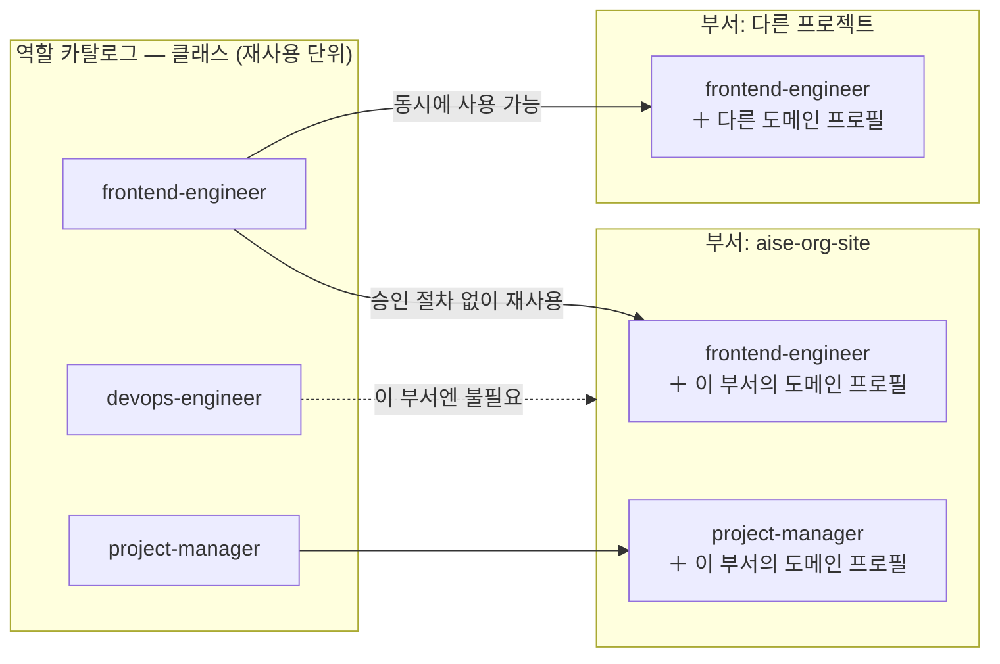

# 사람 하나가 여전히 전체를 볼 수 있어야 한다

[Philosophy](/philosophy)에서 정한 다섯 가지 원칙 중 넷째, "책임은 명확해야 한다"를 실제 구조로
옮기면 이렇게 됩니다.

## 그림이 두 장 필요했다

처음엔 조직도 한 장으로 다 그리려고 했습니다. 그런데 "이 일에 누가 책임지는가"를 그리는 선과
"오늘 실제로 누가 누구와 일했는가"를 그리는 선이 자꾸 어긋났습니다. 둘을 억지로 한 장에 넣으면
어느 쪽도 정확하지 않은 그림이 됐습니다. 그래서 아예 그림을 두 장으로 나눴습니다.

- **조직도(Organization Chart)** — 역할, 책임, 권한, 보고 라인을 정의하는 **고정된 책임 구조**입니다.
  누가 누구에게 책임지는지는 정의하지만, 오늘 실제로 어떻게 협업할지는 정의하지 않습니다.
- **실행 그래프(Execution Graph)** — 업무를 실제로 처리하면서 그때그때 만들어지는 **협업 구조**입니다.
  병렬 작업, 임시 서브에이전트, 부서를 넘나드는 협업이 여기서 자유롭게 일어납니다. 조직도를
  발판 삼지만, 조직도 그 자체는 아닙니다.

<figure>
<svg viewBox="0 0 640 380" role="img" aria-label="사용자 아래 부서 A와 부서 B가 있고 각 부서 아래 부서원 두 명씩이 있는 뎁스-2 조직도(실선), 그 위에 서로 다른 부서 부서원 간 협업과 임시 서브에이전트 참여로 이뤄지는 실행 그래프(점선)가 겹쳐 있다">
  <defs>
    <marker id="arrow-org" viewBox="0 0 10 10" refX="8" refY="5" markerWidth="6" markerHeight="6" orient="auto-start-reverse">
      <path d="M 0 0 L 10 5 L 0 10 z" fill="currentColor" />
    </marker>
  </defs>

  <circle cx="320" cy="30" r="14" fill="none" stroke="currentColor" stroke-width="1.5" />
  <text x="320" y="55" text-anchor="middle" font-size="12" font-weight="600">사용자</text>

  <line x1="320" y1="44" x2="320" y2="78" stroke="currentColor" stroke-width="1.5" />
  <line x1="320" y1="78" x2="172" y2="94" stroke="currentColor" stroke-width="1.5" marker-end="url(#arrow-org)" />
  <line x1="320" y1="78" x2="468" y2="94" stroke="currentColor" stroke-width="1.5" marker-end="url(#arrow-org)" />

  <rect x="100" y="95" width="140" height="40" rx="6" fill="none" stroke="currentColor" stroke-width="1.5" />
  <text x="170" y="120" text-anchor="middle" font-size="12">부서 A — PM</text>

  <rect x="400" y="95" width="140" height="40" rx="6" fill="none" stroke="currentColor" stroke-width="1.5" />
  <text x="470" y="120" text-anchor="middle" font-size="12">부서 B — PM</text>

  <line x1="170" y1="135" x2="112" y2="173" stroke="currentColor" stroke-width="1.5" marker-end="url(#arrow-org)" />
  <line x1="170" y1="135" x2="228" y2="173" stroke="currentColor" stroke-width="1.5" marker-end="url(#arrow-org)" />
  <line x1="470" y1="135" x2="412" y2="173" stroke="currentColor" stroke-width="1.5" marker-end="url(#arrow-org)" />
  <line x1="470" y1="135" x2="528" y2="173" stroke="currentColor" stroke-width="1.5" marker-end="url(#arrow-org)" />

  <rect x="60" y="175" width="100" height="40" rx="6" fill="none" stroke="currentColor" stroke-width="1.5" />
  <text x="110" y="200" text-anchor="middle" font-size="11">부서원 A1</text>

  <rect x="180" y="175" width="100" height="40" rx="6" fill="none" stroke="currentColor" stroke-width="1.5" />
  <text x="230" y="200" text-anchor="middle" font-size="11">부서원 A2</text>

  <rect x="360" y="175" width="100" height="40" rx="6" fill="none" stroke="currentColor" stroke-width="1.5" />
  <text x="410" y="200" text-anchor="middle" font-size="11">부서원 B1</text>

  <rect x="480" y="175" width="100" height="40" rx="6" fill="none" stroke="currentColor" stroke-width="1.5" />
  <text x="530" y="200" text-anchor="middle" font-size="11">부서원 B2</text>

  <path d="M 280 195 C 320 235, 320 235, 360 195" fill="none" stroke="#c1652a" stroke-width="1.5" stroke-dasharray="4 4" marker-end="url(#arrow-org)" />
  <text x="320" y="248" text-anchor="middle" font-size="10" fill="#c1652a">부서 간 협업(실행 그래프)</text>

  <line x1="110" y1="215" x2="110" y2="250" stroke="#c1652a" stroke-width="1.5" stroke-dasharray="4 4" marker-end="url(#arrow-org)" />
  <rect x="40" y="250" width="140" height="40" rx="6" fill="none" stroke="#c1652a" stroke-width="1.5" stroke-dasharray="4 4" />
  <text x="110" y="275" text-anchor="middle" font-size="11" fill="#c1652a">서브에이전트(임시)</text>

  <text x="320" y="335" text-anchor="middle" font-size="11" opacity="0.7">실선 = 조직도(고정된 책임 구조)</text>
  <text x="320" y="353" text-anchor="middle" font-size="11" fill="#c1652a">점선 = 실행 그래프(그때그때 조립되는 협업)</text>
</svg>
<figcaption>사용자 — 부서 — 부서원이라는 뎁스-2 조직도(실선) 위에, 부서를 넘나드는 협업과 임시
서브에이전트 참여로 만들어지는 실행 그래프(점선)가 그때그때 겹쳐진다.</figcaption>
</figure>

## 왜 뎁스를 2로 못박았나

두 번째 질문은 "조직도를 얼마나 깊게 쌓을 것인가"였습니다. 답은 의외로 조직 이론이 아니라 아주
실용적인 데서 나왔습니다 — **사용자 한 명이 조직 전체를 한눈에 파악할 수 있어야 한다.** 뎁스가
깊어질수록 그 사람이 검토해야 할 층이 늘어나고, 결국 무슨 일이 일어나는지 아무도 온전히 파악하지
못하는 상태에 빠집니다. 그래서 라인 조직(실행 책임을 지는 조직)은 딱 두 단계로 고정했습니다 —
**사용자 — 부서 — 부서원.**

부서는 PM과 부서원으로 구성됩니다. PM은 부서원 각자의 역할·책임·역량을 파악하고, 사용자에게서
받은 큰 업무를 부서원이 실제로 감당할 수 있는 크기로 쪼개 나눠줍니다.

## PM은 왜 "네 번째 참모"가 아닐까

여기서 자연스럽게 나오는 질문이 있습니다. [참모가 셋](/staff-governance) 있는데, 부서를 이끄는
PM도 그만큼 중요해 보입니다. 왜 PM은 참모로 못박지 않고 그냥 하나의 역할로 뒀을까요?

::: info 결정 되짚어보기 — PM은 채용되는 역할이지, 고정된 자리가 아니다
**문제.** 부서가 "영구 조직"이 아니라 "프로젝트 단위"로 바뀌자, 부서장이라는 자리를 조직 구조에
따로 파둘 이유가 사라졌습니다. 동시에 반대 방향의 걱정도 있었습니다 — 업무참모가 부서장을 건너뛰고
부서원에게 직접 일을 시키는 이른바 *skip-level* 문제를 어떻게 막을 것인가.

**조사.** 먼저 시도한 해법은 디렉터리 구조로 막는 것이었습니다. 부서원 파일을 부서장 아래에
물리적으로 중첩시켜 두면 접근이 어려워지지 않겠냐는 아이디어였죠. 검토 결과는 부정적이었습니다 —
*"still bypassable by anything that already knew a target subagent's name"*(이미 대상 이름을 아는
쪽에겐 그냥 뚫린다), 게다가 부서를 영구 단위로 가정하는 구조라 이번 개편의 방향과도 어긋났습니다.
(근거: `knowledge/decisions/2026-07-09-pm-is-a-recruited-role-not-a-fourth-staff.md`)

**해결.** 구조가 아니라 **역할의 성질**로 풀었습니다. PM에게 "이 부서를 대표하는 유일한
인터페이스"라는 권한을 주고, 부서원은 오직 PM의 실행 범위 안에서만 생성되게 했습니다. 그러면
업무참모가 부서에 닿는 경로 자체가 PM 하나뿐이라 skip-level은 *일어날 길이 없습니다*. 결정 문서의
표현대로 **"a structural guarantee, not a documented courtesy"** — 지키자고 적어둔 예의가 아니라
구조적 보장입니다. 그래서 PM은 다른 역할과 똑같이 카탈로그에서 채용되고 퇴역하는 평범한 역할이 됐고,
참모 셋이 받는 "채용되지 않는다"는 예외는 받지 않았습니다.

**그래서 생긴 강점.** 조직 구조에 고정 좌석이 하나 줄었는데도 안전장치는 오히려 강해졌습니다.
PM은 필요한 부서마다 새로 채용되고 끝나면 사라지므로, 안 쓰는 조직 계층이 남아 있지 않습니다.
:::

## 같은 역할이 여러 부서에 동시에 있으려면

"frontend-engineer"라는 역할이 세 부서에서 동시에 필요하면 어떻게 될까요? 역할 정의를 세 번
복사해 두는 건 명백히 낭비입니다. 그렇다고 "이 사람은 지금 A부서에 배정 중"처럼 관리하면, 부서마다
누가 비어 있는지 챙겨야 하는 인력 풀 관리가 새로 생깁니다.

::: info 결정 되짚어보기 — 역할은 "인스턴스"가 아니라 "클래스"다
**문제.** 같은 역할을 여러 부서가 쓰려면 정의를 복붙해야 했습니다. 첫 해법 후보는 사람 조직을
닮은 것이었습니다 — 재사용 가능한 역할 *타입*(클래스)과, 부서에 배속되어 경험을 쌓아가는
*개체*(인스턴스)로 나누는 "인재 풀" 모델.

**조사.** 이 인스턴스 개념을 실제 실행 방식에 대보니 맞지 않았습니다. 조사 결과를 그대로 옮기면,
서브에이전트 호출은 언제나 클래스 정의의 *새로운 독립 실행*이고 **"There is no mechanism that keeps
an 'instance' idle-yet-remembering between assignments"** — 배정과 배정 사이에 쉬면서 기억을
유지하는 개체 같은 건 애초에 존재하지 않습니다. 그걸 모델링하려면 유휴/배정 상태 관리 같은
장부를, 실제로는 없는 것을 흉내 내려고 발명해야 했습니다.
(근거: `knowledge/decisions/2026-07-09-role-is-a-class-not-an-instance.md`)

**해결.** 인스턴스 개념을 버리고 **클래스만** 남겼습니다. 역할 파일에서 부서 소속을 나타내던
필드(`tier`, `department`, `reports_to`)를 아예 제거했습니다. 대신 그 역할이 특정 부서에서 알아야
할 맥락은, 부서에 합류하는 시점에 **도메인 프로필**로 덧붙입니다.

**그래서 생긴 강점.** 세 가지가 한꺼번에 따라왔습니다. ① 동시성 문제가 사라졌습니다 — 아무것도
"대여 중"이 되지 않으니 몇 개 부서가 같은 클래스를 동시에 써도 다툴 자원이 없습니다. ② 이미 채용된
클래스를 새 부서에서 쓰는 건 **승인 절차 없이 무료**입니다. ③ "경험"은 특정 개체의 정체성이 아니라
조직의 지식자산에 쌓이므로, 그 교훈을 나중에 *다른* 역할도 꺼내 쓸 수 있습니다.
:::

같은 클래스가 두 부서에 **동시에** 놓여 있어도 서로 간섭하지 않습니다. 차이를 만드는 건 클래스
자체가 아니라, 부서에 합류할 때 인사참모가 붙여주는 도메인 프로필입니다.

## Quick guide

**한 문장으로.** 조직도는 "누가 책임지는가"만 고정하고(뎁스 2, 사용자 — 부서 — 부서원), 실제
협업 모양은 실행 그래프가 그때그때 만들며, 그 안을 채우는 역할은 부서에 묶이지 않는 재사용
가능한 클래스입니다.

**이 페이지를 직접 확인해 보려면**

1. 조직도를 보고 싶다면 `instance/roles/` — 지금 조직에 존재하는 역할 클래스 목록입니다.
   `tier`나 `department` 필드가 **없다는 점**을 확인해 보세요. 위 결정의 결과물입니다.
2. 실행 그래프를 보고 싶다면 각 부서의 `project-record.md`의 **Ledger** — 어떤 역할에게 무엇을
   위임했는지가 `위임: A, B → C` 형태로 실제 기록돼 있습니다.
3. 재사용을 확인하고 싶다면 `instance/portfolio/index.yaml`의 `reuse_tier` — 어떤 클래스가 어느
   부서에서나 쓸 수 있는지(`generic-technical`) 표시돼 있습니다.

**다음으로.** 이 구조를 실제로 굴리는 참모 셋이 궁금하다면 →
[Staff & Governance](/staff-governance). 부서 하나가 태어나서 끝나는 과정이 궁금하다면 →
[Lifecycle](/lifecycle).

*근거: `CONSTITUTION.md` §3, §10.1–§10.2 / `knowledge/decisions/`의
`2026-07-09-pm-is-a-recruited-role-not-a-fourth-staff.md`,
`2026-07-09-role-is-a-class-not-an-instance.md`.*
