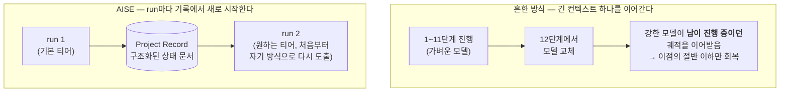

# 다섯 가지, 그리고 각각이 왜 필요했는지

[Home](/)에서 본 문제로 돌아가 보면 — AI는 세션이 끝나면 잊어버립니다. 그런데 이 하나의
문장에서 실제로 다섯 개의 서로 다른 결정이 나왔습니다. 하나씩 따라가 보면, 각각이 왜 필요했는지
보입니다.

## 1. 조직이 중심이다

가장 먼저 정해야 했던 건 "AI를 더 잘 쓰는 법"을 만들 것인가, "AI가 일하는 조직"을 만들 것인가
였습니다. 전자를 택하면 GPT-5가 나오든 Claude 6이 나오든 매번 프롬프트를 새로 튜닝해야 합니다.
AISE는 후자를 택했습니다 — AI 도구는 언제든 교체될 수 있는 구성원이고, 바뀌지 않아야 하는 건
조직의 철학과 운영 방식입니다.

## 2. 조직은 기억해야 한다

목적이 정해지자 바로 다음 질문이 따라왔습니다 — "조직"이라고 부르려면 뭐가 있어야 하나? 가장
먼저 나온 답이 기억이었습니다. 사람은 잊어도 괜찮습니다, 옆 동료가 기억하거나 회의록이 남으니까.
AI 세션은 그 옆 동료도, 회의록도 없이 사라집니다. 그래서 반복적으로 쓰이는 지식과 경험은 반드시
어딘가에 지식자산으로 남아야 한다는 규칙이 첫 번째로 생겼습니다.

## 3. 조직은 지속적으로 성장해야 한다

기억만으로는 부족했습니다 — 기록해두는 것과 그 기록에서 실제로 배우는 것은 다릅니다. 새로운
문제를 겪을 때마다 조직 전체가 조금씩 더 유능해져야 한다는 원칙이 여기서 나왔습니다. 한 번
풀어본 문제는, 다음번엔 그때보다 빠르고 정확하게 풀립니다 — 그 차이가 쌓여야 "조직"이라고 부를
수 있다고 판단했습니다.

## 4. 책임은 명확해야 한다

기억하고 성장하는 것과 별개로, "누가 이 일에 책임지는가"가 흐려지면 안 됐습니다. 모든 업무에는
반드시 담당자가 있고, 협업은 자유롭게 하되 책임까지 함께 흐려지지는 않습니다.

한 가지는 분명히 해두고 싶습니다 — 여기서 "책임자"는 법적·최종적 책임의 주체가 아닙니다. AI
Agent는 그 자리에 설 수 없습니다. "책임자"란 감사 추적상의 오너, 즉 "문제가 생기면 어떤 역할이
검토했어야 했는가"를 되짚어갈 수 있는 라벨입니다. 최종 책임은 언제나 이 조직을 운영하는
사람에게 있습니다.

## 5. AI의 장점을 최대한 활용한다

마지막 원칙은 방향을 하나 더 정합니다 — 앞의 네 가지를 지키기 위해 인간 조직을 그대로
베끼지는 않는다는 것입니다. 인간 조직의 장점(책임, 역할, 협업, 보고, 기억)은 유지하되, AI가
사람과 다르게 잘하는 것 — 지치지 않고 규칙을 정확히 지키는 것, 방대한 문서를 순식간에 훑는 것,
같은 순간에 여러 역할을 동시에 수행하는 것 — 은 굳이 사람 조직의 관성에 맞춰 깎아내지 않습니다.

## 뜻밖의 보너스 하나

원칙이란 대개 무언가를 포기하고 얻는 것입니다. 그런데 위의 첫째와 다섯째가 맞물리면서, 처음엔
의도하지 않았던 이점이 하나 굴러 나왔습니다. 나중에 다른 시스템들을 조사하다가 발견해서 **강점으로
따로 기록해 둔** 사례입니다.

::: info 결정 되짚어보기 — 매번 새로 시작하는 게 오히려 이득이었다
**문제.** 한 번의 작업에 늘 같은 크기의 모델을 쓸 필요는 없습니다. 어려운 판단이 필요한 구간엔
더 강한 모델을, 기계적인 구간엔 가벼운 모델을 쓰는 게 합리적이죠. 그런데 **일하는 도중에 모델을
바꿔도 괜찮은가?**

**조사.** 두 갈래로 확인했습니다. ① 실제로 널리 쓰이는 방식은 **역할마다 모델을 시작 시점에
고정하고 중간에 바꾸지 않는 것**이었습니다(Anthropic의 멀티에이전트 리서치 시스템, LangGraph /
CrewAI / AutoGen 모두 노드별 설정은 있어도 실행 중 승격은 없습니다). ② 왜 그런지는 논문이
설명해 줬습니다 — *"The Handoff Tax: Continuing Non-Native Trajectories in LLM Agents"*(arXiv
2608.24358): 강한 모델이 약한 모델의 **진행 중인 추론 궤적**을 이어받으면, 처음부터 강한 모델로
돌렸을 때의 품질 이점을 **절반도 회복하지 못합니다.** 남이 세워둔 반쯤 지어진 계획과, 어쩌면
틀렸을 중간 결론에 묶여버리기 때문입니다.
(근거: `knowledge/decisions/2026-09-08-stateless-pm-sidesteps-handoff-tax.md`)

**해결.** 여기서 확인한 건, AISE가 이 문제를 **이미 피해 가고 있었다**는 사실이었습니다. AISE의
한 번의 작업(run)은 이전 실행의 추론을 물려받지 않습니다 — 매번 **구조화된 기록**(부서의 세 파일)에서
새로 부트스트랩합니다. 그건 멈춰 세운 사고 과정이 아니라 사람이 읽으라고 쓴 상태 문서입니다.
그래서 "남의 궤적을 이어받는" 상황이 **구조적으로 발생하지 않습니다.** 별도 대책을 세운 게 아니라,
첫째 원칙(도구는 교체 가능한 구성원)과 둘째 원칙(기억은 기록에)을 지킨 결과로 따라온 성질입니다.

**그래서 생긴 강점.** 모델 티어가 **매 run마다 깨끗하게 다시 고를 수 있는 결정**이 됐습니다 —
이월 손실이 없으니까요. 대부분의 에이전트 프레임워크는 긴 컨텍스트 하나를 안고 가기 때문에
"이 작업만 더 강한 모델로"를 하려면 세금을 물거나 상태를 버려야 하는데, AISE는 다시 인스턴스화해도
실질적으로 잃는 게 없습니다.
:::

물론 완전히 공짜는 아닙니다 — 앞선 run이 기록에 남긴 **문제 서술** 자체가 그 티어 수준일 수 있어서,
뒤이은 run은 그 서술을 정답으로 받지 말고 **다시 도출해야 한다**는 단서가 붙어 있습니다. 논문이
측정한 궤적 세금의 아주 약하고 한정된 형태입니다.

## Quick guide

**한 문장으로.** 다섯 원칙은 순서대로 읽으면 하나의 질문에서 파생됩니다 — 조직을 만들 것인가(1),
그럼 무엇이 있어야 조직인가(2 기억, 3 성장, 4 책임), 그리고 그걸 사람 흉내로 하지 않으려면(5).

**각 원칙이 실제 구조로 어디에 나타나는지**

| 원칙 | 실제로 어디서 보이나 |
|---|---|
| 1. 조직이 중심이다 | [Ultimate Goal](/ultimate-goal) — 프레임워크가 아닌 이유 |
| 2. 조직은 기억한다 | [Home](/)의 Project Record 순환, [Lifecycle](/lifecycle)의 지식자산화 |
| 3. 지속적 성장 | [Lifecycle](/lifecycle) 6단계 순환 |
| 4. 책임의 명확성 | [Organization Model](/organization-model), [Staff & Governance](/staff-governance) |
| 5. AI 장점 활용 | [AI-Native Principles](/ai-native-principles) |

**직접 확인해 보려면.** 원문은 `CONSTITUTION.md` §2.1–§2.5 다섯 조항입니다. 다섯 문장밖에 안 되니
한 번 읽어보시면, 이 페이지가 그 다섯 줄을 어떻게 풀어썼는지 바로 대조됩니다.

**다음으로.** 이 다섯 가지가 실제로 어떤 모양의 조직으로 이어지는지 →
[Organization Model](/organization-model).

*근거: `CONSTITUTION.md` §2.1–§2.5 /
`knowledge/decisions/2026-09-08-stateless-pm-sidesteps-handoff-tax.md`.*
