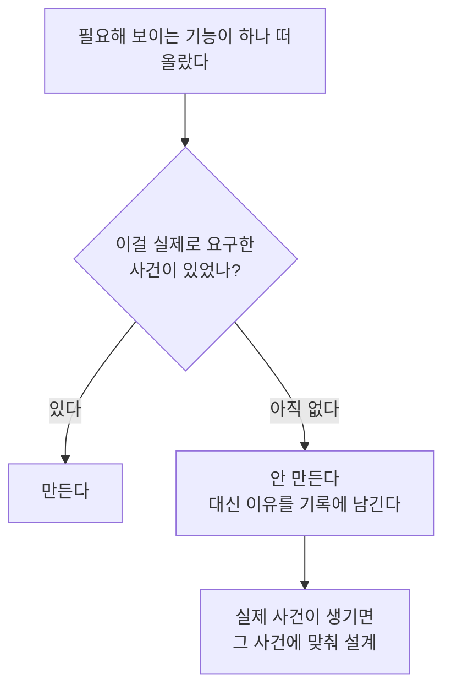

# 일반적인 방식과 무엇이 다른가

::: tip 읽는 자리 — 배경 및 철학 (2/3)
[배경 및 철학](/background) 대분류의 두 번째 글입니다. 바로 앞 [Philosophy](/philosophy)가
"왜 조직을 만들기로 했는가"를 다뤘다면, 이 페이지는 그 선택이 **흔히 하는 방식과 어디서
갈라지는지**를 일곱 개 축으로 하나씩 대조합니다. 다음
[AI-Native Principles](/ai-native-principles)는 그 차이들 중 "AI라서 가능했던" 것만 따로 모읍니다.
:::

앞 페이지의 다섯 원칙은, 그것만 읽으면 반대하기 어려운 말들입니다. 기억해야 한다, 성장해야
한다, 책임이 명확해야 한다 — 누가 아니라고 하겠습니까. **차이는 그 다음에 생깁니다.** 같은
말을 해놓고도 실제로 무엇을 만들지 않기로 했는가에서 갈립니다.

그래서 이 페이지는 자랑을 하지 않고 **대조만** 합니다. 그리고 비교 대상이 되는 "일반적인
방식"도 지어내지 않았습니다 — 아래 나오는 대조는 전부, 이 조직이 실제로 그 결정을 내리면서
**자기 결정 기록에 직접 적어둔 비교 지점**입니다. 표 바로 아래에 각 축의 원본 파일 이름을
붙여뒀으니 직접 대조해 보셔도 됩니다.

## 한눈에 보는 일곱 축

| 축 | 흔히 하는 방식 | AISE |
|---|---|---|
| **1. 조직의 기억** | 사람의 머리, 흩어진 채팅 로그, 도구가 주는 개인 메모리 | 저장소에 커밋된 파일. `git clone` 하나로 재구성되지 않으면 잘못된 자리 |
| **2. 조직도를 언제 그리나** | 도메인을 정하고 역할을 미리 설계해 자리를 채운다 | 비어 있는 채로 시작. 실제 업무가 빈자리를 드러낼 때만 채용 |
| **3. 구성원의 정체성** | 사람 한 명이 한 자리를 차지한다(인재풀) | 역할은 **클래스**. 부서에 묶이지 않고, 동시에 몇 군데서 쓰여도 경합이 없다 |
| **4. 경험이 쌓이는 자리** | 개인이 숙련된다. 인사고과가 그걸 기록한다 | 개인이 아니라 **조직**에 쌓는다. 개인 숙련도 메커니즘은 두 번 연속 "아직 만들지 않음" |
| **5. 보고선** | 급한 건 담당자에게 직접 말한다 | 사소한 일이라도 예외 없이 참모를 거친다(no skip-level) |
| **6. 권한** | 세분화된 접근제어 매트릭스를 짠다 | 거친 단위의 승인 + 판단. 진짜 경계는 애플리케이션이 아니라 OS/인프라 층 |
| **7. 세션을 이어받는 법** | 진행 중인 컨텍스트를 다음 실행에 그대로 물려준다 | 물려주지 않는다. 매번 **기록에서 다시 도출**한다 |

**각 축의 대조가 실제로 적혀 있는 문서** (전부 `knowledge/decisions/` 아래):

1. `2026-07-07-org-memory-must-be-project-local.md`
2. `2026-07-07-recruit-on-demand-phase-1.md`
3. `2026-07-09-role-is-a-class-not-an-instance.md`
4. `2026-07-07-role-proficiency-idea-deferred.md` +
   `2026-09-02-role-proficiency-idea-still-deferred.md`
5. `2026-07-07-line-staff-org-model.md`
6. `2026-07-09-provisioning-scope-is-a-judgment-not-a-mechanism.md` +
   `2026-07-14-folder-scoped-access-control-deferred.md`
7. `2026-09-08-stateless-pm-sidesteps-handoff-tax.md`

눈에 띄는 공통점이 하나 있습니다. **일곱 개 중 넷이 "무언가를 만들지 않기로 한 결정"입니다.**
2번, 4번, 6번이 그렇고, 7번은 아예 안 만들었더니 이득이 따라온 경우입니다. 이 조직에서 설계
문서의 절반쯤은 무엇을 지었는지가 아니라 **무엇을 왜 안 지었는지**에 대한 기록입니다.

## 조직도를 먼저 그리지 않았다

보통 조직을 만들 때는 조직도가 먼저입니다. 무슨 팀이 필요한지 그려놓고 사람을 채웁니다.
AISE는 그 순서를 뒤집었고, 그건 편의가 아니라 명시적인 결정이었습니다.

::: info 결정 되짚어보기 — 빈 조직도로 시작하기로 했다
**문제.** Phase 1을 시작하려면 출발 조직도가 있어야 했습니다. 그런데 운영자의 실제 업무
범위가 너무 넓었습니다 — 임베디드 SW, 펌웨어 시뮬레이션 툴링, 일반 소프트웨어 엔지니어링에
CI/CD와 서비스 개발까지. 어느 한 도메인을 골라 조직도를 그리는 순간, 그 선택이 틀렸을 때
나중에 전부 되돌려야 합니다.

**조사.** 결정 기록은 그 위험을 이렇게 적어뒀습니다 — *"Pre-picking a domain would have
overfit Phase 1 to a guess, contradicting §4.1 itself (recruitment happens in response to a real
gap, not speculatively) and risking premature structure the operator would have to unwind
later."* 미리 고른 도메인은 추측에 과적합된 구조를 만들고, 그 구조는 나중에 운영자가 직접
풀어야 하는 빚이 됩니다.
(근거: `knowledge/decisions/2026-07-07-recruit-on-demand-phase-1.md`)

**해결.** 조직도를 아예 비워둔 채로 시작했습니다. *"A role is only created ... when a real
Operator-mode task reveals a capability the organization doesn't yet have. No top-down
pre-design of roles by domain."* 역할은 실제 Operator 모드 작업이 "이 능력이 없다"를 드러낼
때만 생깁니다.

**그래서 생긴 강점.** 부수 효과가 하나 따라왔습니다 — 채용 절차 자체가 **도표가 아니라 실제로
돌아가는 기능**이 됐습니다. 결정 기록의 표현으로는 *"doubles as a live test of the Recruitment
lifecycle rather than a diagram exercise."* 조직도가 미리 채워져 있었다면 채용 메커니즘은
한 번도 쓰이지 않은 채 문서로만 남았을 것입니다.
:::

## 구성원에게 경력을 쌓게 하지 않았다

이건 사람 조직과 가장 크게 갈리는 지점이고, 두 번에 걸쳐 확인됐습니다.

::: info 결정 되짚어보기 — 인재풀을 만들려다 그만뒀고, 두 번째에도 그만뒀다
**문제.** 처음 떠오른 그림은 자연스러웠습니다. 같은 역할(예: 시장조사 담당)이 여러 부서에
동시에 필요하다면, 재사용 가능한 역할 **타입**을 두고 부서마다 그 타입의 **인스턴스**를
두면 되지 않을까. 그 인스턴스가 배치를 옮겨 다니며 자기 경험을 쌓으면 딱 **인재풀**입니다.
결정 기록도 그 표현을 그대로 씁니다 — *"mirroring a 'talent pool.'"*

**조사.** 그 인스턴스 개념을 실제 실행 방식에 대고 눌러봤더니 받쳐줄 바닥이 없었습니다 —
*"a subagent invocation is always a fresh, independent run of a class definition ... There is no
mechanism that keeps an 'instance' idle-yet-remembering between assignments."* 쉬면서 기억하고
있는 인스턴스 같은 건 애초에 존재할 수 없었고, 그걸 흉내 내려면 **없는 정체성을 시뮬레이션하는
장부**(대기/배정 상태, 풀 관리)를 새로 발명해야 했습니다.
(근거: `knowledge/decisions/2026-07-09-role-is-a-class-not-an-instance.md`)

**해결.** 인스턴스를 버리고 **클래스만** 남겼습니다. 역할 파일에서 부서·계층 같은 인스턴스성
필드를 전부 제거했고, 경험은 개인이 아니라 조직 쪽으로 보냈습니다 — *"'Experience' doesn't
live in any one class's identity — it lives in `org/retrospectives/` → `portfolio/` `insight`
entries."*

그리고 2026년 9월, 같은 질문이 다시 올라왔습니다. 이제 5개 역할 클래스가 4개 부서에 걸쳐
재사용되고 있으니 원래 걸어둔 조건("실제 역할이 반복 업무를 할 때 다시 보자")은 충족된 것
아니냐고요. **다시 봤고, 다시 보류했습니다** — *"the letter of the original trigger condition
looks met, but the substance behind it ... is not."* 여러 부서가 같은 클래스를 서로 다른
일회성 프로젝트에 쓴 것이지, 같은 종류의 일을 두 번 하면서 마찰을 겪은 적은 없었기 때문입니다.
대신 다음 재검토 조건을 훨씬 날카롭게 고쳐 적었습니다 — 두 번째 실행이 첫 번째가 이미 알아낸
것을 **눈에 띄게 다시 도출하는 장면**이 실제 기록에 나타나면, 그때 본다.
(근거: `knowledge/decisions/2026-09-02-role-proficiency-idea-still-deferred.md`)

**그래서 생긴 강점.** 동시성 문제가 통째로 사라졌습니다 — 클래스를 쓴다고 해서 무언가가
"대여 중"이 되지 않으니 경합할 자원 자체가 없습니다. 몇 개 부서가 같은 역할을 동시에 써도
됩니다. 그리고 보류를 두 번 한 덕에, **재검토 조건이 "언젠가"에서 "이런 장면이 기록에
찍히면"으로 바뀌었습니다.** 미루는 것도 두 번째에는 더 정확해질 수 있습니다.
:::

## 권한 매트릭스를 만들지 않았다

"누가 무엇에 접근할 수 있는가"는 보통 표로 풉니다. 역할 × 리소스 매트릭스를 짜고, 세분화할수록
안전하다고 여깁니다. 이 조직은 두 번 그 유혹을 마주쳤고 두 번 다 표를 만들지 않았습니다.

::: info 결정 되짚어보기 — 게이트 주위에 비계를 세워도 판단이 날카로워지지는 않는다
**문제.** 역할이 부서를 넘나드는 공유 클래스가 되고 나니 진짜 걱정거리가 생겼습니다. 한 부서가
필요해서 어떤 권한을 승인받으면, 그 승인은 **그 클래스를 나중에 재사용하는 무관한 모든 부서에
그대로 따라붙습니다.** 한 방향으로만 올라가고 절대 내려오지 않는 톱니바퀴입니다.

**조사.** 첫 번째로 떠오른 처방은 새 장치였습니다 — 부서마다 프로젝트 범위의 권한 파일을 하나씩
두는 것. 그런데 뜯어보니 **안전이 조금도 늘지 않았습니다.** *"the same single decision-maker
(자산참모) would still decide what goes in the new file, using the same judgment."* 같은 사람이
같은 판단으로 새 파일을 채울 뿐이었습니다. 그래서 전제를 되짚었더니, 애초에 **범위**에 관한
요청(어느 데이터, 어느 자격증명)은 **역량**에 관한 승인(이 도구를 아예 써도 되는가)과 다른
종류의 질문이었습니다.
(근거: `knowledge/decisions/2026-07-09-provisioning-scope-is-a-judgment-not-a-mechanism.md`)

**해결.** 새 스키마도, 부서별 권한 파일도 만들지 않았습니다. 대신 판단이 그어야 할 선을
문서에 명시했습니다 — **(a) 거친 역량 승인**은 권한 부여가 다루는 것, **(b) 세밀한 범위·
자격증명 발급**은 아예 권한 부여의 일이 아닌 것. (b)처럼 보이는 요청은 새 승인 단계가 필요하다는
신호가 아니라 **카탈로그 항목 자체가 너무 거칠게 정의돼 있다는 신호**로 읽기로 했습니다.

같은 계열의 질문이 닷새 뒤 다른 모양으로 또 왔습니다 — "이 역할은 이 폴더만은 절대 못 읽게
하고 싶다면?" 이번에도 아무것도 만들지 않았고, 대신 진짜 경계가 어디인지를 적어뒀습니다:
애플리케이션 층의 훅은 본질적으로 best-effort이고, *"The strictly stronger boundary ... is
OS/infrastructure-level isolation ... this is tool-agnostic ... and doesn't depend on the agent's
cooperation at all."* 훅을 만들더라도 그건 경계가 아니라 그 위에 얹는 편의 층이라는 것까지
함께 적었습니다. 그리고 착수하지 않은 이유는 단순했습니다 — *"No department has actually hit
this need — the whole discussion was prompted by a hypothetical, not a real task."*
(근거: `knowledge/decisions/2026-07-14-folder-scoped-access-control-deferred.md`)

**그래서 생긴 강점.** 두 번 다 같은 문장으로 정리됩니다 — *"Adding scaffolding around a gate
that already can't be skipped doesn't make the judgment behind it any sharper; documenting the
actual distinction the judgment needs to draw does."* 우회할 수 없는 게이트에 비계를 더 세우는
대신, 그 게이트가 실제로 그어야 하는 구분을 글로 적었습니다. 덕분에 지금도 권한 표는 없고,
대신 **판단이 무엇을 구분해야 하는지에 대한 문장**이 있습니다.
:::

## 그래서 무엇을 포기했나

정직하게 적어둘 부분입니다. 위의 선택들은 공짜가 아닙니다.

- **예측 가능성을 일부 포기했습니다.** 조직도를 미리 그려두면 "우리 조직에 뭐가 있나"를 한눈에
  볼 수 있습니다. 필요할 때만 채용하는 방식은 그 그림이 항상 불완전합니다.
- **개인의 성장 곡선을 포기했습니다.** 같은 역할이 두 번째 할 때 더 빠르다는 보장은 지금
  없습니다. 조직 차원의 지식 축적으로 대신하고 있지만, 그게 개인 숙련도와 같지는 않습니다.
  이건 위에서 본 대로 **의도적인 미해결 상태**이지, 해결됐다고 주장하는 부분이 아닙니다.
- **세밀한 권한 통제를 포기했습니다.** 지금 이 조직에는 "이 역할은 이 폴더 못 읽음" 같은 장치가
  없습니다. 필요해지면 만들되, 그때는 훅이 아니라 인프라 층에서 만들기로 적어뒀을 뿐입니다.
- **약간의 중복 노동을 감수합니다.** 매번 기록에서 다시 도출한다는 건, 이전 실행이 이미 한
  생각을 다시 한다는 뜻이기도 합니다. [Philosophy](/philosophy)의 마지막 상자가 이 비용을
  "궤적 세금의 아주 약하고 한정된 형태"라고 부릅니다.

## 그리고 가장 큰 차이 하나

표에 넣지 않은 축이 하나 있습니다. **조직이 자기 자신을 바꾸는 일**입니다.

보통은 이게 그냥 작업의 일종입니다 — 코드를 고치다가 프로세스도 같이 고칩니다. AISE는 이
둘을 아예 다른 모드로 갈라놨고, 모드 선언 없이는 조직의 핵심 문서를 건드릴 수 없게 해뒀습니다.
이 이야기는 축 하나로 요약하기엔 커서 [Operator vs Meta Mode](/operator-vs-meta-mode)에 따로
있습니다.

## Quick guide

**한 문장으로.** AISE가 흔한 방식과 갈리는 일곱 지점 중 넷은 "무언가를 더 만든 것"이 아니라
**"실제 사건이 요구하기 전까지 만들지 않기로 한 것"** 입니다.

**이 페이지를 직접 확인해 보려면.** 위 표 아래의 번호 목록이 전부 실제 파일 이름입니다.
`knowledge/decisions/` 아래에서 그대로 열어보시면 됩니다. 특히 `## Why` 절만 훑어도 이 조직이
어떤 식으로 "안 하는 쪽"을 정당화하는지 금방 잡힙니다. 전체 방향의 원문은 `CONSTITUTION.md`
§1 — 네 줄짜리 문제 진술("Individuals forget. / Organizations fail to accumulate enough
experience. / The same problems get solved over and over. / AI has remarkable capability, but
once a session ends it doesn't remain part of the organization.")이 이 모든 대조의 출발점입니다.

**다음으로.** 위 차이들 중 "AI라서 가능했던" 것만 따로 모아 보려면 →
[AI-Native Principles](/ai-native-principles).

*근거: `CONSTITUTION.md` §1, §2.1–§2.5, §4.1 /
`knowledge/decisions/2026-07-07-recruit-on-demand-phase-1.md` /
`knowledge/decisions/2026-07-07-line-staff-org-model.md` /
`knowledge/decisions/2026-07-07-org-memory-must-be-project-local.md` /
`knowledge/decisions/2026-07-07-role-proficiency-idea-deferred.md` /
`knowledge/decisions/2026-07-09-role-is-a-class-not-an-instance.md` /
`knowledge/decisions/2026-07-09-provisioning-scope-is-a-judgment-not-a-mechanism.md` /
`knowledge/decisions/2026-07-14-folder-scoped-access-control-deferred.md` /
`knowledge/decisions/2026-09-02-role-proficiency-idea-still-deferred.md` /
`knowledge/decisions/2026-09-08-stateless-pm-sidesteps-handoff-tax.md`.*
