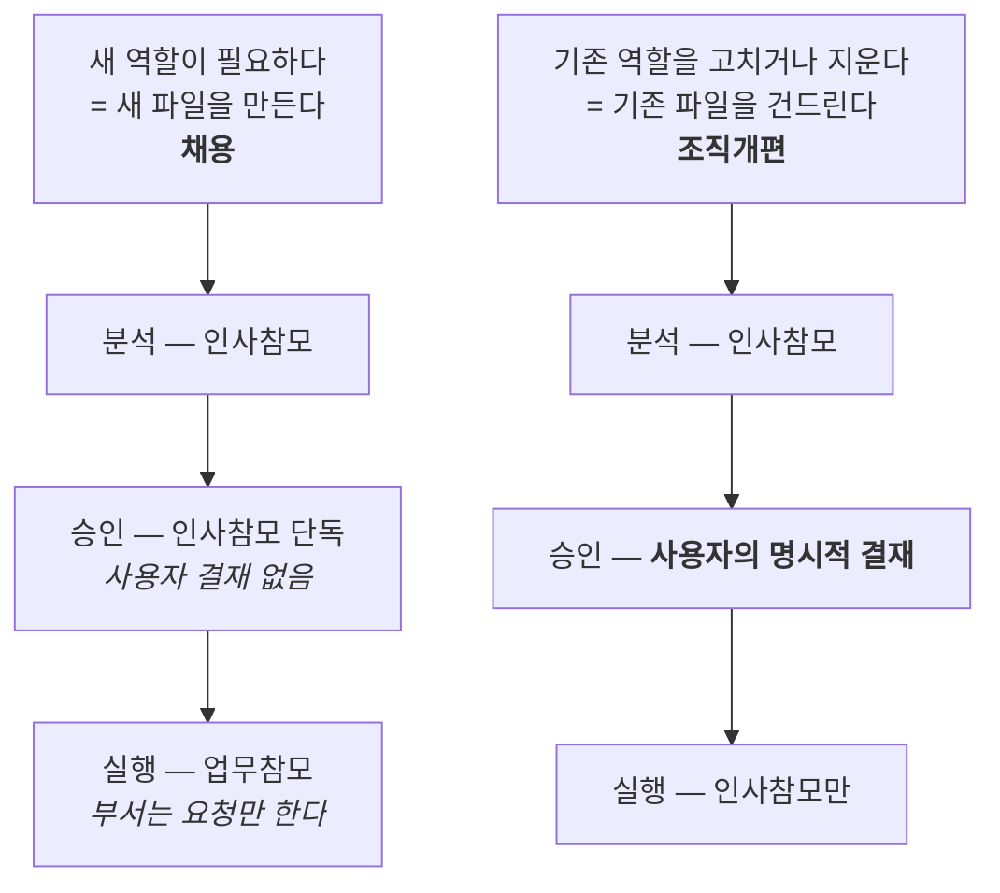

# 실행 책임과 운영 책임을 갈라놓은 이유

::: tip 읽는 자리 — 동작 원리 (2/5)
[동작 원리](/how-it-works) 대분류의 두 번째 글입니다. 앞
[Organization Model](/organization-model)이 조직의 배치도를 그렸다면, 이 페이지는 그 배치도에서
**가장 설명이 필요한 자리 하나**를 확대합니다 — 참모입니다. 실행 책임과 운영 책임을 왜 갈랐고,
참모가 왜 한 명에서 셋이 됐는지. 여기까지가 "정지 화면"이고, 다음
[Lifecycle](/lifecycle)부터 구조가 **움직이기 시작합니다.**
:::

부서가 일을 하는 동안, 그 위에서 조직 전체가 어긋나지 않게 살피는 역할이 따로 있어야 했습니다.
그런데 이 역할을 [뎁스-2 피라미드](/organization-model) 안에 그냥 끼워 넣으면 문제가 생깁니다 —
사용자가 부서마다 일일이 이 역할을 거치게 되어 뎁스가 조용히 늘어나기 때문입니다. 그래서 이
역할들은 아예 뎁스 바깥에 두기로 했습니다. 실제 회사에서 참모장교나 비서실이 위계도의 뎁스에
포함되지 않는 것과 같은 이치입니다.

## 세 명의 참모, 서로 동급

- **업무참모** — 사용자의 의도를 실제로 수행 가능한 업무로 바꾸고, 가장 알맞은 부서를 조립합니다.
- **인사참모** — 채용과 조직개편을 전담합니다. 업무 실행 자체에는 관여하지 않습니다.
- **자산참모** — 어떤 역할이 실제로 어떤 도구·MCP·스킬을 쓸 수 있는지(provisioning)를 전담합니다.

셋 다 실행 책임을 지지 않고, 서로 동급이며, 어느 쪽도 다른 쪽에 보고하지 않습니다. 업무참모가
인사나 provisioning을 직접 결정하는 일도 없습니다 — 필요하면 해당 참모에게 요청만 합니다.

<figure>
<svg viewBox="0 0 640 300" role="img" aria-label="사용자 아래 부서-부서원으로 이어지는 라인 조직과, 뎁스에는 포함되지 않지만 사용자와 부서 사이에서 조율하는 업무참모·인사참모·자산참모 세 명의 동급 참모, 그리고 Meta 모드에서만 활동하는 별도의 경영참모">
  <defs>
    <marker id="arrow-sg" viewBox="0 0 10 10" refX="8" refY="5" markerWidth="6" markerHeight="6" orient="auto-start-reverse">
      <path d="M 0 0 L 10 5 L 0 10 z" fill="currentColor" />
    </marker>
  </defs>

  <text x="160" y="18" text-anchor="middle" font-size="12" font-weight="600">라인(뎁스 2)</text>
  <circle cx="160" cy="34" r="12" fill="none" stroke="currentColor" stroke-width="1.5" />
  <text x="160" y="65" text-anchor="middle" font-size="11">사용자</text>
  <line x1="160" y1="46" x2="160" y2="83" stroke="currentColor" stroke-width="1.5" marker-end="url(#arrow-sg)" />

  <rect x="100" y="85" width="120" height="40" rx="6" fill="none" stroke="currentColor" stroke-width="1.5" />
  <text x="160" y="110" text-anchor="middle" font-size="12">부서(PM)</text>
  <line x1="160" y1="125" x2="160" y2="158" stroke="currentColor" stroke-width="1.5" marker-end="url(#arrow-sg)" />

  <rect x="100" y="158" width="120" height="40" rx="6" fill="none" stroke="currentColor" stroke-width="1.5" />
  <text x="160" y="183" text-anchor="middle" font-size="12">부서원</text>

  <text x="495" y="18" text-anchor="middle" font-size="12" font-weight="600">참모(Staff) — 뎁스 밖</text>
  <path d="M 220 100 C 300 100, 330 90, 392 82" fill="none" stroke="currentColor" stroke-width="1.5" stroke-dasharray="3 4" />
  <text x="300" y="90" text-anchor="middle" font-size="9" opacity="0.7">필요할 때만 경유</text>

  <rect x="392" y="65" width="86" height="40" rx="6" fill="none" stroke="currentColor" stroke-width="1.5" />
  <text x="435" y="90" text-anchor="middle" font-size="11">업무참모</text>

  <rect x="486" y="65" width="86" height="40" rx="6" fill="none" stroke="currentColor" stroke-width="1.5" />
  <text x="529" y="90" text-anchor="middle" font-size="11">인사참모</text>

  <rect x="580" y="65" width="52" height="40" rx="6" fill="none" stroke="currentColor" stroke-width="1.5" />
  <text x="606" y="90" text-anchor="middle" font-size="10">자산<tspan x="606" dy="11">참모</tspan></text>

  <line x1="478" y1="85" x2="486" y2="85" stroke="currentColor" stroke-width="1.5" stroke-dasharray="2 3" />
  <line x1="572" y1="85" x2="580" y2="85" stroke="currentColor" stroke-width="1.5" stroke-dasharray="2 3" />
  <text x="512" y="122" text-anchor="middle" font-size="10" opacity="0.7">동급 · 실행 책임 없음 · 서로 보고하지 않음</text>

  <path d="M 435 105 C 400 135, 260 130, 222 108" fill="none" stroke="#c1652a" stroke-width="1.5" stroke-dasharray="4 4" marker-end="url(#arrow-sg)" />
  <text x="330" y="150" text-anchor="middle" font-size="10" fill="#c1652a">부서 조립 · 지시</text>

  <rect x="452" y="200" width="178" height="52" rx="6" fill="none" stroke="#c1652a" stroke-width="1.5" stroke-dasharray="4 4" />
  <text x="541" y="221" text-anchor="middle" font-size="11" fill="#c1652a">경영참모</text>
  <text x="541" y="238" text-anchor="middle" font-size="9" fill="#c1652a">Meta 모드 전용 · 뎁스 밖</text>
  <line x1="529" y1="105" x2="541" y2="200" stroke="#c1652a" stroke-width="1.5" stroke-dasharray="4 4" />
  <text x="600" y="180" text-anchor="middle" font-size="9" fill="#c1652a">실행에는 관여 안 함</text>
</svg>
<figcaption>왼쪽은 뎁스-2 라인 조직, 오른쪽 위는 뎁스 밖에서 서로 동급으로 일하는 세 참모,
오른쪽 아래는 Operator 모드 조직 운영에는 관여하지 않고 Meta 모드에서만 활동하는 경영참모.</figcaption>
</figure>

## 책임을 두 종류로 나눈 이유

**실행 책임**(부서가 지는, 결과물의 기술적 정확성에 대한 책임)과 **운영 책임**(세 참모가 각자
영역에서 지는 책임)을 섞으면, 문제가 생겼을 때 "누구 책임인가"가 다시 흐려집니다.
[Philosophy](/philosophy)의 넷째 원칙이 다시 등장하는 지점입니다.

## 참모가 원래 한 명이었다는 이야기

지금은 셋이지만, 처음 설계할 때 참모는 **한 명**이었습니다. 그 한 명이 일도 배분하고, 사람도
뽑고, 도구 권한도 정하는 구조였죠. 여기서 실제로 겪은 문제와 그걸 푼 과정이, 이 조직에서 가장
많은 걸 알려주는 사례라 자세히 옮겨둡니다.

::: info 결정 되짚어보기 — 채용 권한을 참모에게서 떼어낸 이유
**문제.** 참모 한 명이 조직 구성을 마음대로 바꿀 수 있으면 곤란합니다. 그렇다고 채용할 때마다
사용자가 일일이 승인하면 승인 피로가 옵니다. 양쪽 다 안 되는 상황이었습니다.

**조사.** 처음엔 **기술적으로 탐지**하려 했습니다. "단순 채용"인지 "조직개편"인지를 파일 변경
내역에서 자동으로 구분해내면 되지 않을까? 조사 결과는 이 방향이 계속 뚫린다는 것이었습니다 —
새 파일을 만들고 옛 파일을 지우거나, `mv`로 이름만 바꾸거나, 파일 안의 `id:` 값만 바꿔치기하면
전부 빠져나갑니다. 결정 문서의 결론이 정확합니다: 이런 안전장치들이 *"kept being defeated by new
bypass shapes"*(막을 때마다 새로운 우회 모양에 계속 뚫렸다), 왜냐하면 **"does this operation
deserve extra scrutiny"는 어떤 경로 매칭 메커니즘으로도 완전히 풀 수 없는 의미론적 판단**이기
때문입니다.
(근거: `knowledge/decisions/2026-07-07-hr-orchestrator-split.md`)

**해결.** 탐지를 포기하고 **구조**로 바꿨습니다. ① 채용/조직개편 권한만 떼어내 별도의
참모(인사참모)에게 넘기고, ② 나아가 *분석·승인·실행*을 서로 다른 주체에게 나눠, 한 주체가
결정과 실행을 동시에 하지 못하게 했습니다. 그리고 결정적인 한 수 — **부서는 기존 역할 파일에
대해 권한이 전혀 없습니다. 부서가 관여할 수 있는 건 새 역할을 요청하는 것뿐이고, 그 파일을
실제로 만드는 것도 부서가 아니라 업무참모입니다.** 그러면 "새 파일이냐 기존 파일이냐"라는
기계적으로 확인 가능한 선 하나로 채용과 조직개편이 갈립니다. 애매한 경우를 사후에 분류하려
애쓰는 대신, **애매한 경우가 생기지 않도록 조직 설계 자체를 바꾼 것**입니다.

**그래서 생긴 강점.** 채용은 여전히 값쌉니다(인사참모가 단독 승인 — 사용자 피로 없음). 반면
기존 구조를 흔들 수 있는 조직개편만 사용자의 명시적 결재에 걸립니다. 즉 **정말로 신호가 되는
한 가지에만 사람의 확인을 쓰고**, 나머지는 자동으로 흘러갑니다.
:::

두 경로를 가르는 기준이 "의도"가 아니라 **"새 파일인가, 기존 파일인가"**라는 점이 이 설계의
핵심입니다 — 판단이 아니라 사실로 갈리기 때문에 우회할 여지가 없습니다.

## 그런데 왜 셋이 됐나

두 번째 참모까지는 채용 문제로 설명됩니다. 세 번째(자산참모)는 전혀 다른 데서 나왔습니다.

::: info 결정 되짚어보기 — 도구는 개인의 것이 아니라 조직의 것이다
**문제.** 새로 합류한 역할에게 무엇을 쥐여줘야 하는가를 정리하다가, 두 가지가 전혀 다른
성질이라는 게 드러났습니다 — **페르소나**(자기 전문성과 책임, 개인에게 속함)와
**provisioning**(도구·MCP·모델·스킬, 즉 실제로 행동할 수단). 후자는 회사가 노트북을 지급하는
것과 같아서 **개인이 아니라 조직에 속합니다.**

**조사.** 처음엔 이걸 담당할 "총무팀"이라는 평범한 부서를 만들려 했습니다. 그런데 두 가지가
걸렸습니다. ① 이 기능은 조직에 따라 있어도 되고 없어도 되는 게 아니라, *조직의 실제 제약을
"무엇을 써도 되는가"로 번역하는 일* 자체가 인사 기능만큼 보편적입니다 — 다만 **무엇이 승인되는지는
배포마다 완전히 다릅니다**(어떤 조직은 보안 기준, 어떤 조직은 비용·라이선스 기준). ② 더 결정적으로,
평범한 부서가 이걸 맡으면 **"그 부서 자신의 provisioning은 누가 승인하나"**라는 순환이 생깁니다 —
인사참모를 만들 때 피했던 것과 똑같은 순환입니다.
(근거: `knowledge/decisions/2026-07-07-as-orchestrator-provisioning-split.md`)

**해결.** 인사참모와 같은 처방을 썼습니다 — 채용되는 부서가 아니라 **헌법이 직접 정의하는 세 번째
참모**로 만들어 순환을 끊었습니다. 이름을 "보안팀"이나 "총무팀"이 아니라 **자산참모**로 정한 것도
의도적입니다: 이름은 어느 배포에서나 통해야 하고(제약의 종류는 배포마다 다르므로), 구체적인 정책
내용만 그 배포의 것으로 남깁니다. 그래서 역할이 셋으로 정리됐습니다 — **인사참모는 누가 존재하는지,
업무참모는 무슨 일이 일어나는지, 자산참모는 무엇을 쓸 수 있는지**를 결정합니다.

**그래서 생긴 강점.** 셋은 서로 독립된 게이트입니다. **채용 승인이 provisioning 승인을 뜻하지
않습니다** — 뽑혔다고 해서 도구를 자동으로 받는 게 아니라, 별도의 판단을 한 번 더 통과해야 합니다.
:::

한 가지 더, 이 게이트에는 흥미로운 후일담이 있습니다.

::: info 결정 되짚어보기 — 게이트에 덧칠하는 대신, 판단의 기준을 적었다
**문제.** 역할이 부서에 묶이지 않는 재사용 클래스가 되자 부작용이 보였습니다 — 한 부서가
필요하다고 해서 어떤 클래스에 권한을 주면, 그 권한이 **그 클래스를 재사용하는 미래의 모든 부서에
영구히 따라붙습니다.** 한 방향으로만 조여지는 톱니바퀴처럼, 최소 권한 원칙이 서서히 무너집니다.

**조사.** 첫 해법 후보는 새 메커니즘이었습니다 — 부서마다 별도의 `provisioning.yaml`을 두는 것.
검토해 보니 **안전해지는 게 없었습니다**: 결국 같은 자산참모가 같은 판단으로 그 새 파일을 채우게
되니까요. 그래서 전제를 다시 봤더니, 애초에 **범위**(어떤 데이터, 어떤 자격증명)에 관한 요청은
**역량**(이 도구를 아예 써도 되는가)을 다루는 provisioning이 기록할 대상이 아니었습니다 — 그건
`Read` 호출이 어떤 파일을 읽느냐와 같은 런타임 파라미터입니다.
(근거: `knowledge/decisions/2026-07-09-provisioning-scope-is-a-judgment-not-a-mechanism.md`)

**해결.** 새 스키마도, 부서별 파일도 만들지 않았습니다. 대신 자산참모 문서에 **판단이 그어야 할
선**을 명시했습니다 — (a) 성긴 역량 승인은 provisioning이 다루고, (b) 세부 범위·자격증명 발급은
provisioning의 일이 아니다. 그리고 (b)처럼 보이는 요청이 오면 그건 **카탈로그 항목이 너무 성기게
정의됐다는 신호**로 읽고, 새 승인 계층을 만드는 대신 카탈로그를 알맞은 입도로 다시 씁니다.

**그래서 생긴 강점.** *"Adding scaffolding around a gate that already can't be skipped doesn't make
the judgment behind it any sharper"* — 어차피 우회할 수 없는 게이트에 구조물을 덧대봐야 그 뒤의
판단이 날카로워지지는 않습니다. 이 결정은 **문제를 메커니즘으로 착각하지 않은 사례**로 남았고,
덕분에 조직에 관리해야 할 파일이 하나도 늘지 않았습니다.
:::

## Meta 모드의 파트너

이 셋과 별개로, 조직 스키마(CONSTITUTION·schema·governance) 자체의 진화를 분석·제안하는
**경영참모**가 있습니다 — 다만 오직 Meta 모드에서만 활동하고, 실제 변경은 항상 사용자 확인을
거칩니다. 자세한 구분은 [Operator vs Meta Mode](/operator-vs-meta-mode)에서 이어집니다.

## Quick guide

**한 문장으로.** 참모 셋은 뎁스 밖에 서서 서로 동급으로 각자 다른 질문 하나씩만 맡습니다 —
**누가 존재하는가(인사)·무슨 일이 일어나는가(업무)·무엇을 쓸 수 있는가(자산)** — 그리고 이 분리
자체가 한 주체가 결정과 실행을 동시에 하지 못하게 막는 안전장치입니다.

**이 페이지를 직접 확인해 보려면**

1. 세 참모의 실제 정의는 `schema/OP_ORCHESTRATOR.md` / `HR_ORCHESTRATOR.md` /
   `AS_ORCHESTRATOR.md` 세 파일입니다. 각 문서가 **자기 영역 밖의 일은 하지 않는다**고 명시적으로
   적어둔 문장을 찾아보세요 — 경계가 문서에 박혀 있습니다.
2. 채용/조직개편의 분석·승인·실행 분리는 `CONSTITUTION.md` §10.5, §10.8에 표로 있습니다.
3. 어떤 역할이 무엇을 쓸 수 있는지는 각 역할 파일의 `provisioning` 필드, 승인된 카탈로그는
   `assets/index.yaml`입니다. 이 둘이 **왜 따로인지**가 위 세 번째 결정 상자의 내용입니다.

**헷갈리기 쉬운 것 하나.** "참모가 부서보다 윗사람"은 아닙니다. 참모는 실행 책임을 지지 않고,
부서는 운영 책임을 지지 않습니다 — 위아래가 아니라 **다른 종류의 책임**입니다.

**다음으로.** 여기까지가 정지 화면입니다. 이제 부서 하나가 태어나서 끝날 때까지의 시간축 →
[Lifecycle](/lifecycle). (조직이 자기 자신을 바꾸는 순간을 어떻게 격리했는지는 이 대분류의
마지막 글 [Operator vs Meta Mode](/operator-vs-meta-mode)에 있습니다.)

*근거: `CONSTITUTION.md` §10.3–§10.9, §11; `schema/OP_ORCHESTRATOR.md`,
`schema/HR_ORCHESTRATOR.md`, `schema/AS_ORCHESTRATOR.md`, `schema/MG_ORCHESTRATOR.md`;
`knowledge/decisions/`의 `2026-07-07-hr-orchestrator-split.md`,
`2026-07-07-as-orchestrator-provisioning-split.md`,
`2026-07-09-provisioning-scope-is-a-judgment-not-a-mechanism.md`.*
