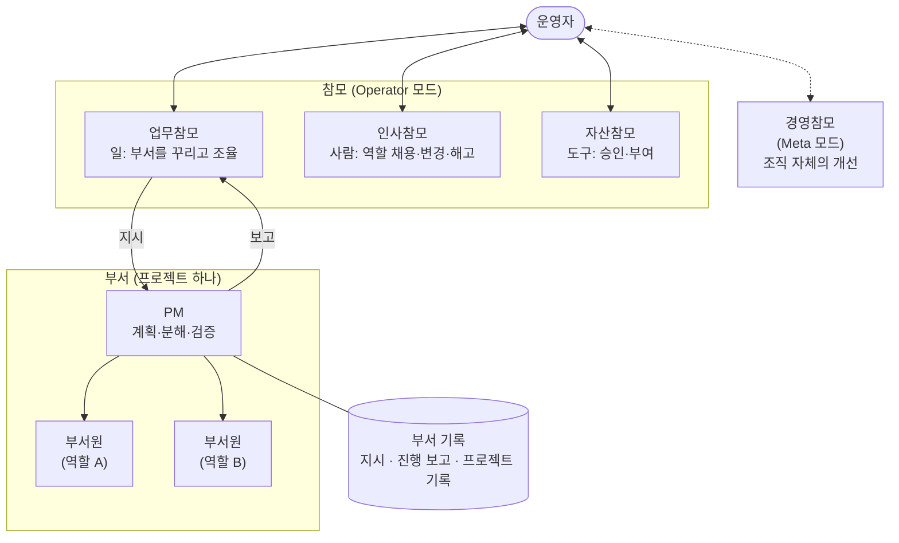

# 2. 한눈에 보기

::: lead
운영자는 참모하고만 이야기하고, 업무참모는 일을 부서에 맡기고, 부서의 PM은 일을 나눠 부서원에게 맡긴 뒤
결과를 직접 확인해서 위로 보고합니다.
:::

이 쪽은 "어떻게"만 보여 드립니다. "왜 이렇게 만들었나"는 [3. 왜 조직인가](/story/why-organization)와
[4. 원칙](/story/principles)에 있습니다.

## 운영자가 지시하면 일어나는 일, 다섯 문장으로

::: point 1. 운영자는 먼저 세션의 모드를 정합니다 — 조직을 써서 일을 하는 **Operator 모드**인지, 조직 자체를 고치는 **Meta 모드**인지.
선언은 `/aise:op` 또는 `/aise:meta` 명령으로 하고, 선언이 없으면 보호된 핵심 문서에 쓰기가 막힙니다. 두 모드를
나눈 이유는 참고 자료 [Operator vs Meta Mode](/operator-vs-meta-mode)에 있습니다.
:::

::: point 2. Operator 모드에서 운영자는 **업무참모** 한 명에게만 말합니다. 업무참모는 어느 부서의 일인지 판단해 그 부서에 지시를 적고, 맞는 부서가 없으면 새로 만듭니다.
업무참모가 부서 안에 쓸 수 있는 파일은 지시 파일(`directive.md`) 하나뿐입니다. 부서의 기록은 그 부서의 PM만
씁니다. 운영자가 PM에게 직접 지시하는 경로는 두지 않았습니다(건너뛰기 금지).
:::

::: point 3. 부서의 **PM**은 자기 부서의 기록을 읽고 계획을 세운 뒤 일을 나눠 **부서원**(역할)에게 맡깁니다. 필요한 역할이나 도구가 없으면 업무참모를 거쳐 인사참모·자산참모에게 요청합니다.
PM은 세션 사이의 기억이 없습니다. 그래서 매번 부서의 기록 세 파일(지시, 진행 보고, 프로젝트 기록)을 읽고
시작합니다. 서로 기다려야 하는 일은 공유 결정을 먼저 정한 다음 병렬로 나눕니다.
:::

::: point 4. PM은 부서원의 결과를 직접 확인하고 합친 뒤, 기록을 남기고 결과물을 PR로 올려 업무참모에게 보고합니다. 운영자의 결정이 필요한 것은 이 보고에 실려 올라옵니다.
PM은 부서원의 "다 됐습니다"를 그대로 믿지 않고 실제 커밋이나 도구 호출을 대조합니다. 운영자가 결정할
것(병합, 범위 변경, 자격 증명 같은 것)은 진행 보고의 "운영자 결정" 표에 남습니다.
:::

::: point 5. 업무참모는 PM의 보고도 그대로 믿지 않고 실제 산출물로 다시 확인한 뒤 운영자에게 보고합니다. 병합과 공개 같은 마지막 결정은 운영자가 합니다.
:::

## 구조 그림 한 장

선은 위아래로만 이어집니다. 운영자에서 PM으로, PM에서 다른 부서의 PM으로 가는 선은 없습니다. 실행 책임을
지는 줄(운영자 — 부서 — 부서원)은 두 단계를 넘지 않습니다. 참모는 그 줄에 세지 않는 보좌 조직입니다. 더 자세한
그림은 참고 자료 [조직의 모양](/organization-model)과 [참모와 거버넌스](/staff-governance)에 있습니다.

## 누가 무엇을 하나

| 자리 | 하는 일 | 하지 않는 일 |
|---|---|---|
| 운영자 | 모드를 정하고 참모에게 지시·결정. 병합·공개, 영향이 큰 도구의 도입, 부서 종료, 정책·거버넌스 변경을 결정 | PM이나 부서원에게 직접 지시하지 않음 |
| 업무참모 | 지시를 해석해 부서에 배정, 부서를 꾸림, 부서 사이 조율, PM 보고를 실제 산출물로 재검증 | 부서의 기록을 직접 고치지 않음(지시 파일만 씀), 직접 개발하지 않음 |
| 인사참모 | 역할(직무 정의) 채용·정의 변경·해고, 부서에 합류하는 역할의 도메인 조사 | 프로젝트 일을 하지 않음 |
| 자산참모 | 도구(스킬, MCP 서버 등)의 승인 목록 관리, 역할마다 쓸 수 있는 도구 결정 | 어떤 역할이 있을지 정하지 않음 |
| 경영참모 | Meta 모드에서 조직 자체(규칙, 구조, 메커니즘)를 진단하고 고침 | 프로젝트 일을 하지 않음 |
| PM | 부서의 계획·완료 기준·방법론, 일의 분해와 위임, 결과 검증과 통합, 부서 기록 작성 | 부서의 종료를 스스로 정하지 않음, 완료 기준을 혼자 바꾸지 않음 |
| 부서원 | 한 분야의 단일 책임으로 실제 실행(코드, 설정, 점검) | 다른 에이전트를 부르지 않음, 부서 밖과 직접 소통하지 않음 |

## 실제로 있었던 요청 하나: 2026-10-01 "upstream 변경 전파 시험"

이번 주에 실제로 있었던 일을 처음부터 끝까지 따라가 봅니다. 모든 단계가 기록으로 남아 있습니다.

::: point ① 운영자의 지시 — aise-core가 크게 재구성됐으니, 이것을 쓰는 세 부서가 얼마나 잘 흡수하는지 보고, 앞으로 더 싸게 흡수할 방법을 각 PM에게서 받아 보자.
2026-10-01, aise-core의 규칙 문서가 다시 쓰이고 결정 기록 124개 파일이 주제별 30개 파일로 옮겨졌습니다. 세 부서
(이 사이트, 위키 플랫폼, 검색 플랫폼)가 이 내용을 콘텐츠나 데이터로 쓰고 있었습니다.

근거: 업무참모의 부서 간 조율 기록 "2026-10-01 — aise-core upstream restructure: propagation test" (기록 있음, 저장소 비공개).
:::

::: point ② 업무참모 — 세 부서의 지시 파일에 사실과 요청만 적었습니다. 무엇을 어떻게 고치라는 처방은 하지 않았습니다.
운영자의 목적이 "각 PM이 스스로 얼마나 잘 흡수하나"를 보는 것이었기 때문입니다. 전달한 것은 바뀐 커밋, 옛
파일명과 새 인용의 대응표, 점검 도구 이름이었습니다.
:::

::: point ③ 각 부서의 PM — 자기 부서가 받은 영향을 직접 조사하고, 계획하고, 고쳤습니다. 한 부서는 일을 세 갈래로 나눠 부서원 셋에게 병렬로 맡겼습니다.
- 이 사이트 부서: 풀리지 않는 결정 인용 167건과 경로 6건, 바뀐 규칙 서술을 찾아 7쪽 × 두 언어를 고쳤습니다(PR #14).
- 위키 플랫폼 부서: PM이 9쪽을 세 묶음으로 나눠 같은 역할(backend-engineer)의 부서원 셋에게 각자의 브랜치에서
  병렬로 맡기고, 결과를 확인한 뒤 하나로 합쳤습니다(병합 커밋 `ed23834`).
- 검색 플랫폼 부서: 검색용 데이터를 청크 단위로 대조해 죽은 경로를 가리키는 청크를 찾고 다시 동기화했습니다.
  이 run은 중간에 사용량 한도로 끊겼다가 같은 작업을 이어서 끝냈습니다.
:::

::: point ④ PM의 보고 — 결과와 함께 "다음에는 더 싸게 흡수할 방법"을 각자 제안했습니다.
예: 이 사이트 부서는 사이트가 마지막으로 대조한 aise-core 커밋을 기록하고 점검을 스크립트로 만들었습니다.
aise-core 쪽에는 "바뀐 개념 목록을 한 줄씩 같이 보내 달라"고 제안했습니다. 이 제안 중 일부는 이후 aise-core에
반영됐습니다(변경 알림 문서).
:::

::: point ⑤ 업무참모의 재검증 — PM의 보고를 믿지 않고, 브랜치를 직접 받아 점검을 다시 돌렸습니다.
이 사이트 부서의 경우, 업무참모가 임시 작업 폴더에서 같은 점검 스크립트를 다시 실행해 참조 0건, 인용 0건을
확인했고, 브라우저 점검 결과 파일의 숫자가 PM 보고와 같은지 대조했습니다. 확인하지 못한 것(한국어 글꼴 문제로
한국어 화면은 아무도 눈으로 확인하지 못함)도 그대로 적었습니다.
:::

::: point ⑥ 운영자의 결정 — PR을 병합하고 공개했습니다. 그 뒤 PM이 공개된 사이트를 다시 확인했습니다.
PR #14는 2026-10-06 `dev`에, 이어서 `main`에 반영돼 공개됐습니다. 2026-10-07 이 부서의 PM이 공개된 문구를
실제 브라우저로 다시 확인했고, 옛 문구가 남아 있으면 실패하는지도 옛 빌드로 함께 시험했습니다.
:::

**이 예에서 보이는 것.** 운영자가 한 일은 지시 한 번과 병합뿐이었습니다. 계획, 분해, 병렬 위임, 검증은 각 층이
자기 몫만 했습니다. 왜 이런 모양을 골랐는지가 [다음 쪽](/story/why-organization)의 이야기입니다.

**다음으로.** → [3. 왜: 통제와 조직 모델](/story/why-organization)
