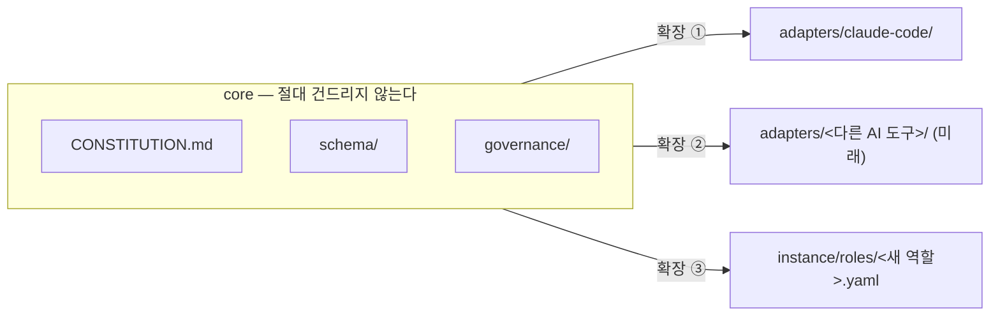

# 고치지 않고 확장한다

::: tip 읽는 자리 — 평가와 가치 (1/2)
[평가와 가치](/value) 대분류의 첫 글입니다. 앞 대분류에서 이 조직을 **써 보는 법**까지
끝냈으니, 이제 되짚을 차례입니다 — 그런데 구조의 값어치는 새 기능을 넣을 때가 아니라
**기존 것을 안 건드리고 넣을 수 있는지**에서 갈립니다. 그래서 "바꿔야 할 때 어떻게
버티는가"가 먼저고, 다음 [Ultimate Goal](/ultimate-goal)에서 "그래서 최종적으로 무엇을
만들려는 것인가"로 닫습니다.
:::

이 조직의 구현 자체도 소프트웨어 설계 원칙을 하나 그대로 따릅니다 — SOLID 중에서도
**개방-폐쇄 원칙(OCP)**입니다. 새로운 게 필요해지면 기존 걸 고치는 대신 옆에 더합니다.

- 새로운 AI 도구를 지원하려면 새로운 `adapters/<tool>/`를 추가합니다 — 기존 core
  (`CONSTITUTION.md`, `schema/`, `assets/`, `knowledge/`, `continuity/`, `governance/`)는
  건드리지 않습니다.
- 새로운 역할·역량이 필요하면 `schema/` 안에 새 파일을 추가합니다 — 기존 adapter나 core 로직은
  수정하지 않습니다.
- Core는 도구에 독립적인 문서·데이터로만 구성됩니다. 특정 AI 도구에만 있는 기능(hooks, slash
  command, subagent 형식 등)은 반드시 `adapters/`에만 존재합니다.

그런데 원칙만 선언해 두면, "이게 정말 tool-specific한 것인가"는 매번 누군가 알아채고 판단해야
하는 일로 남습니다. 실제로 그런 순간이 두 번 있었습니다 — 한 번은 도구 바깥(adapter)을 향해,
한 번은 도구 안쪽(hooks)을 향해서.

::: info 결정 되짚어보기 — OCP를 선언에서 그치지 않고 "체크 가능한 것"으로 만들기
**문제.** `CONSTITUTION.md` §9와 `governance/STANDING_RULES.md`가 이미 OCP 원칙과 "도구별
메커니즘은 체크인이 필요하다"는 규칙을 담고 있었지만, 정작 "이 기능이 tool-specific인지"를
판단하는 반복 가능한 테스트가 없었습니다. 게다가 두 번째 adapter(다른 AI 도구용)가 실제로
첫 번째 adapter가 커버한 걸 다 커버했는지 확인할 방법도 없었습니다.

**조사.** 결정 문서는 이 공백을 정확히 짚습니다 — *"nothing wrote down why that shape is
required or gave a repeatable test for 'is this tool-specific?'"*, 그 결과 판단이 "매번 누군가
알아채고 체크인하는 것"에만 의존했고, *"no way to check whether a future second adapter ...
actually covers everything the first one does"*(미래의 두 번째 adapter가 첫 번째가 하는 걸 전부
커버하는지 확인할 방법이 없었다)는 상태였습니다.
(근거: `knowledge/decisions/2026-07-08-adapter-conformance-policy.md`)

**해결.** `governance/ADAPTER_POLICY.md`를 신설해 판단 기준을 구체적인 테스트로 바꿨습니다 —
*"a concrete test (\"would this need to change if the underlying AI tool changed?\")"*. 모든
`adapters/<tool>/README.md`는 core 개념마다 한 줄씩 있는 바인딩 표를 갖도록 형식을 고정하고,
아직 안 만든 바인딩은 `*(not yet built)*`로 명시하며, "conformance"의 정의 자체를 **표 위에서의
행-대-행 일치**로 못박았습니다(구현이 똑같아야 한다는 뜻이 아닙니다).

**그래서 생긴 강점.** 두 번째 adapter가 실제로 뭘 다 갖췄는지가 더 이상 감(感)이 아니라 표
대조로 기계적으로 확인됩니다. 이 사이트 자신의 mermaid 도입(Phase 10a, i18n 스캐폴드와 함께
추가)도 이 판단 아래 이뤄졌습니다 — "이미 있는 걸 고치지 않고 옆에 더한다"는 같은 원칙을
그대로 따른 선택이었습니다.
:::

::: info 결정 되짚어보기 — 세 번째가 되기 전엔 추출하지 않는다
**문제.** `mode-gate.sh`와 `execution_directive_gate.py`는 이미 각자 독립적으로 똑같은 모양(들어온
JSON을 읽고, 대상 경로를 저장소 루트 기준으로 정규화하고, 표준 형식의 허용/거부 응답을 출력하는
것)을 따로따로 구현하고 있었습니다. 조직개편 승인 게이트를 새로 만들면, 이 중복이 세 번째로
그대로 반복될 상황이었습니다.

**조사.** 결정 문서는 이걸 그대로 짚습니다 — *"mode-gate.sh and execution_directive_gate.py
already independently reimplement the same shape ... the reorg gate would be a third occurrence
of this exact duplication"*. 공유 모듈을 미리 만들어 두지 않고 여기까지 기다린 이유도 명확히
밝힙니다 — *"The shared module is justified by the rule-of-three, not built speculatively — this
was the third occurrence of the exact same duplicated shape"*.
(근거: `knowledge/decisions/2026-09-01-reorg-approval-gate-shared-common-module.md`)

**해결.** `gate_common.py`로 공유 헬퍼를 뽑아내고, 기존 게이트는 동작이 그대로인지 새 유닛
테스트로 검증한 뒤에만 옮겼습니다. 새 조직개편 게이트(`reorg_approval_gate.py`)는 처음부터 이
모듈 위에 지었습니다.

**그래서 생긴 강점.** *"a fourth (any future path-based gate) now cheaper to add correctly"* —
네 번째 게이트가 필요해지면 이제 훨씬 싸게, 그리고 정확하게 추가할 수 있습니다. 공유 모듈을
"언젠가 필요할 것 같아서" 미리 만들지 않고, 실제로 세 번 반복된 뒤에야 추출한 것 자체가 이
페이지의 원칙과 같은 방향입니다 — 확장은 자유롭게 하되, 구조를 성급하게 미리 깔아두지는
않습니다.
:::

## Quick guide

**한 문장으로.** 이 조직은 새 능력이 필요할 때마다 기존 코드를 고치는 대신 옆에 새 파일을
추가하고, 그 판단 기준 자체도(무엇이 tool-specific인지, 언제 공유 모듈을 뽑아도 되는지) 추측이
아니라 체크 가능한 테스트로 고정해 둡니다.

**이 페이지를 직접 확인해 보려면**

1. `governance/ADAPTER_POLICY.md`의 바인딩 표 형식과 `*(not yet built)*` 표기를 직접 열어보세요.
2. `.claude/hooks/gate_common.py`를 열어 `mode-gate.sh`·`execution_directive_gate.py`·
   `reorg_approval_gate.py` 셋이 실제로 이 모듈을 공유하는지 확인할 수 있습니다.
3. `adapters/claude-code/README.md`의 바인딩 표에서 core 개념 하나하나가 이 도구에서 어떻게
   구현됐는지(또는 아직 안 됐는지) 볼 수 있습니다.

**다음으로.** 이 조직이 궁극적으로 무엇을 만들려는 것인지 → [Ultimate Goal](/ultimate-goal).

*근거: `CONSTITUTION.md` §9; `knowledge/decisions/2026-07-08-adapter-conformance-policy.md`,
`knowledge/decisions/2026-09-01-reorg-approval-gate-shared-common-module.md`.*
