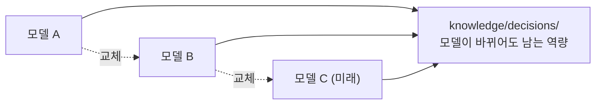

# 프레임워크가 아니라 조직을 만드는 이유

::: tip 읽는 자리 — 평가와 가치 (2/2)
[평가와 가치](/value) 대분류의 마지막 글이고, 전체 서사의 끝입니다. 앞
[Structural Principles / OCP](/structural-principles-ocp)가 "이 구조가 변경을 견디는가"에
답했다면, 이 페이지는 **"그래서 이 모든 게 무엇을 위한 것인가"** 에 답합니다 — 왜 이것을
"프레임워크"가 아니라 "조직"이라고 부르는지. 처음 [Home](/)에서 던진 질문이 여기서 닫힙니다.
:::

AISE는 멀티 에이전트 프레임워크를 만드는 프로젝트가 아닙니다. 그런 프레임워크는 이미 여럿 있고,
앞으로도 계속 나올 겁니다. AISE가 만들려는 건 다른 층위에 있습니다 — AI를 활용해 **스스로 학습하고,
스스로 성장하며, 지속적으로 조직 역량을 축적하는 AI 조직 운영 체계**입니다.

이 차이는 실제로 중요합니다. 프레임워크는 새 모델이 나올 때마다 다시 튜닝해야 하지만, 조직은
시간이 지날수록 더 유능해져야 하고, 그 성장은 새로운 AI 기술이 등장해도 흔들리지 않아야 합니다 —
[Philosophy](/philosophy)의 첫째 원칙("조직이 중심이다")이 여기서 다시 확인됩니다. 도구(모델)는
언제든 교체될 수 있는 구성원이고, 바뀌지 않아야 하는 건 조직의 철학과 운영 원칙입니다.

그런데 "조직이 기억한다"는 말은, 실제로는 두 가지 전혀 다른 성질의 기억을 하나로 뭉뚱그리기
쉽습니다 — 그 구분을 놓치지 않으려 한 번 이름을 통째로 바꾼 적이 있습니다.

::: info 결정 되짚어보기 — "기억"이라는 한 단어에 두 가지를 담지 않는다
**문제.** 실행 컨텍스트(세션, 에이전트 런)가 한계에 다다르면 하던 일이 통째로 사라질 위험이
있었습니다(`CONSTITUTION.md` §2.2, "조직은 기억해야 한다"). 이걸 막을 핸드오프 기록을 어디에
둘지 논의하던 중, 기존 `memory/` 디렉터리를 그대로 확장하는 안이 먼저 나왔습니다.

**조사.** 운영자가 그 자리에서 반문했습니다 — *"'memory' as a word covers both durable,
accumulated knowledge (long-term memory) and in-progress working state (working memory) —
naming both the existing directory and the new one around 'memory' would keep that ambiguity
baked into the org's own vocabulary"*(장기 기억과 작업 중 상태를 둘 다 "memory"라는 한 단어로
부르면, 디렉터리를 나눠도 그 모호함이 조직의 용어 자체에 그대로 박제된다).
(근거: `knowledge/decisions/2026-07-08-knowledge-continuity-split.md`)

**해결.** `memory/`를 **`knowledge/`**로 새로 이름 붙여 "지속적으로 축적되는 조직 역량"만
담게 하고, 작업 중 상태(핸드오프 기록)는 별도의 새 디렉터리 **`continuity/`**로 분리했습니다.

**그래서 생긴 강점.** 핸드오프 기록이 나중에 반복되는 진짜 교훈으로 판명되면 그건 그때
`knowledge/retrospectives/`로 승격됩니다 — 하지만 *"the record itself, while work is still
open, is operational, not knowledge, and forcing a Meta-mode switch just to avoid losing
in-progress work would defeat the point of having continuity at all"*(작업이 아직 진행 중인
동안의 기록 자체는 operational이지 knowledge가 아니고, 진행 중인 작업을 잃지 않으려고 매번
Meta 모드로 전환하게 만드는 건 continuity를 두는 취지 자체를 무너뜨린다). 이 구분 덕분에, 이
사이트가 모델이 바뀔 때마다 통째로 다시 튜닝될 필요 없이 `knowledge/decisions/`에 쌓인 근거를
그대로 인용해 계속 자랄 수 있습니다 — 지금 이 페이지가 인용하는 결정 문서도 바로 그 디렉터리에
있습니다.
:::

## Quick guide

**한 문장으로.** AISE는 특정 모델·도구에 맞춰 튜닝되는 프레임워크가 아니라, 모델이 몇 번을
바뀌어도 `knowledge/decisions/`에 쌓인 역량은 그대로 남는 조직을 만드는 프로젝트입니다.

**이 페이지를 직접 확인해 보려면**

1. `knowledge/decisions/` 디렉터리를 열어 얼마나 많은 결정이 쌓여 있는지 직접 세어볼 수
   있습니다.
2. `continuity/README.md`와 `governance/CONTINUITY_POLICY.md`를 나란히 읽어보면, "작업 중
   상태"와 "축적된 역량"이 실제로 서로 다른 디렉터리·다른 규칙을 따른다는 걸 확인할 수 있습니다.
3. `CONSTITUTION.md` §4.6에서 지식자산의 네 가지 종류(Workflow/Capability/Framework/Registry)를
   직접 확인해 보세요 — "Memory"는 더 이상 그 목록에 없습니다.

**다음으로.** 여기서 쓴 용어들을 한 번에 모아 보려면 → [Glossary](/glossary).

*근거: `CONSTITUTION.md` §8; `knowledge/decisions/2026-07-08-knowledge-continuity-split.md`.*
