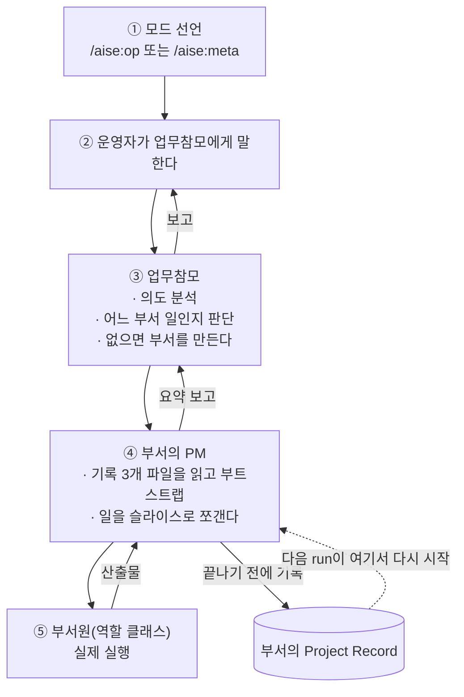

# 일을 맡기는 법

::: tip 읽는 자리 — 쓰는 법과 이어가기 (1/2)
[쓰는 법과 이어가기](/in-practice) 대분류의 첫 글입니다. 앞의 [동작 원리](/how-it-works)가
조직이 **어떻게 생겼는지**를 끝냈다면, 이 페이지는 그 조직에 **실제로 일을 맡기면 무슨 일이
일어나는지**를 순서대로 따라갑니다. 다음 [세션을 넘어 이어가기](/handoff)는 그 세션이 끝난
뒤의 이야기입니다.
:::

여기까지 읽으셨으면 조직도는 다 보신 셈입니다. 그런데 정작 **"그래서 일을 어떻게 시키나"**
는 아직 안 나왔습니다. 이 페이지는 운영자가 실제로 하는 동작만 순서대로 따라갑니다.

먼저 전체 그림입니다. 한 번의 지시가 지나는 경로는 이렇게 생겼습니다.

화살표가 위아래로만 흐른다는 점을 봐두시면 좋습니다. **건너뛰는 선이 없습니다** — 이게
우연이 아니라 명시적으로 금지된 것이라는 이야기가 아래에 나옵니다.

## 모자부터 고른다

일을 맡기기 전에 먼저 정할 게 하나 있습니다. 지금 하려는 일이 **조직을 써서 무언가를 만드는
일**인지, **조직 자신을 고치는 일**인지입니다. 이 조직은 이 둘을 같은 세션에서 섞지 않습니다.

- `/aise:op` — **Operator 모드.** 지금 있는 조직 그대로 실제 업무를 수행합니다. 조직의 보호된
  핵심 문서(헌법, 스키마, 메커니즘 문서)는 건드리지 않습니다.
- `/aise:meta` — **Meta 모드.** 조직 자신을 바꿉니다. 역할을 새로 만들고, 규칙을 고치고,
  워크플로우를 재설계합니다.

두 명령은 실제로 `.aise/mode` 파일에 `op` 또는 `meta` 한 단어를 씁니다. 그리고 이 선언이
없으면 보호된 경로에 쓰기가 막힙니다 — 선언이 예의가 아니라 실제 게이트라는 뜻입니다. 왜
이렇게까지 갈라놨는지는 [Operator vs Meta Mode](/operator-vs-meta-mode)에 따로 있습니다.

그런데 이 모드 선언 명령 자체에, 최근까지 꽤 큰 구멍이 하나 있었습니다.

::: info 결정 되짚어보기 — 참모가 자기 업무 매뉴얼을 한 번도 읽은 적이 없었다
**문제.** 새 규칙 두 개를 업무참모의 운영 문서에 추가했는데, 바로 다음 Operator 모드 세션에서
**0번 지켜졌습니다.** 규칙이 세션 시작 전에 이미 커밋돼 있었으니 "타이밍 때문"이라는 변명도
불가능한 상황이었습니다.

**조사.** 그 세션의 실제 도구 호출 기록을 직접 뒤졌더니 원인이 허무할 만큼 분명했습니다 —
*"it never read `schema/OP_ORCHESTRATOR.md` at all — not once, at any point."* 시스템 프롬프트도
확인했습니다. AISE 관련 내용이 하나도 없는 기본 프롬프트였습니다. 그럼 왜 여태 문제가 안
보였을까요? 다른 모든 역할은 **realize** 과정을 거쳐 역할 정의가 시스템 프롬프트로 구워지는데,
업무참모와 경영참모만은 "모드를 선언한 최상위 세션이 곧 그들"이라는 관례로만 존재했기
때문입니다. 실무에서 그럭저럭 굴러갔던 이유도 확인됐습니다 — 그 세션은 부서 기록들을 읽으면서
거기 배어 있는 관례를 **흉내 내고** 있었습니다. 그래서 오래된 규칙은 살아남고 갓 추가된
규칙만 조용히 무시됐습니다.
(근거: `knowledge/decisions/2026-09-15-orchestrator-persona-never-realized-nor-read.md`)

**해결.** `/aise:op`와 `/aise:meta` 양쪽에 단계를 하나씩 추가했습니다 — 해당 참모 문서를
**전문 읽기**, 그것도 "필요하면 참고할 레퍼런스"가 아니라 *"a real operating manual to follow
this session"* 이라고 명시해서. 더 무거운 장치(별도 realize 아티팩트)는 일부러 안 만들었습니다 —
이 두 참모는 애초에 소환 가능한 서브에이전트가 아니라서 그 파일을 고를 방법 자체가 없고,
*"it would sit unused."*

**그래서 생긴 강점.** 이제 모드 선언이 스위치를 켜는 동작이 아니라 **그 세션의 업무 매뉴얼을
실제로 로드하는 동작**이 됐습니다. 부수적으로 얻은 게 더 있습니다 — 이 조직은 "규칙을 문서에
적었다"와 "규칙이 실제로 지켜졌다"가 다르다는 걸 **세션 기록을 직접 뒤져서** 확인하는 습관을
갖게 됐습니다. 이 결정 문서 자신도 마지막 절이 `## Verification still pending`입니다.
:::

## 말은 언제나 한 사람에게

모드를 정했으면 이제 말하면 됩니다. 단, 말하는 상대는 **언제나 업무참모 한 명**입니다.
"이건 사소하니까 담당 부서에 바로 말할게"가 없습니다.

이건 편의상의 관례가 아니라 명시적으로 배제된 선택지입니다. 원문은 이렇게 적혀 있습니다 —
*"No skip-level, no exceptions: the user always goes through the Orchestrator, never directly to
a department head, regardless of how trivial the task is."* 사소한 요청에 직행을 허용하는 안도
검토됐지만, 그러면 **업무참모가 조직 전체 상태에 대한 시야를 잃는다**는 이유로 기각됐습니다.
(근거: `knowledge/decisions/2026-07-07-line-staff-org-model.md`)

한 층 아래도 같은 규칙입니다. PM이 부서원에게 일을 나누고, 운영자가 부서원에게 직접 말하는
경로는 없습니다.

## 부서가 조립되는 순간

업무참모는 요청을 듣고 어느 부서 일인지 판단합니다. 맞는 부서가 없으면 새로 만듭니다 —
부서를 만드는 건 채용이 아니라서 인사참모의 승인도 필요 없습니다. 다만 새 부서는 보통
**`draft`** 로 시작합니다.

`draft`에서도 실제 일을 할 수 있습니다 — 타당성 검토, 조사, PoC까지. 그래서 "언제 진짜로
착수한 건가"가 흐려지기 쉽고, 실제로 한 번 흐려졌습니다.

::: info 결정 되짚어보기 — 자동 전환 대신 "물어보는 자리"를 만들었다
**문제.** 첫 부서를 `draft`로 굴리다 보니, 배경조사·스코핑·실제 PoC 스파이크에 역할 두 개
채용까지 다 끝났는데도 **정식 착수 승인을 받은 적이 한 번도 없다는 사실을 아무도 눈치채지
못한 상태**가 됐습니다. 그럼 "채용이 일어나면 자동으로 `active`로 올리자"는 규칙을 넣으면
될까요?

**조사.** 그 안을 검토하고 기각했습니다. 이유가 둘이었습니다. ① 채용은 탐색 목적으로도
`draft` 안에서 정당하게 일어납니다 — 자동 트리거로 만들면 이미 올바르게 이뤄진 PoC 목적의
채용까지 소급해서 "착수 사건"으로 오분류하거나, "탐색용 채용 vs 실행용 채용"이라는 더 그리기
어려운 구분선을 새로 요구하게 됩니다. ② 명시적 승인 규칙은 애초에 **안전 검문소**로 존재하는
것인데, 그럴듯한 대리 지표를 근거로 자동화해 버리면 *"would remove the one place a human is
guaranteed to weigh in before a department's resourcing/scope escalates."*

그리고 진짜 문제가 무엇이었는지가 분리됐습니다 — 운영자는 판단을 잘못한 게 아니라 **판단할
자리가 있다는 걸 알려주는 게 아무것도 없었을 뿐**이었습니다. *"That's a missing prompt, not
a missing automatic trigger."*
(근거: `knowledge/decisions/2026-07-27-activation-prompt-point.md`)

**해결.** 상태 전환 규칙은 그대로 두고, **물어보는 의무**만 추가했습니다. PM이 "탐색이 아니라
실제 산출물을 만들기 위한" 채용이 필요하다고 판단하는 순간, 업무참모는 그 자리에서 운영자에게
착수 여부를 **명시적으로 물어야** 합니다. 조용히 `draft`에 머무는 것도, 알아서 `active`로
올리는 것도 둘 다 금지입니다. 상태를 실제로 움직이는 건 여전히 운영자의 대답뿐입니다.

**그래서 생긴 강점.** 안전 속성(사람이 명시적으로 커밋을 결정한다)은 그대로 둔 채, 실제로
관측된 실패 모드(그 결정 지점이 눈치채이지 않고 지나간다)만 고쳤습니다. 새 상태값도, 새
자동 전환도 만들지 않았습니다 — **문제를 트리거 설계로 오해하지 않고 알림 설계로 재분류한**
사례입니다.
:::

운영자가 착수를 승인하면 부서는 `active`가 되고, 그때부터 본격적으로 굴러갑니다. 부서가
끝나는 것도 같은 원리입니다 — PM은 자기 일이 끝났다고 스스로 선언하지 못합니다. 전체 흐름은
[부서의 생명주기](/lifecycle)에 있습니다.

## 부서 안에서 다시 나뉜다

부서에 일이 도착하면 PM이 받습니다. PM이 하는 첫 동작은 코드를 여는 게 아니라 **자기 부서의
기록 세 파일을 읽는 것**입니다. 왜 그래야 하는지는 다음 페이지의 주제입니다.

그다음 PM은 일을 슬라이스로 쪼개고 부서원(역할 클래스)에게 나눕니다. 이때 PM이 지키는 것 중
운영자가 알아두면 좋은 게 두 가지입니다.

- **PM은 부서원의 자기보고를 그대로 믿지 않습니다.** "됐습니다"를 받으면 실제 산출물이나 실제
  도구 호출 기록을 직접 열어 대조한 뒤에야 위로 보고합니다. 이 사이트를 만든 부서에서도 실제로
  이 대조 덕에 잡힌 오류가 여러 건 있습니다 — 커밋됐다고 적혀 있는데 실은 커밋 안 된 작업,
  산출물에 남아 있던 "커밋 전 제거" 표시가 붙은 임시 블록 같은 것들.
- **의존이 있으면 병렬로 안 던집니다.** 두 역할이 서로의 결정을 기다려야 하는 관계면, PM이
  공유 결정을 먼저 정리하고 나서 나눕니다. 자세한 건 [협업 방식](/collaboration-model)에
  있습니다.

## 운영자가 실제로 하는 일은 이만큼

정리하면, 한 번의 작업에서 **사람이 반드시 해야 하는 동작**은 생각보다 적습니다.

| 시점 | 운영자가 하는 일 |
|---|---|
| 시작 | `/aise:op` 또는 `/aise:meta` 중 하나 고르기 |
| 지시 | 업무참모에게 하고 싶은 일을 말하기 (부서를 지목할 필요 없음) |
| 착수 판단 | 업무참모가 "이건 실제 착수인데 승인하시겠습니까"를 물어오면 답하기 |
| 게이트 | 되돌리기 어려운 동작(공개 배포, `main` 병합 등)을 승인하기 |
| 종료 판단 | "이 산출물이 내 의도를 충족하는가"를 판정하기 — 이건 AI가 대신 못 합니다 |

나머지 — 어느 역할을 쓸지, 어떤 순서로 나눌지, 무엇을 기록에 남길지 — 는 조직 안에서
처리됩니다.

## Quick guide

**한 문장으로.** 일을 맡기는 절차는 **모드 선언 → 업무참모에게 말하기** 두 동작이고, 나머지
경로(부서 조립, 슬라이스 분해, 기록)는 조직이 자기 규칙대로 처리하되 **되돌리기 어려운
지점에서만** 다시 사람에게 물어옵니다.

**이 페이지를 직접 확인해 보려면.**
- `.claude/commands/aise/op.md` / `meta.md` — 모드 선언이 실제로 무엇을 하는지 (다섯 단계입니다)
- `governance/MODE_POLICY.md` — 각 모드에서 무엇이 잠기는지
- `schema/README.md`의 "Department lifecycle" — `draft → active → ended → closed`
- `schema/OP_ORCHESTRATOR.md` — 업무참모 자신의 업무 매뉴얼

**다음으로.** 그리고 이 세션이 끝납니다. 무엇이 남고 다음 세션이 그걸 어떻게 주워 드는지 →
[세션을 넘어 이어가기](/handoff).

*근거: `CONSTITUTION.md` §10.3, §10.5 / `governance/MODE_POLICY.md` /
`schema/README.md`("Department lifecycle") / `.claude/commands/aise/op.md`·`meta.md` /
`knowledge/decisions/2026-07-07-line-staff-org-model.md` /
`knowledge/decisions/2026-07-27-activation-prompt-point.md` /
`knowledge/decisions/2026-09-15-orchestrator-persona-never-realized-nor-read.md`.*
